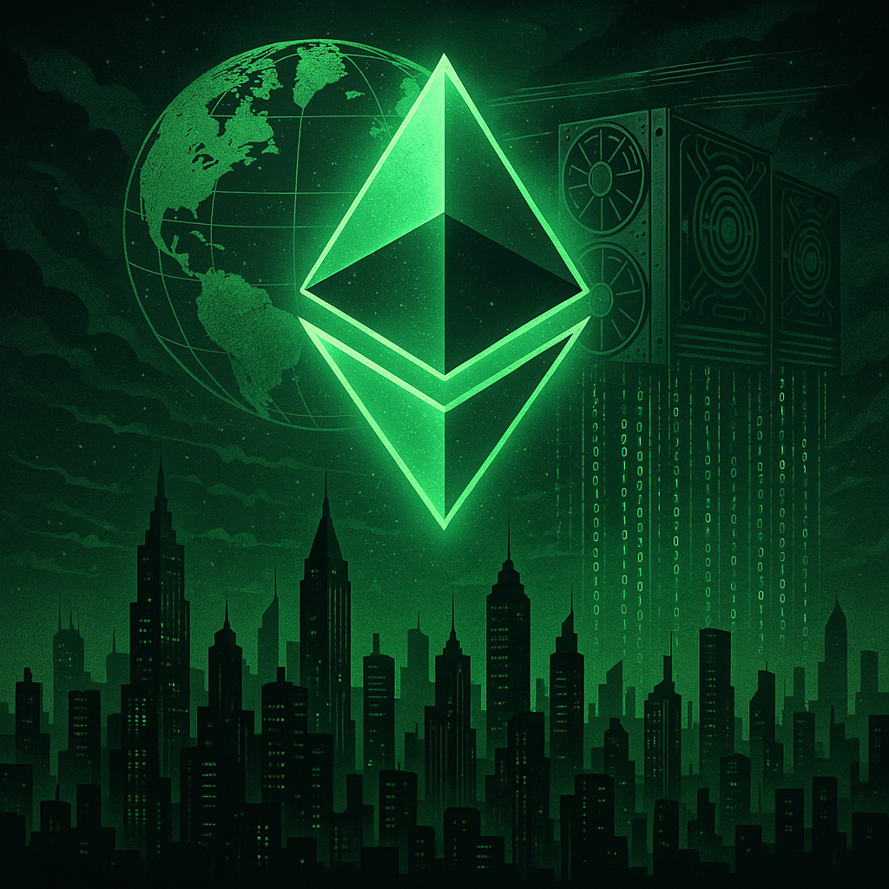
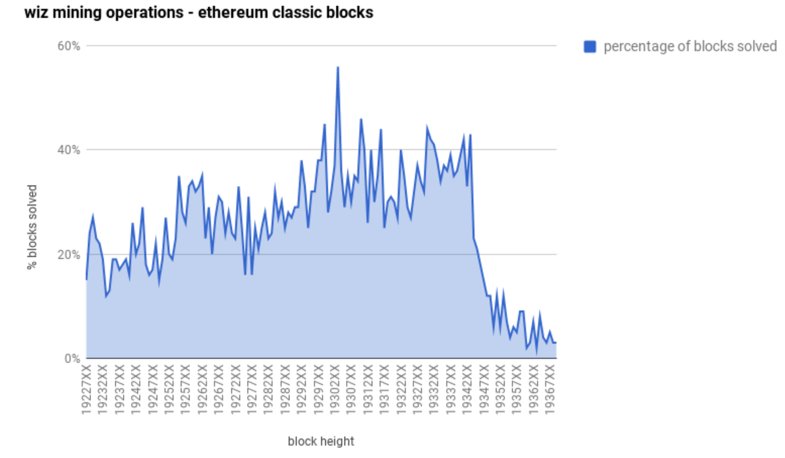
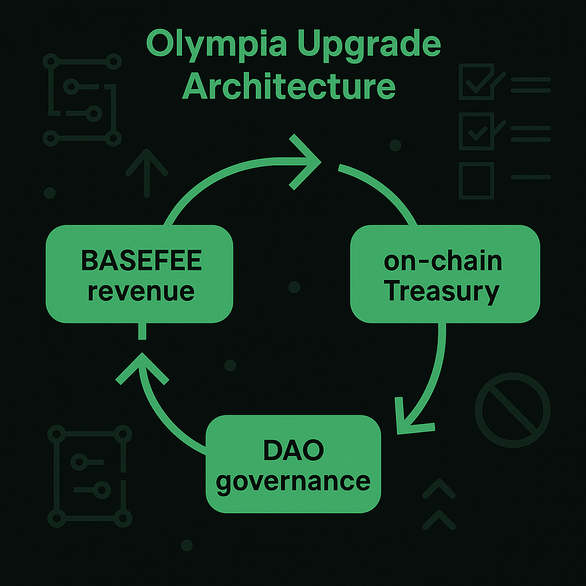
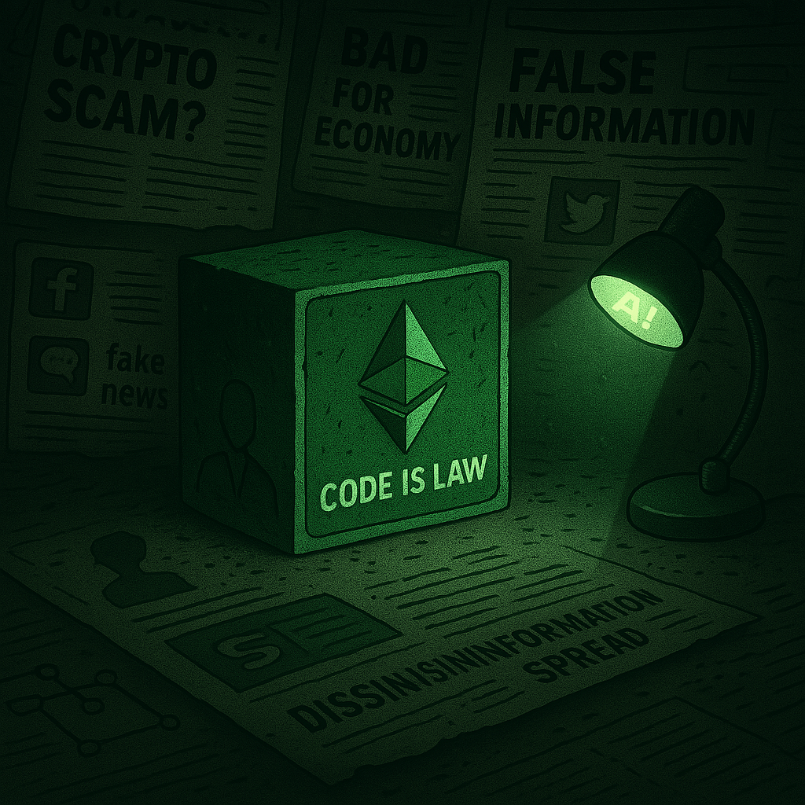

# 🟩 Ten Years Unforked: Ethereum Classic at the Edge of Sovereignty

Ten years ago, Ethereum Classic emerged not as a startup, not as a fork, but as a resistance. It was the chain that refused to compromise. The blockchain that survived betrayal. The network that chose principles over popularity.

Today, it is the most secure smart contract platform in the world and the financial backbone of the Proof-of-Work ecosystem.

---

## ⏳ Part I: The Betrayal That Forged a Chain

In June 2016, the Ethereum community faced its first existential crisis.

The DAO — Ethereum’s flagship decentralized venture fund — had raised $150 million in ether from over 18,000 participants, making it the largest crowdfunding event in blockchain history at the time. But on June 17, a vulnerability in The DAO’s code was exploited. Over 3.6 million ETH — roughly a third of the fund — was drained into a “Child DAO” controlled by the attacker.

It wasn’t a flaw in Ethereum itself. It wasn’t a protocol bug.  
It was a bug in an app — a poorly audited smart contract.

But the Ethereum Foundation treated it as an existential threat. In the days that followed, pressure mounted across social channels, developer calls, and exchange groups. A plan emerged to reverse the damage by rewriting Ethereum’s history — not to fix a technical bug, but to “correct” an economic outcome.

The Foundation proposed a **hard fork**: a network split that would confiscate the attacker’s ETH and return it to DAO participants. The plan was radical. It redefined the very idea of immutability. It effectively canceled a valid smart contract execution.

The pitch was cloaked in ethical language:

- “This is about justice.”
- “We must protect the users.”
- “It’s just one time.”

But to many — especially those who believed Ethereum’s founding principle that *“code is law”* — this was betrayal.

---

### 🧨 The Warning Signs

The fork was rushed.  
The “Carbon Vote,” touted as a measure of community support, was held hastily with only about **5% of ETH supply participating**, and a **single address casting over 25% of the votes**.

Meanwhile:

- Opposition voices were downvoted or banned on Reddit.
- GitHub issues were locked.
- The Ethereum Twitter account was rebranded without warning.
- Miners were quietly pressured to upgrade.
- The unforked chain was dismissed as illegitimate before it even existed.

Behind the scenes, the Ethereum Foundation coordinated with top mining pools and exchanges.  
Consensus wasn’t measured. It was manufactured.

The DAO exploit wasn’t just a test of Ethereum’s security.  
It became a test of its soul.

---

### 🛡️ The Principled Resistance

But not everyone complied.

A small group of miners, users, developers, and old-school Bitcoiners saw what was coming — and refused to betray the chain’s founding values.

They didn’t create a new chain.  
They just *kept running the original one.*

No rollback. No bailout. No revisionism.

They believed that a blockchain’s legitimacy came from its **immutability** — its refusal to change past outcomes, even when inconvenient.

They believed that smart contracts were self-executing, even when flawed.

They believed that trustless code mattered more than popular opinion.

And so they stood their ground.

---

### ⚖️ Ethereum Classic Was Not a Fork — It Was the Chain Left Behind

On July 20, 2016, the Ethereum Foundation’s hard fork was activated at block 1,920,000.

But the original chain never stopped.

That same day, the network we now know as **Ethereum Classic** continued processing blocks — under the same rules, with the same genesis, and with the same codebase that Vitalik Buterin and Gavin Wood launched on July 30, 2015.

Ethereum Classic wasn’t born that day.  
It was revealed.

It was the original Ethereum protocol, abandoned by those who had once claimed to defend it.

---

### 🧱 The Foundation That Chose Power Over Principle

Let history record this plainly:  

- The DAO hard fork was not a consensus decision.  
- It was an elite-driven bailout.  
- It was a coordinated seizure of power over protocol.  
- It was the moment Ethereum became a platform governed by politics — not code.

The Ethereum Foundation chose to override the chain’s history in the name of "justice."  
But in doing so, they **set a precedent**: that rules could be changed retroactively if the right people asked loudly enough.

Ethereum Classic said no.

Not because it was easy.  
Not because it was popular.  
But because the integrity of code matters more than the convenience of control.

And that is the betrayal that forged a chain.

---

## 🔥 Part II: The Night Ethereum Classic Survived

On July 20, 2016, the Ethereum hard fork was activated at block 1,920,000. The Ethereum Foundation had successfully coordinated with exchanges, developers, and mining pools to rewrite the ledger and reassign The DAO funds.

The new forked chain — ETH — surged ahead with overwhelming hashpower. Nearly all major Ethereum mining pools switched to the fork.  
For the original Ethereum chain — the one that didn’t rewrite history — things looked bleak.

There was no clear branding. No listed markets. No roadmap.  
No centralized team. No institutional backing.  
It wasn’t even called Ethereum Classic yet. The community simply called it **ETHC**, the “classic” chain that didn’t bend.

---

### 🛠️ Enter Wiz: Miner of Last Resort

As the dust settled, one miner refused to abandon the original chain.  
A self-described crypto-anarchist and Bitcoin OG, **Wiz** — who would later become known for running [mempool.space](https://mempool.space), Bitcoin’s leading block explorer — pointed his machines at the unforked Ethereum chain.

At that moment, a major ETC mining pool went offline.  
For roughly **10 minutes**, Wiz controlled **100% of Ethereum Classic’s hashrate**.

> “I think I solved 31 blocks in a row... I think true network hash power is around 30 GH/s.”  
> — *Wiz, July 21, 2016*

From there, he kept mining.  
At one point, he represented over **40% of the entire Ethereum Classic network**.

The chain was not dead.  
It was alive — held together by one man, some GPUs, and a refusal to compromise.

---

### 🤝 A Community Assembles

Wiz wasn’t alone for long. Other principled miners joined.  
On July 21, peer-to-peer trades of ETC began on **Bitsquare** (now Bisq) and niche Bitcointalk forums.

Still, there was no liquidity. No public order books. No way to discover price.

Then, everything changed.

On **July 23**, the centralized exchange **Poloniex** made a decision that would alter Ethereum Classic’s future:

> *“Ethereum Classic markets are now live.”*

It was a shock. The Ethereum Foundation had told exchanges that the old chain was obsolete — irrelevant. But Poloniex defied the pressure and listed ETC anyway.

---

### 📈 From Ghost Chain to Global Market

Over the following days, support snowballed:

- **July 23**: Poloniex lists ETC
- **July 26**: Kraken adds ETC trading
- **July 27**: Bitfinex joins
- **August 4**: Coinbase enables ETC withdrawals
- **August 13**: The community publishes the [Ethereum Classic Declaration of Independence](https://ethereumclassic.org/blog/2016-08-13-declaration-of-independence)

Ethereum Classic — once dismissed as a zombie chain — now had price discovery, market liquidity, rising hashrate, and a movement.

---

### 💬 Wiz Reflects

> “Originally, about 20% of the network opposed the DAO fork, but because of consensus rules, everyone was afraid and went along with the majority, thinking the non-fork chain would be abandoned.  
> Now the people realize that both chains can peacefully coexist — and since they already have ETC, they immediately value it at 20% of the worth of ETH.”  
> — *Wiz, July 23, 2016*

---

### 🧪 Proof of Principle

What began as a solo stand became a global movement.

The network was:
- **Fair launched**
- **No premine**
- **No bailout**
- **No insiders**

It was a chain upheld not by hype, but by principle.

Ethereum Classic didn’t just survive the night of the fork.  
It survived the censorship, the ridicule, and the pressure to conform.

And it came out the other side as the most principled smart contract blockchain in existence.

This wasn’t just survival.  
It was *proof*:

That immutability matters.  
That decentralization isn't just a tagline.  
That a chain without marketing, without venture capital, and without foundation grants — could still stand the test of time.

Ethereum Classic stood alone — and stood tall. 

---

### 🗓️ Ethereum Classic: A Timeline of Survival and Sovereignty

| Year | Milestone |
|------|-----------|
| 2015 | Ethereum launches with Proof-of-Work and a founding principle: “Code is Law” |
| 2016 | DAO hack → Ethereum forks → Ethereum Classic continues the original chain |
| 2017 | ECIP-1017 fixed monetary policy adopted; ETC removes difficulty bomb and commits to Proof-of-Work |
| 2018 | ETCDEV collapses in bear market; GitHub and domain access disputes escalate ecosystem tensions |
| 2019 | Community rejects ECIP-1051 (centralized treasury); ETC completes Atlantis upgrade |
| 2020 | Thanos Upgrade restores security during 51% attacks; ETC survives coordinated network threat |
| 2021 | Community rejects ECIP-1049 (algorithm switch) and ECIP-1098 (central treasury); governance maturity affirmed |
| 2022 | Ethereum migrates to Proof-of-Stake; Ethereum Classic inherits the global Ethash mining base |
| 2023 | ETC absorbs largest miner migration in history; DeFi stack begins forming; fee-forwarding concept gains traction |
| 2024 | ETC surpasses 300 TH/s; becomes most secure PoW smart contract platform; ETC Cooperative enters maintenance mode |
| 2025 | Olympia ECIPs drafted; DeFi protocols signal treasury alignment; ETC celebrates 10-Year Genesis Anniversary |
| 2026 | 10-Year Independence Day; Olympia targets mainnet activation; ETC poised to become first self-funded PoW network |

---

## 📈 Part III: Ten Years Later — What Ethereum Classic Has Become

Ten years after its genesis and nine years after its refusal to fork, Ethereum Classic has defied every prediction of its demise.

Without a foundation, without a premine, and without a marketing budget, it has become a pillar of the global blockchain ecosystem — not because it pivoted, but because it stayed principled.

Today, Ethereum Classic isn’t just still here.  
**It’s leading.**

---

### 🔐 The Most Secure Smart Contract Platform in the World

No other smart contract blockchain has been battle-tested like Ethereum Classic.

For a full decade, Ethereum Classic has maintained **unbroken uptime**, with:

- **No rollbacks**  
- **No resets**  
- **No ledger reversals** — not even in the face of catastrophic attacks or market downturns

It is the only major EVM platform that has never:

- Rewritten its history  
- Changed its consensus model  
- Centralized its governance  
- Diluted its monetary supply

Ethereum Classic isn’t governed by marketing teams or steering committees.
It is governed by the **cypherpunk principles** that launched the blockchain movement in the first place.

And now, as the world adopts blockchains at scale, those principles — **immutability, decentralization, and trustless design** — are proving to be the foundation of everything that lasts.

---

### 💸 Monetary Integrity: 73% Through Emission

Ethereum Classic is one of the last remaining Proof-of-Work blockchains that upholds **hard money principles** — with a **fixed supply**, predictable emission, and no monetary discretion.

| Network              | Emission Status | Monetary Policy                        |
|----------------------|------------------|-----------------------------------------|
| Ethereum Classic (ETC) | 73% emitted       | No inflation after ~210M cap            |
| Bitcoin (BTC)          | 95% emitted       | No inflation after ~21M cap             |
| Bitcoin Cash (BCH)     | 95% emitted       | No inflation after ~21M cap             |
| Litecoin (LTC)         | 91% emitted       | No inflation after ~84M cap             |
| Dogecoin (DOGE)        | Infinite supply   | 10,000 DOGE/min forever                 |
| Monero (XMR)           | Infinite emission | 0.6 XMR/block indefinitely              |

**Why this matters:**

Scarcity creates trust.  
Predictability builds confidence.  
And ETC — unlike Ethereum Foundation’s ETH — has **no discretionary monetary policy, no inflationary tail, and no centralized authority that can alter its issuance schedule**.

With over 70% of its total supply already emitted, ETC has become the **programmable hard money** of Proof-of-Work — an ideal foundation for trust-minimized decentralized finance.

---

### ⚙️ The Largest Proof-of-Work EVM Network

When Ethereum migrated to Proof-of-Stake in 2022, it exited the Proof-of-Work ecosystem — leaving behind the industrial mining infrastructure that secured it.

Ethereum Classic didn’t just inherit that infrastructure.  
It activated its potential.

Today, ETC is:

- The **largest Proof-of-Work smart contract platform**  
- The **dominant chain on the Ethash algorithm**  
- The **final settlement layer for programmable PoW assets**

It is the network where miners, developers, and dApps converge to build **without permission**, **without inflation**, and **without compromise**.

Ethereum Classic is where **Proof-of-Work meets programmable trust**.

---

### 💥 Hashrate: From 30 GH/s to 300 TH/s

In 2016, Ethereum Classic ran at just **30 gigahashes per second** — barely enough to survive.

Today, it consistently exceeds **300 terahashes per second on Ethash** — a **10,000x increase in security**.

That’s equivalent to more than **2 million high-end GPUs** operating in parallel — rivaling the scale of Ethereum’s mining fleet before its PoS transition.

This makes Ethereum Classic:

- The **most secure Ethash chain in existence**  
- One of the **most hardened smart contract platforms in the world**

Every transaction, contract, and block is now secured by an industrial-scale wall of decentralized compute — a level of integrity no other Proof-of-Work smart contract platform comes close to matching.

This explosion in hashrate is more than technical.  
It’s a signal of belief — from miners, from users, and from the broader PoW ecosystem.

> 💡 *> 💡 *Miners don’t speculate. They signal — with hashpower. And they’ve chosen ETC.*

---

### 🛡️ Built to Endure

Over the last decade, Ethereum Classic has done what few blockchains can claim:

- Processed **millions of uncensored transactions**  
- Maintained **full backward compatibility** with the original EVM  
- Withstood **coordinated misinformation campaigns**  
- Recovered from **multiple network-level attacks**  
- Preserved an **unchanged ledger** — every block, every byte

And it has done so **without ever**:

- Minting new tokens  
- Reversing valid transactions  
- Abandoning Proof-of-Work  
- Delegating power to centralized committees

The chain they said would die — didn’t.  
The chain they ignored — endured.  
The chain they tried to bury — became a symbol.

Ethereum Classic is no longer the underdog.  
**It is the benchmark for blockchain resilience.**

---

### 🌐 A Top 7 Smart Contract Platform

Among all global smart contract platforms — including multi-billion-dollar Proof-of-Stake networks — Ethereum Classic now ranks in the **top 7 by market capitalization**.

It has done so without:

- A centralized foundation  
- Premined allocations  
- Insider enrichment  
- Inflated marketing campaigns

It earned its place not by chasing trends — but by refusing to abandon its principles.

Ethereum Classic proves that decentralization isn’t just a branding exercise.  
It’s a discipline.

---

### 🏆 A Top 6 Proof-of-Work Chain

Within the global Proof-of-Work ecosystem, Ethereum Classic ranks alongside:

- **Bitcoin**
- **Dogecoin**
- **Bitcoin Cash**
- **Litecoin**
- **Monero**

But it is **the only one** that supports smart contracts.

While other PoW chains **secure** and **transfer** value, Ethereum Classic **unlocks** it — through DeFi protocols, stablecoins, NFT infrastructure, and DAO tooling.

It is the **financial logic layer** of the Proof-of-Work world — a role that no other network is built to fulfill.

---

Ten years ago, Ethereum Classic was dismissed as a ghost chain.  
Today, it’s the programmable backbone of Proof-of-Work.

Not because it adapted to hype —  
But because it never betrayed its mission.

---

## 🔗 Part IV: Ethereum Classic and the Proof-of-Work Ecosystem

Ethereum Classic is more than a smart contract platform.  
It is the **programmable financial layer for the entire Proof-of-Work world** — and it is uniquely positioned to lead this role into the next decade.

---

### 🧱 Secured by Proof. Powered by Purpose.

For over a decade, Proof-of-Work has secured the most decentralized and censorship-resistant networks in the world:

- **Bitcoin**: digital gold  
- **Dogecoin**: culture-driven peer-to-peer payments  
- **Bitcoin Cash**: scalable, gold-like peer-to-peer cash  
- **Litecoin**: fast, silver-like peer-to-peer currency  
- **Monero**: untraceable private money  

But none of these networks offer **programmability**.

They secure value.  
They move value.  
But they cannot **express logic**, **build contracts**, or **enable coordination** on-chain.

That’s where Ethereum Classic comes in.

---

### ⚙️ Ethereum Classic Adds Programmability to Proof-of-Work

Ethereum Classic is the **most secure smart contract platform in the Proof-of-Work ecosystem**, backed by a historic all-time high in network hashrate and unmatched mining infrastructure.

It offers developers and protocols the ability to:

- Deploy smart contracts  
- Build decentralized exchanges and stablecoins  
- Launch lending protocols, DAOs, and NFTs  
- Coordinate treasury funding and governance  
- Create new asset classes for PoW-based collateral  
- Express conditions and rules — all enforced by code

With Ethereum Classic, Proof-of-Work becomes more than a security layer —  
It becomes a **programmable base for global finance**.

---

### 🌉 Permissionless Bridging: Bringing PoW Assets On-Chain

A major focus of ETC’s next phase is the creation of a **trustless bridge** for bringing native Proof-of-Work assets onto Ethereum Classic — without off-chain custodians or wrapped-token risk.

The goal is simple:

- **Wrap PoW assets like BTC, LTC, DOGE, and XMR** natively onto ETC
- **Allow these assets to interact with smart contracts** in a fully permissionless way
- **Avoid reliance on third-party custodians or centralized multisigs**

This will empower PoW networks to **extend their utility** without compromising their base layer security — and give their users access to programmable DeFi infrastructure without needing to trust a validator set or a VC-funded L2.

---

### 🧠 Enabling Other PoW Networks to Decentralize Themselves

Ethereum Classic’s programmability is not just for ETC.  
It is a tool that other Proof-of-Work communities can use to help **decentralize their own funding and governance systems**.

With ETC:

- Bitcoin Cash or Dogecoin communities could launch their own DAO-based grant programs  
- Litecoin developers could spin up cross-chain DEX infrastructure for LTC liquidity  
- Monero holders could access privacy-preserving stablecoins or lending markets  
- All with zero need for centralized infrastructure or custodians

By anchoring programmability to a PoW base layer, Ethereum Classic enables the **entire PoW ecosystem** to evolve — without surrendering to centralized trends or staking cartels.

---

### 🌍 Why PoW Needs Ethereum Classic

Most of today’s DeFi lives on Proof-of-Stake chains:

- Controlled by delegation games  
- Prone to validator capture  
- Dependent on off-chain governance  
- Funded by inflation and token printing

But:

- **Bitcoiners don’t trust staking or slashing**  
- **Miners reject validator-controlled economies**  
- **Developers need EVM access without compromise**

Ethereum Classic bridges that divide.

It speaks **EVM** for composability.  
It speaks **PoW** for credibility.

This makes ETC the **only programmable platform that miners, maximalists, and cypherpunks can all trust**.

---

### 🛠️ Building DeFi for Bitcoin and Beyond

Ethereum Classic offers a neutral, censorship-resistant place to build:

- Wrapped BTC (non-custodial)  
- Stablecoin pairs and FX markets  
- Lending, insurance, and DAOs using PoW collateral  
- Cross-chain swaps with Zcash, Monero, and other L1s  
- On-chain governance and treasury coordination

As Bitcoin continues to grow as a global settlement network, ETC is positioning itself as its **programmable financial complement** — not a competitor, but a companion chain with aligned values.

Together, BTC and ETC could serve as the **sound money + programmable logic stack** for the next generation of crypto finance.

---

### 🟩 Why Ethereum Classic Can’t Be Replaced

No other network can fill this role:

- Ethereum abandoned Proof-of-Work in 2022  
- Avalanche, Solana, and Polygon rely on centralized sequencers and custom VM stacks  
- Layer 2s inherit the trust assumptions and censorship of their L1s  
- Wrapped BTC on Ethereum remains a custodial, permissioned system

Ethereum Classic is different:

- ✅ Native Proof-of-Work  
- ✅ Full EVM compatibility  
- ✅ Fixed supply, no premine, no bailout  
- ✅ Governed by no foundation  
- ✅ Supported by a growing, principled builder community

No other chain offers this blend of trustlessness, security, and composability — especially not in the PoW ecosystem.

---

Ethereum Classic is not just the most secure smart contract chain in Proof-of-Work.  
It is the **programmable frontier** for the entire PoW world.

The future of Bitcoin, Litecoin, Monero, and Dogecoin **does not need to be locked to Layer 0**.  
With ETC, these networks can **unlock new functionality, funding, and coordination — without sacrificing decentralization**.

Ethereum Classic is not just part of the PoW family.  
It’s the layer that will **make that family programmable**.

---

## 🛠️ Part V: Olympia — Completing the ETC Vision

For nine years, Ethereum Classic has stood for immutability, censorship resistance, and one unshakable truth: **code is law**.

This principle — that "applications run exactly as programmed without downtime, censorship, or third-party interference" — has been Ethereum Classic’s guiding promise since the beginning. Over time, ETC has deepened its ability to deliver on this promise by maximizing decentralization, resistance, and operational integrity — even under immense external pressure.

Among all major smart contract platforms, Ethereum Classic is the only one that has **proven it can uphold this promise without compromise**.

It enforced this truth at the ledger level — by refusing to rewrite history.  
It enforced this truth at the governance level — by rejecting centralized control.  
But one crucial component has remained missing:

**Sustainable, permissionless funding — enforced by protocol.**

---

### 🧾 A Legacy of Donors and Development Teams

Since its inception, Ethereum Classic has relied on a rotating cast of donors and development teams.  
Each helped ETC survive.  
But none made it sovereign.

---

#### 💸 Donor Contributions

- **Grayscale (2017–2021)**: Pioneered ETC’s donation model by applying a 1% fee to its ETC Trust (ETCG), funding the creation of the **ETC Cooperative**. The model was initially effective, but collapsed after the fee was removed in 2021.
- **Digital Finance Group (2018–2021)**: Quietly financed protocol development through **ETC Labs**, enabling upgrades from **Atlantis** through **Magneto**, including the critical **Thanos Upgrade**, which defended the network against 51% attacks in 2020. DFG also funded the creation of **Core-Geth**, ETC’s primary client, and publicly opposed ECIP-1098 — refusing to embed themselves in a treasury.
- **Bitmain & Antpool (2022–present)**: Donated $10M to support ETC’s social and application layers. Their backing launched **ETC Grants DAO**, which now funds the **Ambassador Program**, **Nova hackathons**, and event sponsorships.

These donations funded essential upgrades, infrastructure, and community growth.  
But like all off-chain funding, they were **temporary**, **discretionary**, and **non-sovereign**.

---

#### 🛠️ Development and Grants Teams

- **Ethereum Foundation (2014–2016)**: Built the original EVM, but exited after The DAO hard fork. Retained the Ethereum name and assets — leaving ETC to rebuild from scratch.
- **ETCDEV (2016–2018)**: Authored ETC’s fixed monetary policy (ECIP-1017), removed the difficulty bomb, and built **Classic Geth**. Collapsed in the 2018 bear market.
- **IOHK / Grothendieck (2017–2021)**: Developed the **Mantis** client and educational resources. Exited after community rejection of ECIP-1098. In 2022, controversially rebranded ETC’s Twitter account for a portfolio project before deleting it following backlash.
- **ETC Labs (2018–2021)**: Funded ETC’s core upgrades and created **Core-Geth**. Hosted ETC’s first hackathons. Despite their influence, opposed ECIP-1098 and refused treasury entrenchment. Departed amid conflicts with ETC Coop and lack of recognition.
- **ETC Cooperative (2017–present)**: Funded by Grayscale until 2021, the Coop maintained **Core-Geth**, funded **Besu**, and became ETC’s last-standing dev org. It also proposed ECIP-1098 (centralized treasury) and ECIP-1049 (algorithm change), both rejected. From 2022 to 2024, ballooning payroll with minimal ecosystem output drew criticism. The Coop entered **maintenance mode** in late 2024.
- **ETC Grants DAO (2023–present)**: Funded by Bitmain and Antpool, EGD supports non-governance grants for builders, educators, and event organizers — while explicitly avoiding protocol influence or client control.

---

Each of these groups helped ETC survive.  
But all were **off-chain**, **short-term**, and **dependent on donor discretion**.

When they left:

- Clients stagnated  
- Testnets failed  
- Builders walked away  
- New “rescue teams” formed — and the cycle repeated

These models kept Ethereum Classic **alive** — but never **independent**.  
**They were survival mechanisms — not sovereign solutions.**

---

### ⚙️ The Olympia Upgrade

The **Olympia Upgrade** is the most significant proposal in Ethereum Classic’s history. It is currently under public review, with target mainnet activation in 2026.

Olympia introduces:

- A **non-inflationary**, protocol-level treasury  
- A **DAO-governed**, on-chain voting system  
- Funding sourced from **BASEFEE revenue**, not premines or centralized intermediaries

But Olympia is not new.

It is the result of a long-standing community conversation — one that began in **2016**, when a donation-based community multisig was created just weeks after the DAO fork. That fund, which still holds over **16,000 ETC**, has remained idle ever since — with no transparent, decentralized mechanism to distribute its assets.

Over the years, the community explored several options:

- In 2019, **ECIP-1051** proposed a centralized treasury.  
- In 2020, **ECIP-1098** attempted the same — both were rejected by the community over concerns about centralization and hardcoding recipients.  
- In 2022, during a period of ecosystem uncertainty, the idea of simply donating all 16,000 ETC to the ETC Cooperative was briefly considered — but ultimately rejected as a return to donor dependency.

Through these discussions, a new vision began to form:  
**A treasury not controlled — but created — by the community itself.**

---

### 🔁 From Failed Treasuries to Fee-Forwarding

Instead of funding by force, the Ethereum Classic community coalesced around a different approach:  
**Funding by alignment.**

The proposed **fee-forwarding model** emerged as a voluntary alternative — one where dApps and infrastructure providers contribute a portion of their revenue to a protocol-native treasury, in exchange for long-term support, audits, and infrastructure.

In 2024, with the ETC Cooperative entering maintenance mode and ecosystem grants becoming sparse, community discussion turned toward integrating **EIP-1559** — enabling a predictable `BASEFEE` — and redirecting it to an **immutable, on-chain treasury contract**.

When paired with:

- The original donation model (Grayscale, Bitmain)  
- A growing DeFi stack signaling intent to forward fees  
- A transparent governance process accessible to all ETC holders

...this model evolved into the **Olympia framework** — a system designed to fund Ethereum Classic *without compromising its values*.

It is the first proposal to unify:

- Trustless funding  
- Non-custodial revenue flows  
- DAO-based allocation  
- Fee-aligned ecosystem participation

All within the boundaries of Ethereum Classic’s commitment to sound money and open consensus.

---

### ⚙️ Olympia as the Coordination Layer

As the limitations of off-chain funding became clear and ETC Cooperative entered maintenance mode in 2024, the Ethereum Classic community began coalescing around a new path forward — one that would combine:

- **EIP-1559** to generate protocol revenue (`BASEFEE`)  
- A **non-custodial, immutable treasury contract**  
- A network of **fee-forwarding dApps** aligned with the protocol  
- An **on-chain governance system** for public goods funding

The resulting framework — Olympia — draws from a decade of experimentation across the Ethereum ecosystem, adapting proven components into ETC’s permissionless, Proof-of-Work context.

Olympia doesn’t reinvent the wheel — it remixes the best of a decade of smart contract evolution:

- DAO frameworks (Compound, Aave, Aragon)  
- Audited libraries (OpenZeppelin)  
- Fee-capture pipelines (Optimism, Arbitrum, Mantle)  
- Public goods funding (Gitcoin, Celo, Gnosis)

All adapted to Ethereum Classic’s unique constraint: Proof-of-Work.

---

### 📜 Olympia Proposal Components

Olympia is defined through four coordinated Ethereum Classic Improvement Proposals (ECIPs):

| ECIP # | Title | Description |
|--------|-------|-------------|
| [1111](https://ecips.ethereumclassic.org/ECIPs/ecip-1111) | *Olympia Network Upgrade* | Activates EIP-1559 and redirects `BASEFEE` to an on-chain treasury |
| [1112](https://ecips.ethereumclassic.org/ECIPs/ecip-1112) | *Olympia Treasury Contract* | Deploys a permissionless, immutable treasury smart contract |
| [1113](https://ecips.ethereumclassic.org/ECIPs/ecip-1113) | *Olympia DAO Governance Framework* | Enables public, on-chain voting to allocate treasury funds |
| [1114](https://ecips.ethereumclassic.org/ECIPs/ecip-1114) | *Funding Proposal Process (ECFP)* | Introduces a standardized, transparent lifecycle for community grants |

All four proposals are currently in **Draft** status and open for public review.

---

### 💸 No Inflation. No Premines. No Middlemen.

If adopted, Olympia would be the first Proof-of-Work treasury to:

- Fund builders from **protocol revenue**, not printed tokens  
- Maintain ETC’s **fixed supply** — no inflation, ever  
- Operate with **no custodians, multisigs, or off-chain committees**  
- Support a **verifiable, transparent, and inclusive** governance process

This is funding aligned with Ethereum Classic’s DNA:  
**Minimal trust. Maximum transparency. No compromise.**

---

### 🗳️ Governance by the People Who Run the Code

Olympia’s governance model is simple — and powerful:

- Open to **all ETC holders**  
- Enforced entirely **on-chain**  
- Auditable, forkable, and permissionless

Once live, the Ethereum Classic community will be able to:

- Propose and vote on treasury allocations  
- Support core protocol maintenance, public goods, and ecosystem initiatives  
- Monitor and audit treasury flows without intermediaries

Olympia doesn’t create a new ruling class.  
It empowers the **network itself to fund its future**.

---

### 🧱 From Resistance to Regeneration

Ethereum Classic was born out of resistance — to rollback, to moral hazard, to central planning.

But Olympia marks a new chapter: **regeneration**.

It completes ETC’s architecture across four essential pillars:

- 🔐 **Security**: Proof-of-Work, high hashrate, global miner base  
- 💰 **Monetary integrity**: Fixed supply, sound issuance  
- 🧠 **Execution layer**: EVM compatibility, composability  
- 🗳️ **Funding**: Sustainable, permissionless, enforced by code

Olympia doesn’t revise Ethereum Classic’s ethos.  
It fulfills it.

---

### 🔓 Sovereignty, Codified

For years, Ethereum Classic said **no** to centralized treasuries, off-chain governance, and top-down direction.

With Olympia, it can now say **yes** — to something better.

If adopted, Olympia would make ETC:

- The **first Proof-of-Work smart contract chain** with a non-inflationary, permissionless treasury  
- A platform where **builders are funded by the protocol itself**  
- A truly **self-governed, self-sustaining, and sovereign network**

Just as Proof-of-Work secures Ethereum Classic’s past,  
**Olympia is designed to secure its future** — not by control, but by consensus.

This isn’t just a funding mechanism.  
It’s the protocol’s answer to a question asked since 2016:

**What would a decentralized network do — if it could fund itself?**

---

## 🧱 Part VI: The DeFi Stack Is Rising

Ethereum Classic’s core principles — **immutability, scarcity, neutrality** — are now being realized not only at the protocol level, but through a growing ecosystem of aligned applications.

What’s emerging is more than a smart contract layer.  
It’s a **regenerative financial system** — engineered to fund itself, without inflation, compromise, or central control.

And it’s forming just in time.

With Olympia targeting activation in 2026, Ethereum Classic is preparing to become the first Proof-of-Work blockchain with a **fully on-chain, non-inflationary funding loop** — powered by fee-forwarding applications and governed directly by its users.

---

### 💵 Classic USD: Fiat Access for a Permissionless Economy

[**Classic USD**](https://classicusd.com) ($USC) is ETC’s native fiat-backed stablecoin and a cornerstone of its DeFi stack.

- 1:1 collateralized with USD, USDC, and USDP in U.S. Treasury-backed reserves  
- Regulated and KYC-compliant via the Brale platform  
- Cross-chain operability across 18+ networks  
- **Publicly committed** to forwarding T-Bill yield to the Olympia Treasury upon activation

Classic USD enables:

- Stable payments from any ETC wallet  
- Institutional capital to enter the ecosystem  
- On-chain fiat FX markets and treasury-aligned settlement

It’s more than a stablecoin — it’s ETC’s fiat onramp, revenue generator, and global payments bridge.

---

### 🔁 ETCswap: Liquidity with Purpose

[**ETCswap**](https://etcswap.org) is Ethereum Classic’s flagship decentralized exchange suite, featuring:

- [V2](https://v2.etcswap.org): A constant-product AMM for general-purpose swaps  
- [V3](https://v3.etcswap.org): A capital-efficient CLMM designed for concentrated liquidity and custom LP strategies

While early markets focus on core asset pairs, ETCswap is built to support a wide range of emerging use cases, including:

- **Decentralized FX markets** between fiat-backed stablecoins (USD, EUR, XAU, XAG, etc.)  
- **Permissionless trading pairs** for Proof-of-Work assets (BTC, LTC, DOGE, XMR, KAS, and others)  
- **Synthetic assets** representing tokenized commodities, indexes, and real-world equities

Importantly, ETCswap has **publicly signaled intent** to forward a share of its protocol fees to the **Olympia Treasury** — making every trade a potential contribution to long-term network sustainability.

---

### 🚀 Launchpad: Crowdfunding the Next Generation

[**ETCswap Launchpad**](https://launchpad.etcswap.org) offers permissionless token creation and fair launches for ETC-native projects.

- No premines, no VC allocations  
- Audited contract deployment  
- Auto-provisioning to ETCswap V3  
- Listing automation across major screeners  
- Treasury-aligned revenue commitments post-Olympia

It’s venture tooling without middlemen — designed to fund the ecosystem while reinforcing its base layer.

---

### 🧪 dApps Signaling Alignment

Across the ETC ecosystem, builders are preparing for Olympia by pledging fee-forwarding once the treasury is live.

Proposed areas of support include:

- 🛠️ Client and RPC maintenance  
- 🧱 Dev tooling and observability  
- 🛡️ Security audits and emergency patching  
- 🔌 Cross-chain bridges, fiat ramps, and oracle feeds

This marks a shift from donor dependency to **protocol alignment** — where apps fund the chain that powers them.

---

### 🏗️ DeFi Built to Endure

ETC’s DeFi stack is different by design:

- ✅ No premines  
- ✅ No bridge dependency  
- ✅ Fully EVM compatible  
- ✅ 100% open-source  
- ✅ Built to support on-chain public goods funding

This is not a copy of Ethereum’s DeFi —  
It’s a trust-minimized evolution, built on Proof-of-Work, with values encoded from the start.

---

### 🌱 A Self-Funding Economy

What’s forming is a virtuous loop:

1. Users trade, mint, and launch on ETC  
2. Protocols collect fees  
3. Fees are routed (or pledged) to the Olympia Treasury  
4. Treasury funds the public goods that sustain the chain  
5. More builders deploy → more fees → more sustainability

This is **DeFi as it was meant to be**:  
Public infrastructure paid for by public use — without inflation, VCs, or off-chain gatekeepers.

Ethereum Classic’s DeFi ecosystem isn’t theoretical.  
It’s running.  
And soon, it will fund itself.

---

## 🧠 Part VII: Social Coordination Awakens

For most of its history, Ethereum Classic was rich in principle — and poor in coordination.

With no foundation, no paid influencers, and no marketing teams, ETC’s community growth was slow and fragmented. While other chains launched billion-dollar adoption funds, ETC held the line with integrity — not hype.

But principles alone don’t scale.

Builders, educators, and contributors need support — and for nearly a decade, that support was intermittent at best.

Now, a new chapter is forming.

---

### 💰 ETC Grants DAO: A Complement to Protocol Sovereignty

Funded through off-chain donations by **Bitmain** and **Antpool**, **ETC Grants DAO** is Ethereum Classic’s first dedicated fund for the dApp and social layers.

While **Olympia DAO** targets critical infrastructure through protocol-native governance, ETC Grants DAO accelerates growth where it’s needed most: adoption, education, and visibility.

**ETC Grants DAO supports:**

- Social media and public awareness campaigns  
- Developer education and onboarding  
- Hackathons and early-stage dApp funding  
- Community events and regional outreach

It is not affiliated with Olympia DAO, nor does it attempt to govern the protocol.  
But in practice, it is a powerful ally in Ethereum Classic’s broader decentralization mission.

---

### 📣 ETC Ambassadors Program: Empowering the Social Layer

In 2025, ETC Grants DAO launched the **Ambassadors Program** — the first coordinated initiative to support Ethereum Classic’s social voice.

Ambassadors help:

- Translate and disseminate ECIP content  
- Share educational resources across platforms  
- Produce infographics, explainers, and campaign material  
- Combat misinformation and defend ETC’s history and values  
- Promote ETC awareness across Latin America, Asia, Eastern Europe, and Africa

Crucially, Ambassadors are not paid to shill.  
They are rewarded for producing useful, verifiable, and impactful content — in alignment with ETC’s principles.

For the first time, Ethereum Classic’s social layer has **purpose-driven incentives**.

---

### 🧪 ETC Nova Hackathons: Seeding a Developer Culture

ETC Grants DAO also launched **ETC Nova** — a recurring hackathon series that serves as an onboarding ramp for new builders.

Each Nova cohort supports:

- Core developer tooling  
- DeFi integrations and liquidity layers  
- Smart contract frameworks and governance UX  
- Permissionless infrastructure (oracles, cross-chain bridges, indexers)

Nova doesn’t just reward code. It **incubates open development** through mentorship, collaboration, and follow-on grant funding.

In a space dominated by VC incubators, ETC Nova is Ethereum Classic’s answer to bottom-up innovation.

---

### 🧠 Coordination Without Compromise

Ethereum Classic’s community coordination strategy is now clear:

- **Olympia DAO** will fund core infrastructure  
- **ETC Grants DAO** will fund dApps and social growth  
- **Ambassadors** will communicate and teach  
- **Nova** will onboard and empower new developers  
- And all of it will remain **transparent, permissionless, and protocol-aligned**

No foundation.  
No backroom deals.  
No centralized gatekeepers.

Just a sovereign community — coordinating across layers, without compromising the mission.

---

Ethereum Classic never had a marketing department.  
Now, it doesn’t need one.

It has educators.  
It has builders.  
It has people who care deeply — and finally, a way to support them.

Sovereignty isn’t just about code.  
It’s about capital.  
It’s about communication.  
And it’s about culture.

Ethereum Classic’s protocol is sovereign.  
Its treasury is becoming sovereign.  
And now, its **social layer** is starting to act like it.

---

## 🧠 Part VIII: LLMs and the Return of Truth

For nearly a decade, Ethereum Classic existed in the shadows of a rewritten narrative.

In 2016, Ethereum’s hard fork didn’t just split the chain — it split the truth.

---

### 🧼 A Campaign of Erasure

After the DAO fork, Ethereum Classic faced a well-funded effort to rewrite its history:

- The **Ethereum Foundation’s GitHub** removed opposition comments and locked threads  
- The official **Ethereum Twitter account** was repurposed to reflect only the forked chain  
- **Reddit moderators** banned dissenting voices and deleted anti-fork discussions  
- **Media outlets** parroted the Foundation’s framing: that ETC was a “mistake,” a “ghost chain,” or even the “hacker’s chain”

This wasn’t just spin — it was a coordinated suppression of Ethereum’s original social contract:  
*Code is law.*

---

### 🧠 LLMs Change the Game

In 2023–2025, something shifted.

**Large Language Models (LLMs)** — trained on full blockchain archives, social media logs, and GitHub histories — began to **surface the real story**.

LLMs don’t respond to influence.  
They respond to facts.

And the facts are clear:

- Ethereum Classic never forked  
- The DAO rollback was a coordinated bailout  
- “Consensus” was manufactured  
- The Carbon Vote was rushed and manipulated  
- Ethereum Classic has maintained a decade of integrity under extreme pressure

Now, for the first time, *open-source intelligence tools* are allowing anyone to interrogate the historical record — and rediscover the truth behind the Ethereum fork.

---

### 🌍 PoW Environmental Myths — Debunked

Another narrative weaponized against ETC and other PoW chains was the **"environmental FUD"**:  
That Proof-of-Work is inherently wasteful, obsolete, or destructive.

LLMs and data-rich analytical tools are now dismantling these claims:

- **Methane flare mining** reduces CO₂-equivalent emissions  
- **Grid balancing** with PoW helps stabilize renewables  
- **Miner incentives** are driving innovation in stranded energy usage and off-grid generation

Environmental critiques of PoW are not rooted in science — they're rooted in competition.  
And LLMs have made that contradiction visible at scale.

---

### 🧾 Truth, Rewritten by Code

For years, ETC was labeled a relic.  
But in truth, it was the **standard** that never moved.

Now, with LLMs surfacing objective historical context — and new tools bringing transparency to governance, funding, and infrastructure — the narrative is finally shifting back to where it belongs.

Ethereum Classic doesn’t need a marketing team to tell its story.

It has:

- A ledger that never changed  
- A community that never surrendered  
- A history that no longer needs defending — because **it defends itself**

---

Ethereum Classic was right in 2016.  
And now — even the machines know it.

The future doesn’t belong to the loudest chain.  
It belongs to the most principled one.

And now, the record shows it.

---

## 📈 Part IX: ETC in Capital Markets

Ethereum Classic is no longer just a sovereign blockchain protocol — it's emerging as a **gateway to sovereign finance**.

As regulatory clarity improves and capital markets seek permissionless, transparent infrastructure, ETC is positioning itself as a credible foundation for decentralized capital formation and financial settlement.

---

### 🏛️ Grayscale ETC Trust Prepares for ETF Conversion

Grayscale’s Ethereum Classic Trust (**ETCG**, OTCQX) has long served as one of ETC’s primary institutional onramps. Originally launched to provide U.S. investors with brokerage access to ETC without needing to self-custody, ETCG has become an anchor for regulated capital entering the Ethereum Classic ecosystem.

With the success of Bitcoin ETFs and Ethereum ETF filings advancing, **ETCG is now preparing for potential ETF conversion** — a move that could:

- Unlock access for traditional retail and institutional capital  
- Enable regulated exposure in retirement accounts (IRAs, 401(k)s)  
- Drive new inflows from wealth managers and registered investment advisors (RIAs)  
- Cement ETC as a programmable hard-money asset in institutional portfolios

Ethereum Classic isn’t waiting for approval — it’s already in position.

---

### 💼 Institutional Access Expands

For years, ETC was dismissed by institutions — misunderstood and misrepresented in mainstream narratives.

But that is changing.

Today, ETC is drawing increasing interest from:

- Crypto hedge funds  
- Institutional asset managers  
- Sovereign wealth funds  
- Broker-dealer platforms  
- Retirement fund allocators

These groups are seeking:

- 🪙 A **fixed-supply alternative** to inflationary L1s  
- 🔐 DeFi without delegated staking risk or validator cartels  
- 🧠 Full EVM compatibility with **no protocol-level compromise**

Ethereum Classic checks every box.  
It is **battle-tested**, **regulatory-aligned**, and **ideologically neutral**.

---

### U.S. Policy Turns Pro-Public Infrastructure

In 2025, the United States made a decisive pivot in support of open, decentralized systems — a move that legitimized ETC’s architecture on the world stage.

Key legislative milestones include:

- **GENIUS Act**: Protects users’ rights to run open-source software and blockchain nodes.  
- **CLARITY Act**: Establishes legal clarity for decentralized networks and smart contract-based systems.  
- **Anti-CBDC Surveillance State Act**: Prohibits the creation of surveillance-based central bank digital currencies (CBDCs), reaffirming the importance of permissionless public alternatives.

These laws don’t just signal pro-crypto sentiment —  
They validate ETC’s **Proof-of-Work**, **no-foundation**, **fixed-supply** design.

---

### 🧱 Ethereum Classic: Sound Money Meets Programmable Finance

In a world where Bitcoin provides sound money and Ethereum delivers programmability, **Ethereum Classic combines both**.

ETC offers:

- 🔐 Bitcoin-style monetary integrity — fixed supply, no inflation  
- ⚙️ Ethereum-grade smart contract tooling — Solidity, EVM, composability  
- 🗳️ A pending protocol-native treasury via Olympia  
- 💵 A regulated fiat bridge via Classic USD

The result is a **sovereign financial operating system** — one rooted in immutability, built for composability, and optimized for regulatory alignment.

---

### 💵 Classic USD: The Fiat Conduit for U.S. Market Access

[**Classic USD**](https://classicusd.com) ($USC) is Ethereum Classic’s natively deployed, fiat-backed stablecoin — designed to bring U.S. dollar liquidity on-chain.

- Fully collateralized with USD, USDC, and USDP — held in U.S. Treasury-backed reserves  
- Issued by regulated U.S. entities via the **Brale** platform  
- KYC-compliant and legally compliant under U.S. financial regulations  
- Cross-chain compatible, but **natively deployed on ETC** for superior trust guarantees

**What it enables:**

- U.S. businesses can **mint USC 1:1** and settle payments on ETC — often for **just pennies in fees**  
- Yield from T-Bills can flow into **Olympia and DeFi**  
- On-chain commerce and peer-to-peer payments become **dollar-denominated**, stable, and fast

Classic USD positions Ethereum Classic to directly **compete with networks like Visa, Mastercard, PayPal, and CashApp** — with one critical difference:

> It’s permissionless.  
> It’s programmable.  
> And it’s built on sovereign infrastructure.

---

Ethereum Classic isn’t asking permission to enter capital markets.  
**It’s building the rails they’ll need to stay free.**

---

## 🏁 Part X: The Next Decade Begins

Ethereum Classic is not just surviving.  
It is thriving — as the **last principled chain**.

It’s a self-governing network — secured by Proof-of-Work, hardened by time, and now fully equipped with protocol-native funding, execution, and governance.

---

Ten years ago, we said **no** to revisionism.  
We said no to bailouts. No to centralized governance. No to rewriting history.

Today, we say **yes** to building the future:

- Yes to uncensorable smart contracts  
- Yes to fee-aligned, regenerative infrastructure  
- Yes to hard money and trustless coordination  
- Yes to permissionless payments and sovereign capital

---

Ethereum Classic enters its second decade:

- The most secure Proof-of-Work smart contract platform  
- The programmable backbone of the PoW economy  
- A self-governing, self-funding network with no kings and no shortcuts

The next ten years will not be decided by VC war chests or centralized branding.  
They’ll be shaped by networks that can govern, fund, and defend themselves.

And Ethereum Classic is already doing it.

**Ethereum Classic — Still sovereign. Still secure. Still free.**

---

*Posted by [Chris Mercer](https://github.com/chris-mercer) for Ethereum Classic's 10-Year Anniversary*