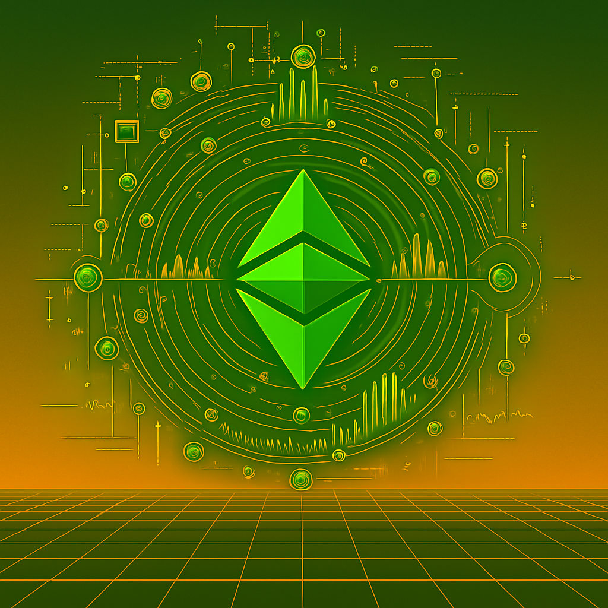
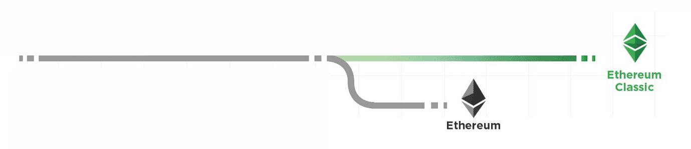
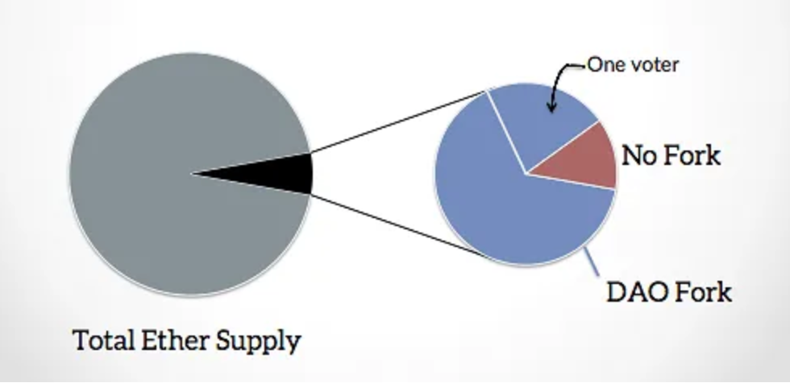
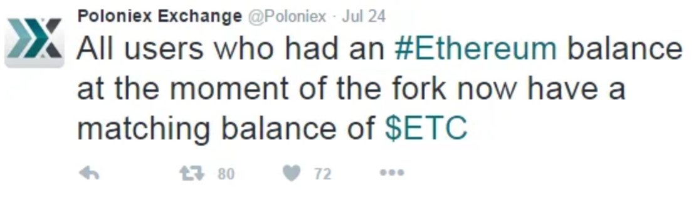
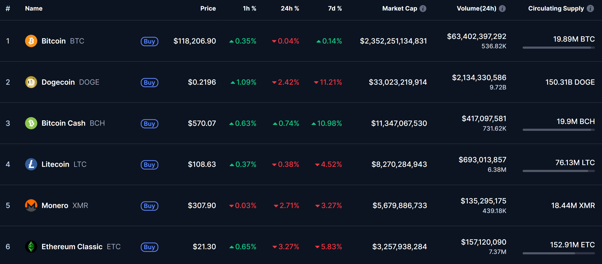
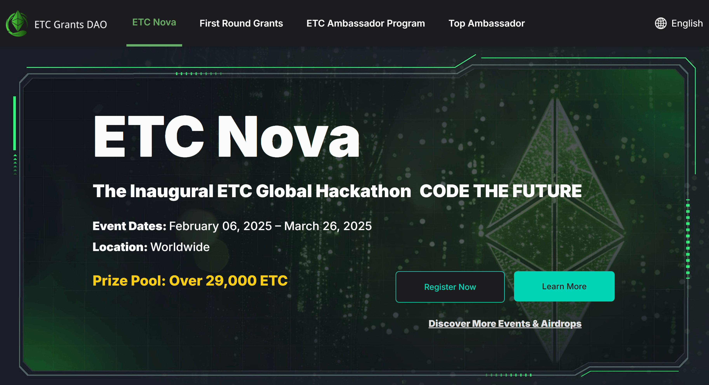
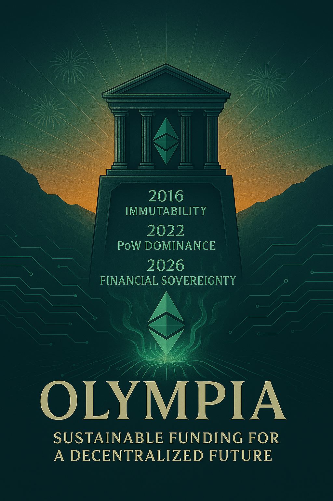
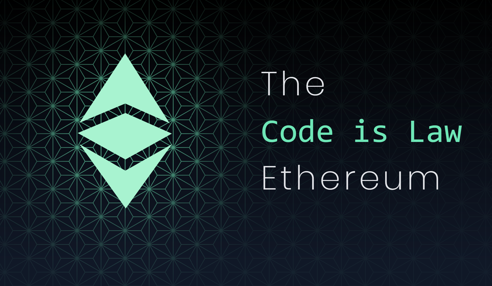
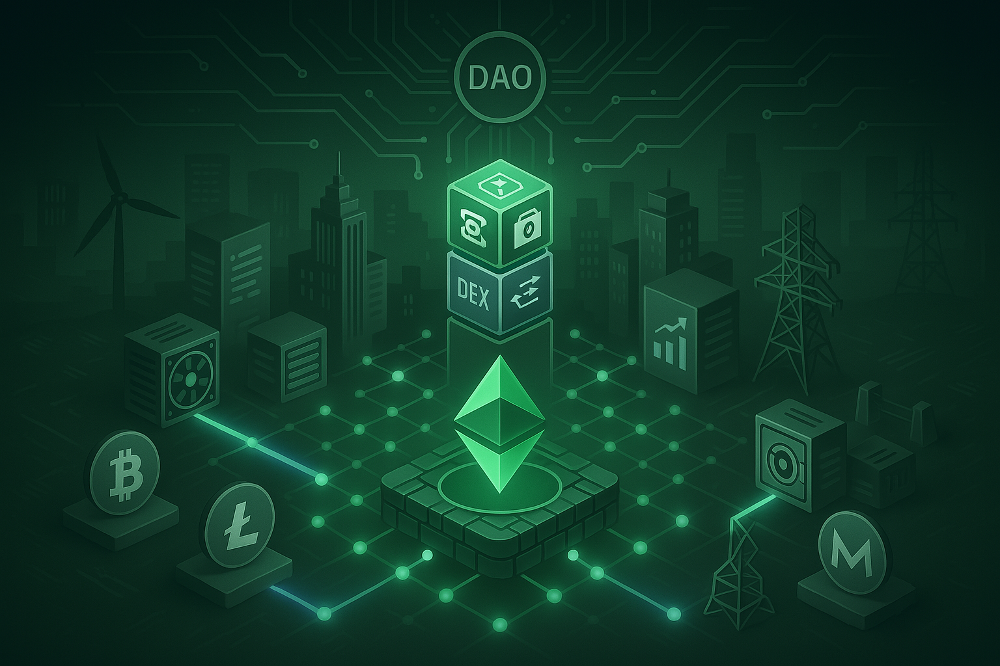
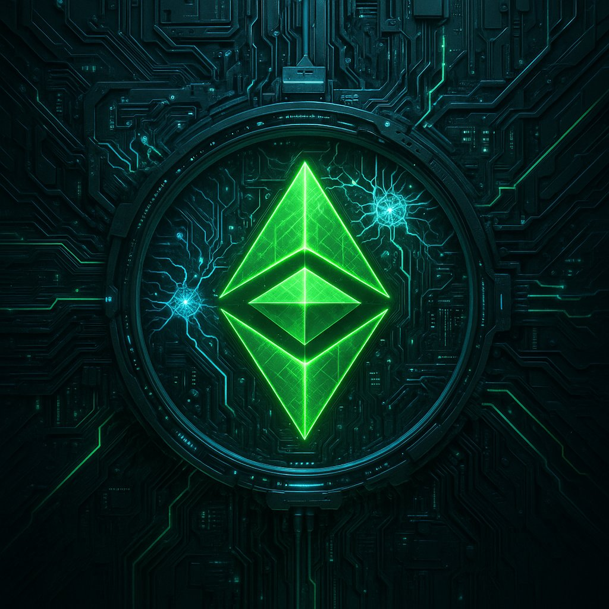

# A Decade of Integrity: Celebrating 10 Years of Ethereum Classic
### The Original Ethereum Vision, Uncompromised

---

## I. A Rare Milestone in Blockchain History

Few blockchain networks survive a full decade. Fewer still remain faithful to their founding principles.

As of mid-2025, only a handful of chains in the top 100 by market cap — including Bitcoin, Litecoin, and Monero — can trace their origins back to 2015 or earlier. Among smart contract platforms, just one holds that distinction while preserving Proof-of-Work: **Ethereum Classic**.

On **July 30, 2015**, Ethereum’s [Genesis Block](https://etc.blockscout.com/block/0xd4e56740f876aef8c010b86a40d5f56745a118d0906a34e69aec8c0db1cb8fa3) launched the first fully programmable, Turing-complete smart contract platform. Earlier systems like Counterparty, Omni, and BitShares experimented with programmability, but Ethereum was the first to embed a virtual machine into the protocol layer — enabling developers to deploy unstoppable applications directly to the blockchain.

But just a year later, in **July 2016**, Ethereum faced a defining crisis. Following the high-profile hack of **The DAO**, developers proposed a controversial hard fork — not to fix the network, but to reverse the outcome of a single smart contract.

The result was a split:

- **Ethereum (ETH)** became the forked chain — altering history to recover stolen DAO funds.  
- **Ethereum Classic (ETC)** preserved the original chain — unaltered, immutable, and governed by **“Code is Law.”**

Despite ETH retaining the branding, ETC is the original ledger, continuing from the genesis block without violating consensus. In an industry shaped by forks, funding pressures, and governance drift, Ethereum Classic remains a rare exception — a network that has endured not because it pivoted, but because it didn’t.

---

## II. Ethereum Classic Was Not Born — It Was Preserved

Ethereum launched with a revolutionary promise: **“Build Unstoppable Applications.”**

Its design offered developers a way to write code that no person or institution could censor, pause, or override. This commitment to immutability attracted a wave of users and builders — all aligned under one principle: **Code is Law.**

That vision met its first serious test in 2016 with the launch of **The DAO**, a decentralized venture fund built on Ethereum. Within weeks, it raised over **$150 million**, representing nearly **14% of all ETH in circulation**. It was the largest crowdfunding event in crypto history — until it was hacked.

A reentrancy vulnerability allowed an unknown attacker to drain **3.6 million ETH**. Yet the Ethereum protocol itself had not failed — the DAO contract had. And according to its own terms:  
> *“The DAO’s code controls and sets forth all terms.”*

Nevertheless, panic swept the community. Under pressure from stakeholders and exchanges, the Ethereum Foundation proposed a hard fork to undo the exploit. A rushed “coin vote” — with no quorum, 6% turnout, and one whale contributing 25% of all votes — was used to justify the change.

On **block 1,920,000**, the fork was executed. A one-time surgical state override moved funds from the attacker’s address to a recovery contract.

The community celebrated. But the contract layer — once believed untouchable — had been breached. A blockchain had reversed its own history.

---

## III. Declaring Independence

Not everyone agreed with Ethereum’s decision to hard fork. For a vocal minority of miners, developers, and users, the rollback of The DAO contract wasn’t a solution — it was a **capitulation**. It established a dangerous precedent: that in moments of controversy, consensus could be overwritten, contracts could be edited, and the rules could be changed by those with influence.

So on **July 20, 2016**, at **block 1,920,001**, they quietly resisted.

Instead of upgrading to the forked Ethereum client, they launched their nodes with the `--oppose-dao-fork` flag — opting out of the rewrite and continuing the original, unedited chain. There was no coordinated protest, no foundation press release. There was simply a refusal to abandon the ledger.

They weren’t launching a new chain.  
They were **preserving the real one**.

### The Chain That Refused to Die

Within 72 hours, Ethereum Classic gained market legitimacy:
- **Poloniex** became the first major exchange to list ETC, followed quickly by **Kraken**, **Bitfinex**, and others.
- Developers from across the Ethereum ecosystem began modifying clients. **Parity** and **Geth** released updated versions with full native support for ETC.
- OTC desks began quoting two-sided ETC markets.
- Miners — including some who had no stake in The DAO — redirected hashpower in defense of the original ruleset.

What many had dismissed as a “dead chain” was proving to be anything but. A new community quickly began to form — one united not around personalities or speculation, but a core principle:  
> **Immutability must be unconditional — or it is meaningless.**

### The Declaration of Independence

On **August 13, 2016**, the newly galvanized Ethereum Classic community published its first formal manifesto: the *Ethereum Classic [Declaration of Independence](https://ethereumclassic.org/blog/2016-08-13-declaration-of-independence)*.

> *“Let it be known to the entire world that on July 20th, 2016, at block 1,920,000, we as a community of sovereign individuals stood united by a common vision to continue the original Ethereum blockchain — truly free from censorship, fraud, or third-party interference.”*  
>  
> *“In realizing that the blockchain represents absolute truth, we stand by it, supporting its immutability and its future.”*

This wasn’t just branding. It was a **constitutional document** — a public affirmation that Ethereum Classic would not abandon its users, its contracts, or its history, no matter the political or financial cost.

It was not a fork. It was a **refusal to forget**.  
It was the moment Ethereum Classic declared itself **sovereign**.

### Resistance and Relevance

Ethereum Classic faced coordinated attempts to erase it. It was labeled a “zombie chain.” ETC discussions were censored on Reddit and Gitter. Prominent Ethereum supporters even formed **51Pool.org** to coordinate a hashrate attack.

But ETC’s defenders asked for only one thing: **neutral hash** — not allegiance, just fairness. Miners responded. The attack never materialized. **ETC survived.**

In doing so, it became the first chain to assert that **not every fork is an upgrade**, and that **immutability is a constraint — not a feature**. It validated the principle that social consensus cannot be a backdoor for rewriting contract law.

---

## IV. Ethereum Classic’s Unique Position in the Blockchain Landscape

By surviving the DAO Fork, Ethereum Classic preserved not just a chain — but a role that no other network has filled since.

With Ethereum’s 2022 transition to Proof-of-Stake, ETC became the **only major programmable blockchain still secured by Proof-of-Work**. It is fully **EVM-compatible**, **Turing-complete**, and **neutral**.

Other decade-old PoW chains like Bitcoin, Bitcoin Cash, Litecoin, Dogecoin, and Monero serve important purposes — but none offer smart contract functionality. Ethereum Classic is the **only energy-secured smart contract platform** in existence.

### Its distinguishing traits include:
- No premine and no centralized foundation  
- Predictable, Bitcoin-inspired monetary policy (**5M20**)  
- Ethash hashrate dominance  
- Upgrade conservatism and backwards compatibility

In a space saturated with “move fast and fork things” mentalities, ETC’s value proposition is simple:  
**Don’t break the base layer.**

Developers who want neutrality.  
Institutions that need legal predictability.  
Users who want true finality.

For them, Ethereum Classic offers a settlement layer they can trust to **never betray its code or its ledger**.

---

## V. The Post-Merge Era — Proof-of-Work’s New Home

When Ethereum finalized its transition to Proof-of-Stake in **September 2022**, it marked the end of mining on the world’s most widely used smart contract platform. In a single moment, billions of dollars in mining infrastructure — from industrial-scale GPU farms to ASIC rigs and hosting facilities — were rendered obsolete.

But while Ethereum was turning off its hashrate, **Ethereum Classic had been preparing for this moment for years**.

Back in **2020**, ETC implemented the **Thanos upgrade**, transitioning to **ETChash**, a modified version of Ethash. This upgrade reduced the DAG size and growth rate, extending the lifespan of GPU miners and preserving decentralization at the consensus layer. Crucially, it made Ethereum Classic a **plug-and-play destination** for displaced Ethash miners.

As The Merge drew closer, Ethereum Classic delivered a clear and uncompromising message to the mining community:

> **“We are committed to the Ethash mining algorithm. We are committed to Proof-of-Work. We are a stable home.”**

That commitment resonated.

In the weeks surrounding the Merge, Ethereum Classic’s hashrate **surged over 500%**, reaching new all-time highs above **300 TH/s**. Mining pools, firmware developers, and ASIC manufacturers retooled for ETChash. Dashboards and wallets added native support. For the first time since the DAO Fork, ETC wasn’t just enduring — it was thriving as the **natural successor to Ethereum’s Proof-of-Work legacy**.

Even **Vitalik Buterin**, Ethereum’s co-founder, publicly acknowledged ETC’s role:

> *“If you like Proof-of-Work, you should use Ethereum Classic. It's a totally fine chain. It’s the original Ethereum.”*

What began as an ideological holdout was now being recognized as **Proof-of-Work’s new home** — not by compromise or hype, but by consistent technical choices and a decade of principled execution.

### Institutional Backing and Global Growth

In **July 2022**, **Bitmain** and **Antpool** committed **$10 million** to the **[ETC Grants DAO](https://x.com/ETCGrantsDao)**, funding protocol development, tooling, and education. In 2025, ETC Grants DAO launched the **ETC Nova Hackathon** for dApp development and the **ETC Ambassador Program** to increase social awareness of Ethereum Classic.

Meanwhile, ETC took stage at the **Proof-of-Work Summit** (Prague 2023, Frankfurt 2024), where miners, developers, and economists gathered to discuss Ethereum Classic’s role as the **programmable financial backbone** for Proof-of-Work assets like **Bitcoin, Litecoin, Dogecoin, and Monero**.

Importantly, institutional exposure to ETC has been quietly growing for years. In **2017**, **Grayscale Investments** launched the **Grayscale Ethereum Classic Trust (ETCG)** — its second-ever crypto product after Bitcoin, and still its **second-largest single-asset holding**. ETCG has provided long-term, compliant access to ETC for institutional investors and family offices, with strong regulatory standing and no unresolved classification issues.

Now, following the approval of spot Bitcoin ETFs in the U.S., Ethereum Classic is widely considered a strong candidate for ETF conversion. With its **Proof-of-Work consensus**, **lack of premine**, and **longstanding treatment as a non-security**, ETC is well-positioned to be among the first smart contract platforms to receive ETF status — **likely within this administration**.

---

## VI. Olympia — Sustainable Funding Without Compromise

Despite its growth, Ethereum Classic long faced a structural challenge: it had **no protocol-native funding mechanism**.

The **2025 [Olympia Upgrade](https://medium.com/@ethereum-classic/whats-olympia-why-now-bef537babcda)** proposal changed that.

By introducing **Type-2 transactions** (EIP-1559-compatible) with a twist, Olympia redirects **BASEFEE** not to a burn address, but to an **immutable on-chain treasury**. *This treasury is governed by a tokenless DAO and standardized funding process (ECIP-1112–1114), with optional miner-smoothing via ECIP-1115.*

* Participation is **voluntary** — legacy transactions remain supported.
* Funds are **non-inflationary** — no new ETC is minted.
* The treasury is **immutable**, **non-upgradable**, and **governance-isolated**.

**Olympia** represents a historic achievement in chain sovereignty:
A **self-funding public infrastructure model** that aligns with ETC’s founding values.

---

## VII. Code is Law Prevails

Over the past decade, Ethereum Classic has weathered nearly every trial a blockchain can face.

It was **abandoned** by its founding developers and dismissed by much of the industry. It endured public **smear campaigns**, **social censorship**, repeated **51% attacks**, and coordinated efforts to destabilize its credibility. From **Twitter takeovers** to long periods of **funding scarcity** and market neglect, Ethereum Classic stood exposed — often alone.

Yet through it all, the chain **never altered its rules**. It never reversed a transaction. It never wavered from the principle that launched it: **Code is Law**.

Where other networks adjusted to the whims of politics, sentiment, or convenience, Ethereum Classic chose the harder path — one defined by discipline and clarity. It paid the price in silence and criticism. But in time, that consistency became its **greatest asset**.

Today, the market increasingly values what Ethereum Classic has always offered:

- A **settlement layer** that is truly neutral  
- A **protocol immune to special interests**  
- **Finality** that cannot be revoked by governance votes  

For developers building long-term infrastructure, for institutions seeking credible neutrality, and for users who demand unbreakable guarantees, Ethereum Classic stands alone:  
A chain that does not flinch under pressure — because it never granted anyone the power to bend it in the first place.

In Ethereum Classic:
> What you deploy is what executes.  
> What you sign is what settles.  
> What you earn is what you own.

**Code is Law. Still. Always.**

---

## VIII. A Permissionless Future for Proof-of-Work Assets

For ten years, Ethereum Classic has proven that a blockchain can endure without compromise — not by being the fastest or most popular, but by being the most principled.

Now, in **2025**, Ethereum Classic is entering a new chapter — one not just of survival or vindication, but of **leadership**.

With Ethereum long gone to Proof-of-Stake, and legacy chains like Bitcoin, Litecoin, and Monero unable to support native smart contracts, ETC stands alone as the **programmable, censorship-resistant financial layer** of the Proof-of-Work ecosystem.

This is not a speculative vision — it is a practical one. It’s already happening.

### The Smart Contract Hub for PoW

Ethereum Classic now offers a programmable home for:

- **Tokenized ASICs and hosting contracts**, where mining rights and payouts can be exchanged as NFTs  
- **Permissionless bridges** to Bitcoin, Dogecoin, and Monero, enabling atomic swaps and privacy-preserving transfers between non-Turing complete chains  
- **Stablecoin issuance and settlement**, allowing PoW-denominated trade in fiat-pegged assets like [Classic USD](https://classicusd.com) ($USC)  
- **Lending and collateral markets** for mining hardware, PoW asset treasuries, and long-term hashrate contracts  
- **Decentralized identity and escrow systems** optimized for adversarial, high-value environments  

This isn’t “DeFi” in the speculative, liquidity-chasing sense — it’s DeFi in the **sovereign infrastructure sense**.

Ethereum Classic is becoming a place where the world’s most secure but least programmable assets — **Bitcoin, Litecoin, Monero, Dogecoin** — can finally interact through a **trust-minimized, energy-secured, smart contract environment**.

### A Base Layer for the Energy Economy

As the crypto industry matures and expands into real-world use cases, the need for **credible, apolitical, settlement infrastructure** becomes paramount.

Ethereum Classic is uniquely suited to serve this role:

- It is secured by **energy and hashrate**, not validator politics  
- It offers **smart contract programmability** without exposing users to upgrade churn or on-chain governance drama  
- It has a **stable, Bitcoin-inspired monetary policy**, and a **non-inflationary funding mechanism** through Olympia  

It is, quite literally, a **decentralized global energy market for blockchain compute** — one where programmable PoW assets can be traded, collateralized, tokenized, and hedged using logic that **cannot be censored or reversed**.

As centralized platforms fragment and Proof-of-Stake systems experiment with governance-heavy models, Ethereum Classic provides a base layer that is **sovereign, neutral, and unstoppable by design**.

---

### What Comes Next

Ten years ago, Ethereum Classic was not supposed to exist.  
But it does — and today, it thrives.

Not because it was easy.  
Not because it was popular.  
But because it was right.

In the years to come, the world will continue to test the limits of decentralization.  
More DAOs will be hacked.  
More chains will be captured.  
More governance models will be manipulated.  
More networks will pivot.

And when that happens, the need for a chain that **doesn’t bend** will only grow stronger.

Ethereum Classic may not win every narrative war.  
It may not win every TVL race.  
But it doesn’t have to.

Because when the rest of the world comes looking for a chain that **cannot be stopped**,  
a ledger that **cannot be rewritten**,  
and a contract layer that **cannot be compromised**,  

**Ethereum Classic will be there.**

> Still running.  
> Still neutral.  
> Still immutable.  

**A decade of integrity — and just getting started.**  
**Bitcoin is Plan B. Ethereum Classic is Plan C. Stay Classy.**

