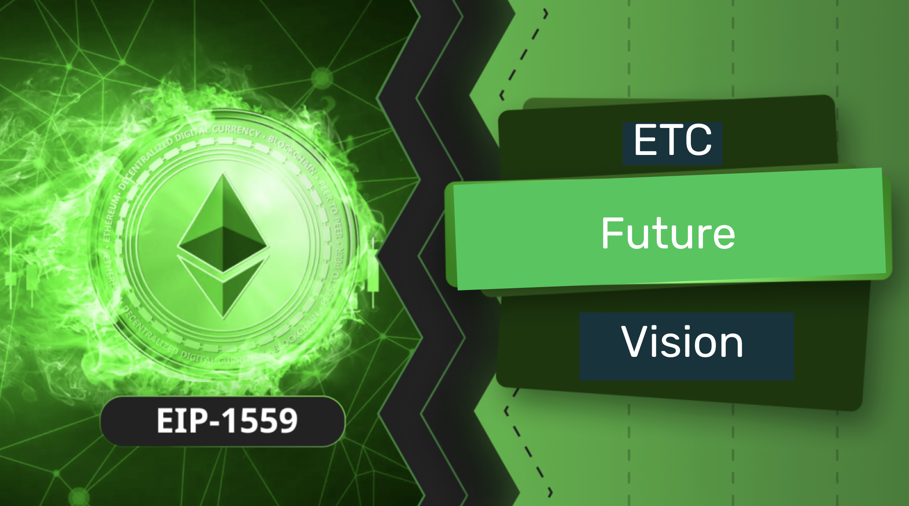

In the last [ETC Community Call](https://youtu.be/N9zab2XWLVI?si=oDuLYkuXgrYNZJB-) the possible integration of EIP-1559 was discussed. In the same conversation the question was raised that the ETC community should have a discussion about its future. 

As I have written in [many articles](https://ethereumclassic.org/news/tag/blog) and said [in many videos](https://www.youtube.com/@ETCupdates) all of which have been published on this website, ETC's competitive advantages are that it is a proof of work blockchain, that it has a fixed monetary policy, and that it is programmable. These three things combined and fully integrated in one single layer zero system make it unique in the world. 

However, although ETC is just like Bitcoin but programmable, the fact that it is programmable makes it also very similar to Ethereum. Indeed, Ethereum Classic is the original Ethereum!

This fact begs the question whether the community will continue to mimic ETH in terms of its updates and innovations or if ETC must forge its own path in terms of its operation, design, usability, and method.

In my opinion, ETC should be as close as possible to ETH, which is currently the EVM standard, provided that it does not jeopardize its true and most fundamental value: Decentralization. If that is compromised, then it must break off and separate.

It is important to note that there are very few truly decentralized blockchains in the world. Perhaps only Bitcoin, ETC, Litecoin, Doge, and probably Monero. Otherwise, the whole blockchain industry has opted for money grabs and the pretense of innovation, with the guise of decentralization, desperately trying to impress investors and traders with new technologies and methods for the sake of artificially inflating the value of their tokens. This has led most projects to sacrifice decentralization and adopt compromised technologies in terms of decentralization such as Proof of Stake, Proof of Authority, dubious layer 2 systems, and on-chain funding mechanisms called treasuries among many others.

In this noisy context and environment there are many temptations to follow the most shiny objects and fall into the abominable traps of centralization. This must be avoided at all costs in ETC.

Having said the above, my vision for ETC is that it is intrinsically sufficient as it is. It doesn't even need EIP-1559. This means that it should, in general, adjust some parameters or fix some minor details every now and then, but it should be considered complete as it is. 

ETC must remain as a fully integrated Proof of Work programmable blockchain and just wait for the market to realize all the rest are lies. We must stop falling for sparkly and shiny things that catch everyone's attention but that are false innovations, with false promises, with false advantages.

The only advantage of the blockchain industry is decentralization. And the only true innovations in the sector have been POW and smart contracts. Nothing more. 

ETC is the only one in the world with both!

In a world with AI, CBDCs, POS and POA centralized blockchains, scoring systems, climate hysteria, and the one-global-government agenda, the only tools for people in the planet to escape the techno-tyranny that is coming, to protect their wealth and liberty, will be BTC and ETC.

If in the meantime, we see a constant flow of false projects flooding the market and confusing the world with their lies, and ETC gets no funding and dies, then it is better that it dies than to try to perpetuate it while totally centralizing its design.

In terms of how to decide these things, and what upgrades to integrate, ETC actually has a very robust system with its ECIP process and community debates like the one we had in the last few days. In truly decentralized systems, formal roadmaps and future visions cannot exist, otherwise they would confirm that the system is centralized, therefore already dead.

But ETC will never die. This is because it has already won, because it is already good. In a world of lies, ETC is true. This is its value. 

---

**Thank you for reading this article!**

To learn more about ETC please go to: https://ethereumclassic.org
