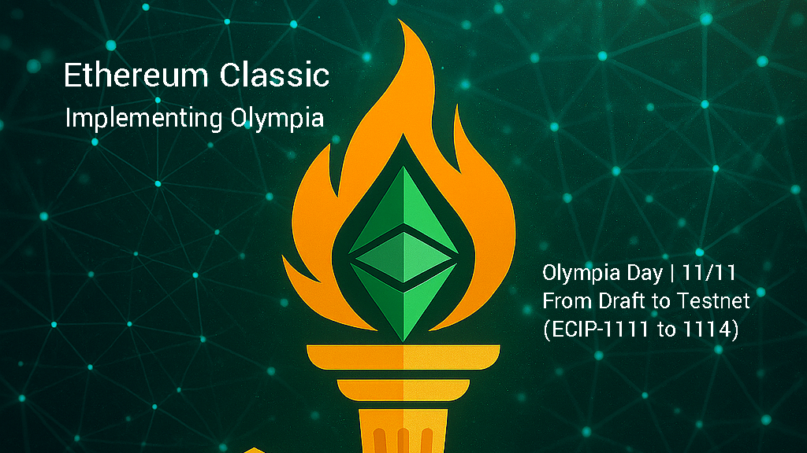

# Implementing Olympia: From Draft to Testnet
**November 11, 2025**

---

## Part 0: The Transition from Research to Reality

It’s fitting that this transition begins on **11/11** — a date that mirrors the number at the heart of Olympia’s foundation: **ECIP-1111**.  
On this day, often celebrated as a symbol of alignment and renewal, **Ethereum Classic moves from years of research into the first phase of implementation.**

After nearly a decade of debate and experimentation, Ethereum Classic enters a new phase of maturity.

The **Olympia upgrade suite (ECIPs 1111–1114)** — discussed in various forms from 2016 through 2024 and formally proposed in 2025 — has evolved from a series of conceptual drafts into a coordinated, step-by-step implementation plan now preparing for **testnet deployment**.

This milestone marks the first time in Ethereum Classic’s history that the network will integrate an **opt-in, voluntary, protocol-native, non-inflationary funding system** directly into its consensus logic.  
Olympia represents the culmination of a long-standing goal: establishing a **sustainable, decentralized mechanism** to fund client development, public infrastructure, and ecosystem maintenance.

---

## Why Olympia Matters

Proof-of-Work networks face a fundamental long-term challenge: as block subsidies decline, miner incentives must increasingly depend on transaction fees to maintain network security.

Ethereum Classic’s fee market does not yet provide the stable, predictable incentives needed to align miners, developers, and users around lasting network security.

In the absence of such alignment, **donation-based funding** has remained the fallback — a model that has repeatedly proven fragile, with major development teams dissolving every few years throughout ETC’s history — often leaving community volunteers to maintain core infrastructure until new teams emerged.

Olympia introduces a framework that unites all participants — miners, developers, and ecosystem contributors — around a transparent, self-sustaining fee market, while giving the traditional donation model a clearer, more accountable path for continued support.

It establishes an on-chain system that reveals the baseline funding requirements necessary for Ethereum Classic to function reliably for:

- **Miners** — secure the network and rely on stable clients, predictable income streams, and liquid markets to convert rewards into operating capital.  
- **Core Developers** — maintain clients and tooling and rely on open, auditable funding and proposal systems to contribute effectively.  
- **Donors and Ecosystem Sponsors** — support the network’s growth but seek a transparent, on-chain funding system that replaces costly, centralized grant models and prevents any single entity from becoming the network’s de facto maintainer.  
- **Off-Chain Services** — provide institutional and financial infrastructure through exchanges, custodians, and TradFi integrations that depend on modern, well-maintained clients.  
- **Application Developers** — expand demand for blockspace and rely on a modern, actively maintained EVM that remains interoperable with upstream tooling and programmability.  
- **End Users** — depend on stable, secure systems to transact efficiently, self-custody assets, and enjoy a first-class user experience.

---

## Beyond Funding — Aligning Incentives in Proof-of-Work

Yet Olympia goes beyond funding alone — it also addresses the economic alignment problem at the heart of Proof-of-Work itself: the long-term incentive structure that ensures miner participation and network security.

By introducing an **opt-in transaction type** that redirects `BASEFEE` revenue into both a **network treasury** and a **smoothed payout system for miners**, Olympia ties the health of the fee market directly to the security of the chain.

Within ECIP-1111, one design consideration under review is the **L-curve distribution model** — a mechanism that smooths `BASEFEE` payouts across multiple blocks.  
This model creates steadier income for miners by spreading fee rewards over several blocks and providing predictable revenue, while also channeling a portion of the `BASEFEE` into sustainable core development funding.

In essence, Olympia introduces a single, elegant mechanism to solve two of Proof-of-Work’s oldest challenges:

1. **Securing miners’ long-term incentives**  
2. **Ensuring continuous, decentralized development**

**Shared principle:**

> When on-chain activity grows, so do the incentives that sustain miners, fund development, and strengthen the network as a whole.

With the proposed smoothing model, miners enjoy steady fee flows even as block rewards decline — reinforcing network security — while the same `BASEFEE` revenue supports client maintenance, infrastructure, and ecosystem growth.

In addition, Olympia’s new transaction type preserves **compatibility with modern wallet and exchange standards**, ensuring Ethereum Classic remains fully integrated within the broader cryptocurrency ecosystem — from centralized exchanges to open-source browser wallets.

---

## The Significance of 11 / 11

**Olympia Day — 11 / 11 / 2025** marks the moment Ethereum Classic begins implementing the Olympia upgrade suite.
Just as ECIP-1111 anchors the technical foundation of Olympia, 11/11 now anchors its timeline — signifying the transition from theory to practice, from drafts to deployment.

On this date, Ethereum Classic reaffirms its role as **the programmable Proof-of-Work network built to last**, aligning security, sustainability, and self-sovereignty within a single, immutable system.

---

## The Four Pillars of Olympia

The Olympia upgrade suite is built on four coordinated ECIPs, each addressing a specific layer of Ethereum Classic’s sustainability and governance model:

### 🔹 ECIP-1111 — BASEFEE Redirection & L-Curve Smoothing

The foundation of Olympia. ECIP-1111 introduces the **EIP-1559 fee mechanism** into Ethereum Classic while redirecting the burned `BASEFEE` to a **protocol-level treasury**.  
The new transaction type is **opt-in, voluntary, and fully additive**, with legacy transaction types (Type-0 and Type-1) continuing to function unchanged.

This adaptation maintains full **EVM compatibility** while ensuring every transaction strengthens ETC’s sustainability instead of removing value from circulation.

The **L-curve smoothing model** distributes redirected `BASEFEE` revenue across multiple blocks to stabilize miner income and strengthen long-term security — complementing ECIP-1017’s deflationary schedule and aligning incentives around a healthy, fee-driven economy.

---

### 🔹 ECIP-1112 — The Immutable Treasury Contract

Defines a **minimal, immutable, protocol-level smart contract** that receives all redirected `BASEFEE` revenue.  
This contract functions as **Ethereum Classic’s first on-chain funding vault**, with transparent accounting and no administrative keys.  
Every coin received is **auditable, visible, and governed by protocol logic alone.**

---

### 🔹 ECIP-1113 — The Olympia DAO Governance Framework

Establishes the **Olympia DAO**, a modular governance framework to manage treasury disbursements through **on-chain voting**, **quorum thresholds**, and **time-locked execution**.  
It introduces the **Olympia Improvement Proposal (OIP)** process — a structured way to evolve governance, deploy new child-DAO pipelines, or modify parameters without new hard forks.

---

### 🔹 ECIP-1114 — The Funding Proposal and Disbursement System

Defines the **Ethereum Classic Funding Proposal (ECFP)** standard — the interface between contributors and the treasury.  
Any developer, researcher, or organization can submit a proposal with milestones, budgets, and on-chain progress tracking.

Approved proposals are executed automatically through the DAO, ensuring transparent, auditable, and milestone-based disbursements that remove the friction and opacity of manual grant programs.

---

### 🔁 Together, these four ECIPs form a closed-loop system:

- **Revenue generation** through network activity  
- **Secure custody** of funds  
- **Decentralized governance** via Olympia DAO  
- **Transparent funding** of public goods  

This architecture transforms Ethereum Classic from a **donor-dependent network** into a **self-funding, self-governing public utility** — powered by on-chain activity and aligned incentives.

---

## Pioneering PoW: A First Among Proof-of-Work Networks

While most PoW chains rely on centralized foundations or off-chain grants, **Ethereum Classic can now finance its own evolution through protocol logic**.

Olympia demonstrates what only a **smart-contract-capable Proof-of-Work network** can achieve — a sustainable economic loop that rewards security, development, and utility, **without inflation or trusted intermediaries**.

It preserves the values that defined ETC in 2016 — **immutability, Proof-of-Work, and credible neutrality** — while finally addressing the long-standing challenges of decentralized, durable funding and long-term network security.

---

## The Road Ahead

This series, **Implementing Olympia: From Draft to Testnet**, will chronicle the transition from concept to code.  
Over the coming months, we’ll explore:

- The engineering of the ECIP-1111 BASEFEE and proposed L-curve mechanism  
- The design and audit of the ECIP-1112 Treasury Contract  
- The structure and deployment of the ECIP-1113 DAO Framework  
- The workflow and transparency of the ECIP-1114 Funding Process  

Together, these explorations document how Olympia moves from draft to deployed code — setting the stage for **mainnet activation**.

Each installment will take readers deeper into the contracts, logic, and governance systems now moving toward ETC’s testnets — showing how Olympia is being implemented to be **auditable, adaptable, and permanently decentralized.**

---

## A Bright Future: The Olympia Implementation Era Begins

**Olympia Day — 11 / 11 / 2025** marks the moment Ethereum Classic begins implementing the Olympia upgrade suite.  
Olympia is not a single hard fork; it’s the start of a **living framework** where on-chain activity directly powers network longevity.

For miners, developers, ecosystem sponsors, and long-time community members alike, this marks a return to Ethereum Classic’s founding ethos:

> “A credibly neutral, self-sustaining Proof-of-Work network built to last — secured by miners, maintained by builders, supported by institutions, and enforced by code.”

---

## Next in the Series

👉 **Part 1 — Implementing ECIP-1111: BASEFEE Redirection and Miner Alignment**

💚⚒️
*Ethereum Classic Core Devs*
