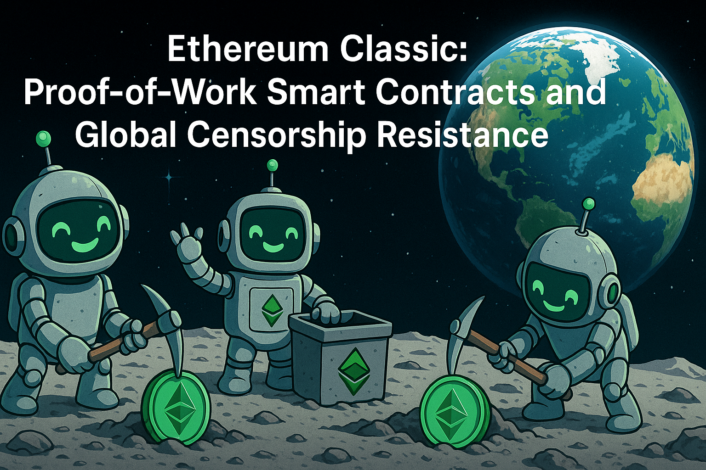

Ethereum Classic is currently the largest proof-of-work smart contract platform. The network operates at roughly 300 terahashes per second (TH/s), according to public hashrate trackers such as [2Miners](https://2miners.com/etc-network-hashrate). This represents approximately 90 to 95 percent of all Ethash or Etchash compatible hashing power across all networks.

This level of mining participation has practical implications. It supports a permissionless environment where individuals and organizations anywhere in the world can participate without identification or prior approval. It also strengthens resistance to censorship because mining hardware and miners themselves are geographically dispersed.

## Mining without permission

Anyone with compatible hardware can mine Ethereum Classic. The project’s mining guide at ethereumclassic.org/mining explains how to download mining software, connect to a pool, and begin contributing computational work. No registration, identity verification, or staking commitment is required.

Miners can operate on home computers, small rigs, or professional farms. They may connect through privacy-enhancing routing tools such as TOR, work through international mining pools, or mine solo. The protocol measures only proof-of-work computation and does not track the identity or location of the individual producing it.

In contrast, proof-of-stake systems require participants to lock assets in validator nodes. On Ethereum, this means holding 32 ETH to run a validator. Most participants use staking services provided by companies such as Coinbase, Kraken, or Lido, which operate within regulatory jurisdictions. These organizations maintain offices, personnel, and identifiable corporate structures.

## Censorship concerns after the Tornado Cash sanctions

When the U.S. Treasury’s Office of Foreign Assets Control sanctioned Tornado Cash in August 2022, the effects were visible across the Ethereum ecosystem. Research from the Federal Reserve Bank of New York documented that a noticeable share of Ethereum blocks began excluding transactions from sanctioned addresses. The report is available here:
https://www.newyorkfed.org/research/staff_reports/sr1112

Flashbots, a leading block-building infrastructure provider, added filters for sanctioned addresses. [The Block](https://www.theblock.co/post/173417/at-least-23-of-ethereum-blocks-are-complying-with-us-sanctions) reported that at least 23 percent of Ethereum blocks in October 2022 fell into this category:

After the sanctions announcement, Ethermine, which had been the largest Ethereum mining pool before the Merge, stopped processing Tornado Cash transactions as reported by [CryptoSlate](
https://cryptoslate.com/largest-ethereum-miner-ethermine-stops-processing-sanctioned-transactions)

Infrastructure providers also responded. Infura and Alchemy restricted API access to Tornado Cash contracts, and Circle froze USDC held in sanctioned addresses. These actions created cascading effects that influenced validator behavior.

## Why this matters for credible neutrality

The response to the Tornado Cash sanctions highlighted an important point about privacy and financial technology. Tools such as mixers and privacy protocols are not inherently criminal. Individuals and organizations use them for many ordinary reasons, including protecting salary information, safeguarding business activity, shielding wallet addresses from public association, or maintaining privacy while transacting in politically sensitive environments.
Law enforcement agencies already focus their efforts on the parts of the system where oversight is practical. These are the entry and exit points where digital assets are exchanged for fiat currency, such as centralized exchanges, custodians, and payment processors. These organizations maintain compliance programs, conduct reporting, and cooperate with investigations. Monitoring these regulated entities allows authorities to trace illicit activity without requiring the underlying blockchain to censor or restrict protocol-level transactions.

A blockchain network that maintains integrity at the consensus layer supports this balance. When the network remains neutral, it includes all valid transactions according to the protocol’s rules, regardless of their origin or social interpretation. This approach creates a consistent and predictable execution environment. Participants can rely on the network to process transactions fairly, and regulators still retain the ability to enforce laws at the surrounding on-ramps and off-ramps. Credible neutrality comes from the idea that the network itself should not interpret intent or apply policy but should focus on verifying validity.

## How proof-of-work responds differently

Ethereum Classic miners are not organized around validator sets, corporate entities, or identifiable operators. The mining ecosystem follows economic incentives rather than membership requirements. Several characteristics contribute to this:

### No identity requirements
Mining does not require formal registration. Participants can redirect their hashrate through different pools or network routes with minimal friction.

### Geographic distribution
Miners cluster where electricity costs are favorable. Regions such as Iceland, Kazakhstan, Texas, and parts of China and South America host mining operations because of local energy conditions. This geographic variety spreads risk and reduces the chance that a single government can influence a large percentage of hashrate.

### Low switching costs
If a miner encounters regulatory pressure in one jurisdiction, they can move their hashrate to a pool hosted elsewhere. The hardware works on any Etchash chain, and miners frequently switch pools for operational reasons.

### Hardware diversity
Ethereum Classic supports mining with both GPUs and ASICs. Etchash was introduced in ECIP-1099 (“Thanos”) to slow the rate at which the DAG file grows. This keeps older 4 GB and 6 GB graphics cards useful for longer periods:
https://ecips.ethereumclassic.org/ECIPs/ecip-1099

ASIC manufacturers such as Bitmain, Jasminer, and iPollo all produce miners compatible with Ethereum Classic. Examples include:

- iPollo V-series: https://ipollo.com/products/v1-mini-etchash
- Jasminer X16-Q Pro: https://www.jasminer.com/products/x16-q-pro
- Bitmain Antminer E9 models: https://shop.bitmain.com/products/antminer-e9

Since GPU mining remains common, the network does not rely solely on specialized hardware that could be restricted through export policy.

## Current mining landscape

When Ethereum transitioned to proof-of-stake in September 2022, most Ethash miners migrated to Ethereum Classic. Hashrate rose from approximately 65 TH/s to more than 275 TH/s within days, a shift covered by [CoinDesk](https://www.coindesk.com/tech/2022/09/16/ethereum-classic-hashrate-jumps-post-merge)

Today, miners distribute their hashrate across several pools such as:

- 2Miners (https://2miners.com/etc-mining-pool)
- F2Pool (https://www.f2pool.com/coin/etc)
- Hiveon (https://hiveon.com/pool/etc)

MiningPoolStats tracks dozens of active pools:
https://miningpoolstats.stream/ethereumclassic

Solo mining is still practical for small and mid-size operators. Sites such as https://etc.solopool.org provide estimates for finding blocks with moderate hashrate levels.

## Security considerations

Because Ethereum Classic dominates the available Ethash and Etchash hashrate, acquiring sufficient hardware for an attack is difficult. NiceHash removed support for Etchash after the ECIP-1099 upgrade, which limits the ability to rent short-term hashrate.

Performing a majority attack would require acquiring a large number of ASICs or GPUs, which involves high capital cost and lengthy procurement times. The attacker would also suffer opportunity costs because mining produces a steady revenue stream.

Block rewards currently total approximately 2.56 ETC per block, and around 6,000 blocks are mined each day. At an ETC price near $16, this results in roughly $250,000 to $300,000 in daily miner revenue. Any attack must exceed both capital and opportunity costs for participants already earning predictable returns.

### Position within the broader ecosystem

Ethereum Classic offers smart contract functionality with a proof-of-work security model. Bitcoin also uses proof-of-work but does not provide a general-purpose execution environment. Ethereum provides a rich smart contract ecosystem but relies on proof-of-stake consensus.

ETC remains EVM-compatible. Development guides are available at:
https://ethereumclassic.org/development/guides

Applications written for Ethereum can generally be deployed on Ethereum Classic without modification. The difference lies in the consensus mechanism and associated security characteristics.

## Conclusion

Ethereum Classic demonstrates that a proof-of-work smart contract platform can maintain strong mining participation and broad geographic distribution even after the shift of Ethereum to proof-of-stake. The network’s mining architecture encourages anonymous participation, supports both GPUs and ASICs, and spans many jurisdictions. These characteristics create structural resistance to censorship and central control.

The platform trades higher energy use and a smaller ecosystem for these properties. For applications that require permissionless participation and resilience to regulatory pressure, Ethereum Classic offers a distinctive set of features within the family of EVM-compatible blockchains.

