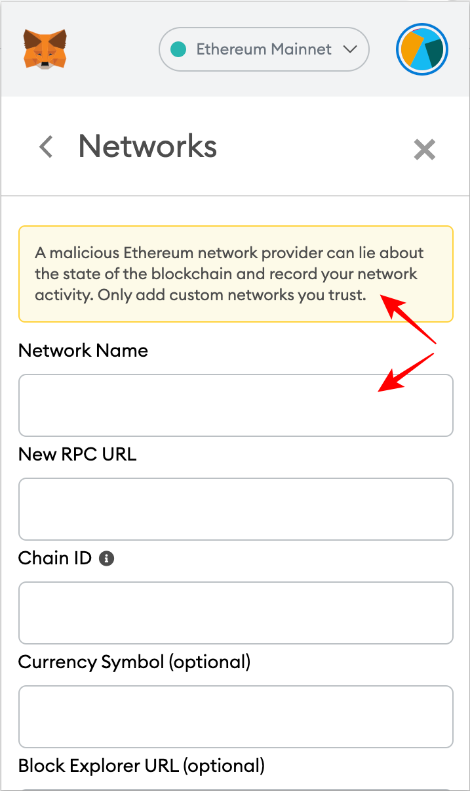
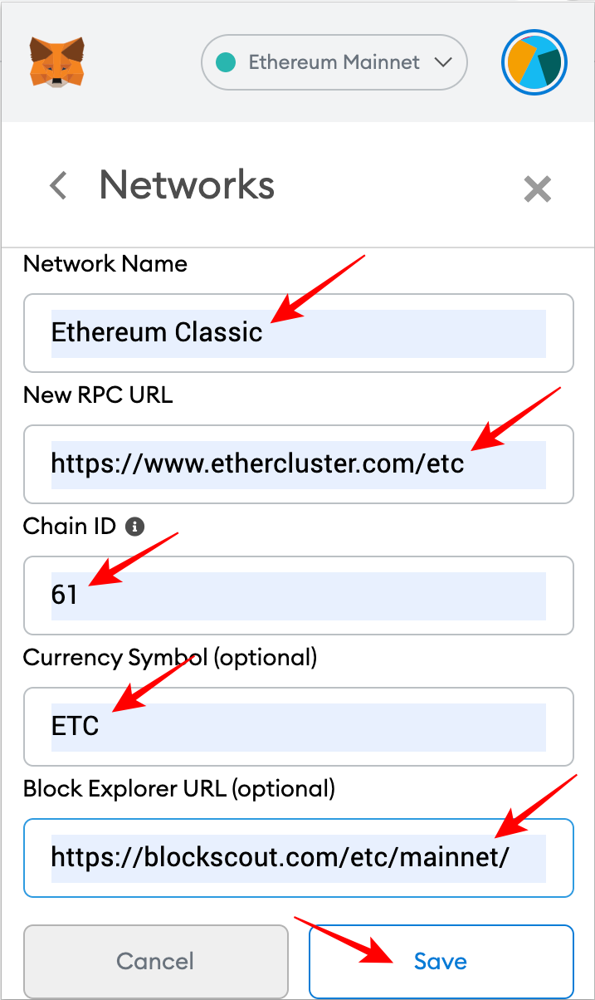

import AddNetwork from '../../../src/components/addNetwork.js'

**⚠️ Update**  
You can now easily add ETC to MetaMask by clicking "Connect-Wallet" on ChainList:

<AddNetwork />

You can find this link at the bottom of every page on this website.

---

[MetaMask](https://metamask.io) can be used as a wallet to manage your ETC and Tokens, as well as interact with applications that support it. This post explains how to start using MetaMask with the Ethereum Classic (ETC) network.

You may also consider [Nifty Wallet](https://chrome.google.com/webstore/detail/nifty-wallet/jbdaocneiiinmjbjlgalhcelgbejmnid?ucbcb=1), a fork of MetaMask that supports ETC out of the box.

## 1. Log Into MetaMask

The first step is to log in to unlock your MetaMask.

## 2. View Initial Screen

You will see your normal initial screen. In this case the default network is Ethereum (ETH) and your account will be shown as usual. As you use other networks, they will show as the default when you unlock your MetaMask if they were the last ones used.

In my case, it shows Ethereum as the initial network, and I have a zero balance in my ETH account `0x48c1...EfF3`.

## 3. Open the Networks Dropdown Menu

The next step is to open the networks dropdown menu. You can do this by clicking on the bar where you see the default network.

As it may be seen above, the default list of networks is the Ethereum mainnet and its most popular testnets.

The “Local Host 8545” would be a connection to an Ethereum node if you were running one in your machine.

“Custom RPC” is the option to add custom networks, in this case ETC.

“RPC” stands for “remote procedure call”, which is the term for the protocol machines use for programs to call other programs in remote machines.

## 4. Select Custom RPC

So, the next step is to click on “Custom RPC”.

## 5. View the New Network Form

After selecting “Custom RPC” you will see the form to add a network. It has a security message at the top and five options with empty fields to enter the new network you want to use:

- Network Name: The name of the network you want to add.
- New RPC URL: A URL for the network RPC you want to add.
- Chain ID: The ID to send and direct transactions to the network you want to add.
- Currency Symbol (optional): The currency symbol of the network you want to add. For example, “ETH” is the symbol for Ethereum, and “ETC” is the symbol for Ethereum Classic.
- Block Explorer URL (optional): MetaMask has links to blockchain explorers per network to check account history, new transactions sent, and balances on them, so here you would add a block explorer for the network you want to add.

## 6. Enter the Ethereum Classic Network Information

The next step, is to add Ethereum Classic’s specific information. Below is the network data I used:

- Network Name: `Ethereum Classic`
- New RPC URL: `https://www.ethercluster.com/etc`
- Chain ID: `61`
- Currency Symbol (optional): `ETC`
- Block Explorer URL (optional): `https://blockscout.com/etc/mainnet/`

For the “RPC URL” I used the one provided for this purpose by the [ETC Cooperative](https://etccooperative.org/), which is from a product they built called [Ethercluster](https://ethercluster.com/)

_[Editor Note] Ethercluster is now operated by [RIVET](https://rivet.cloud/). You can find more RPC Endpoints in the [network](/network/endpoints) section._

The “Chain ID” must be “61” because that is the specific ID of the Ethereum Classic network for sending ETC transactions by wallets and nodes to the operating blockchain.

Although the “symbol” and “block explorer URL” are optional, I recommend using “ETC” as the symbol because that is the widely known market symbol of the network, and BlockScout as the blockchain explorer because that is the one I usually use (but you can add your preferred one!).

Click “save” to add ETC to MetaMask.

## 7. View Ethereum Classic in the Networks Dropdown Menu

Once ETC is added, you will see in the networks dropdown menu that it is added to the list of networks.

## 8. You May View Your Same Account but on ETC

If you go to your account, you will notice that it is the same as your ETH account. In my case, it is the same `0x48c1...EfF3` account.

This is because both ETH and ETC use the same account format, so accounts on Ethereum may also be used in Ethereum Classic.

In fact, you may remember that I had a zero balance in my ETH account, but now a balance of 1 ETC may be seen in the same account, but on Ethereum Classic. This is because I sent 1 ETC to this account in the Ethereum Classic network for this demonstration.

Note also that the ETC network is now the one showing in the networks bar, and the “ETC” symbol is now used to show the balance.

## 9. You May Move Back to Ethereum With the Same Account

So, as both networks use the same account format you may move back to the Ethereum mainnet and you will be able to see your ETH account with the same number again.

## 10. You May Move Back to Ethereum Classic With the Same Account

To use the ETC network, simply select Ethereum Classic again in the networks dropdown menu where you will see your ETC balances again.

//

I wish you success investing in and using ETC!

---

** Code is Law **
