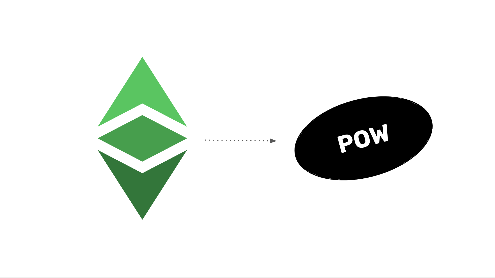

As we explained in the “Ethereum Classic Course” introduction, Ethereum Classic (ETC) is one of the most valuable blockchains in the world because it is the largest proof of work smart contracts blockchain and the most secure system to host and operate decentralized applications (dapps).

At the core of its value proposition is the technology of Proof of Work (POW). POW provides true decentralization, sound money, and the most trust minimized dapps. 

In this course, that we named the “ETC Proof of Work Course”, we will explain why POW is so revolutionary and how ETC benefits from it.

This course is divided in 8 sections that we list below. Each of sections 2 through 8 start with a post that describes the advantages of POW to ETC.

You can watch the full series in the following youtube [playlist](https://www.youtube.com/playlist?list=PLIzptAKK7iDTrbWd0JIJGXNrn9sVGVNoE).

<iframe width="100%" height="400" src="https://www.youtube-nocookie.com/embed/videoseries?list=PLIzptAKK7iDTrbWd0JIJGXNrn9sVGVNoE" title="YouTube video player" frameborder="0" allow="accelerometer; autoplay; clipboard-write; encrypted-media; gyroscope; picture-in-picture; web-share" allowfullscreen></iframe>

## Part 1: Describing POW

- [1. All the Components of Bitcoin Already Existed](/blog/2023-11-09-etc-proof-of-work-course-1-all-the-components-of-bitcoin-already-existed)
- [2. What Didn’t Exist Was a Secure Consensus Mechanism](/blog/2023-11-16-etc-proof-of-work-course-2-what-didnt-exist-was-a-secure-consensus-mechanism)
- [3. How Does Proof of Work Work?](/blog/2023-11-23-etc-proof-of-work-course-3-how-does-proof-of-work-pow-work)
- [4. Why POW Based Nakamoto Consensus Is Secure and Complete](/blog/2023-11-30-etc-roof-of-work-course-4-why-pow-based-nakamoto-consensus-is-secure-and-complete)
- [5. The POW Mining Difficulty Adjustment Explained](/blog/2023-12-17-etc-proof-of-work-course-5-the-pow-mining-difficulty-adjustment-explained)

## Part 2: Benefits of POW

- [6. ETC Is BTC Philosophy With ETH Technology](/blog/2023-12-14-etc-proof-of-work-course-6-etc-is-btc-philosophy-with-eth-technology)
- [7. The Revolutionary Benefits of Proof of Work](/blog/2023-12-21-etc-proof-of-work-course-7-the-revolutionary-benefits-of-proof-of-work)
- [8. POW Promotes Basic Rights](/blog/2023-12-28-etc-pow-course-8-pow-promotes-basic-rights)
- [9. The Meaning of Immutability in POW](/blog/2024-01-11-etc-proof-of-work-course-9-the-meaning-of-immutability-in-pow)
- [10. The POW Permissionless Paradox](/blog/2024-01-18-etc-proof-of-work-course-10-the-pow-permissionless-paradox)

## Part 3: Positioning of POW

- [11. A Model for Ethereum Classic and Ethereum Complementation](/blog/2024-01-25-etc-proof-of-work-course-11-a-model-for-etc-and-eth-complementation)
- [12. How Ethereum Proved that the POW Fee Model Will Work](/blog/2024-02-01-etc-proof-of-work-course-12-how-ethereum-proved-that-the-pow-fee-model-will-work)
- [13. There Will Only Be 3 or 4 POW Blockchains in the Future](/blog/2024-02-08-etc-proof-of-work-course-13-there-will-only-be-3-or-4-pow-blockchains-in-the-future)
- [14. POW Winners Compared to Global Reserve Currencies](/blog/2024-02-15-etc-proof-of-work-course-14-pow-winners-compared-to-global-reserve-currencies)
- [15. POW Will Be the Base Layer of the Blockchain Industry](/blog/2024-02-22-etc-proof-of-work-course-15-pow-will-be-the-base-layer-of-the-blockchain-industry)

## Part 4: Security of POW

- [16. The Three Pillars of Ethereum Classic](/blog/2024-02-29-etc-proof-of-work-course-16-the-three-pillars-of-ethereum-classic)
- [17. POW Has Division of Power, POS Does Not](/blog/2024-03-07-etc-proof-of-work-course-17-pow-has-division-of-power-pos-does-not)
- [18. POW Blockchains Will Always Be Under Constant Social Attack](/blog/2024-03-14-etc-proof-of-work-course-18-pow-blockchains-will-always-be-under-constant-social-attack)
- [19. POW Is Digital Gold, POS Is Community Fiat Money](/blog/2024-03-21-etc-proof-of-work-course-19-pow-is-digital-gold-pos-is-community-fiat-money)

## Part 5: POS Fallacies and POW Ungovernance

- [20. Integrating Bit Gold in Ethereum Classic](/blog/2024-03-28-etc-proof-of-work-course-20-integrating-bit-gold-in-ethereum-classic)
- [21. If It's Not Proof of Work, Then It's Not a Blockchain](/blog/2024-04-04-etc-proof-of-work-course-21-if-its-not-proof-of-work-then-its-not-a-blockchain)
- [22. Why POS Is Less Secure Than POW](/blog/2024-04-18-etc-proof-of-work-course-22-why-pos-is-less-secure-than-pow)
- [23. POW Security Model and Ungovernance Explained](/blog/2024-04-25-etc-proof-of-work-course-23-pow-security-model-and-ungovernance-explained)
- [24. Proof of Work Is Not Voting](/blog/2024-05-02-etc-roof-of-work-course-24-proof-of-work-is-not-voting)

## Part 6: POW Philosophy

- [25. The Innovation of ETC Is Unstoppability](/blog/2024-05-09-etc-proof-of-work-course-25-the-innovation-of-etc-is-unstoppability)
- [26. POS Social Consensus vs POW Code Is Law](/blog/2024-05-16-etc-proof-of-work-course-26-pos-social-consensus-vs-pow-code-is-law)
- [27. What Does “Security” Mean in POW Blockchains?](/blog/2024-05-23-etc-proof-of-work-course-27-what-does-security-mean-in-pow-blockchains)
- [28. POW Is Censorship Resistant, PoS Is Not](/blog/2024-05-30-etc-proof-of-work-course-28-pow-is-censorship-resistant-pos-is-not)
- [29. POW Is a Commodity, PoS Is a Security](/blog/2024-06-06-etc-proof-of-work-course-29-pow-is-a-commodity-pos-is-a-security)

## Part 7: Explaining the Value of POW

- [30. Why Does ETC Have Value?](/blog/2024-06-13-etc-proof-of-work-course-30-why-does-etc-have-value)
- [31. POW’s Focus on Trust Minimization](/blog/2024-06-20-etc-proof-of-work-course-31-pows-focus-on-trust-minimization)
- [32. The Enormous Value of POW During Banking Crises](/blog/2024-06-27-etc-proof-of-work-course-32-the-enormous-value-of-pow-during-banking-crises)
- [33. The Meaning of Finality in POW](/blog/2024-07-11-etc-proof-of-work-course-33-Tthe-meaning-of-finality-in-pow)

## Part 8: Debunking the POW Naysayers

- [34. Mining ETC](/blog/2024-07-25-etc-proof-of-work-course-34-mining-etc)
- [35. POW Must Be Attackable to be Secure](/blog/2024-08-01-etc-proof-of-work-course-35-pow-must-be-attackable-to-be-secure)
- [36. POW Is Not What Makes a Blockchain Unscalable](/blog/2024-08-15-etc-proof-of-work-course-36-pow-is-not-what-makes-a-blockchain-unscalable)
- [37. POW Is Not Inefficient nor Wastes Energy](/blog/2024-08-29-etc-proof-of-work-course-37-pow-is-not-inefficient-nor-wastes-energy)

As seen above, the 8 sections of the ETC Proof of Work Course promise to cover all important aspects of the technology and, when you put all the parts together, how it represents a powerful change in paradigm in computer science and for the world.

Following this introduction, we will publish 37 text articles and their corresponding videos developing all the topics laid out here.

We hope you find this course as valuable as the Ethereum Classic Course!
