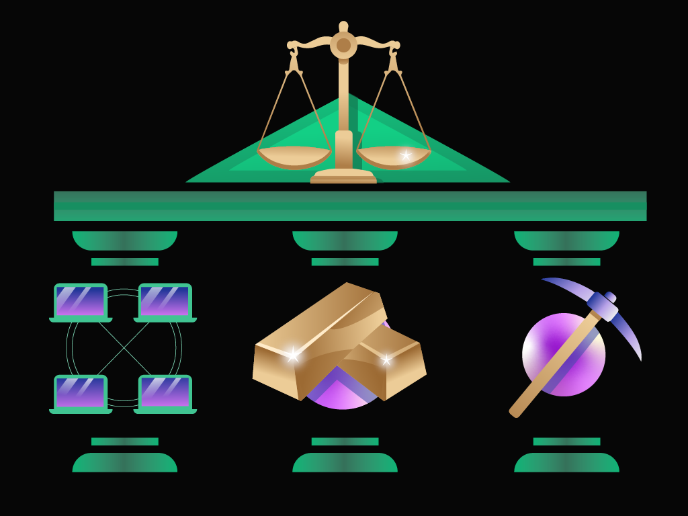

イーサリアムクラシック財団は、人ではなく、アイデアで成り立っています。

イーサリアムクラシック財団は、腐敗しやすい中央集権的な機関によって開発が誘導される他のブロックチェーンと比較して、ETCの寿命を最大化し、捕捉されないような方法で意思決定を行うように設計された一連の原則である。 アイデアとして、さまざまな攻撃から免れ、堅牢で、時の試練に耐えることができるのです。

イーサリアムクラシックにはトップダウンのコントロールがなく、 [アンチフラジリティ](https://en.wikipedia.org/wiki/Antifragility)につながり、参加者が容易に表現でき、理解でき、長期にわたって永続できる分散化の教義を維持、洗練させることによって達成されます。

イーサリアムクラシックにとって、その基盤は最も強く、最も重要な要素である。 ETCは、The DAO [事件](/why-classic/genesis)に対応し、ブロックチェーンの実用性と価値のすべては最終的に原理の下流にあるという認識から存在しています。 継続的な [の追求](/why-classic/decentralism) を通して _分散化最大主義_、ETCの技術的および社会的レイヤーは、外部の力がチェーンを危うくし、 _Code is Law_を覆すことを防ぐように構成されています。
