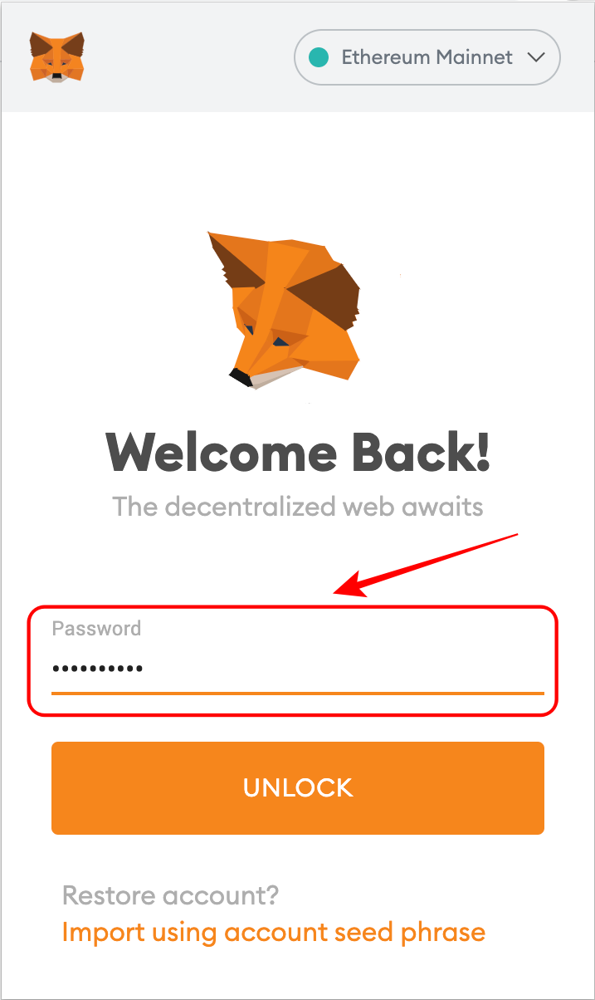
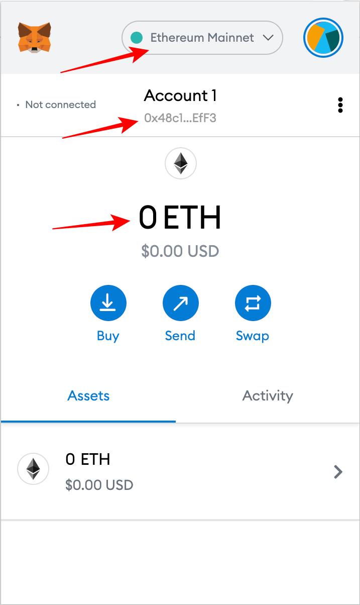
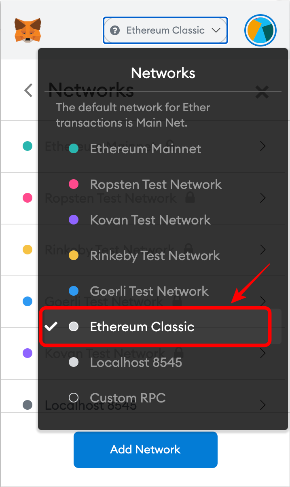
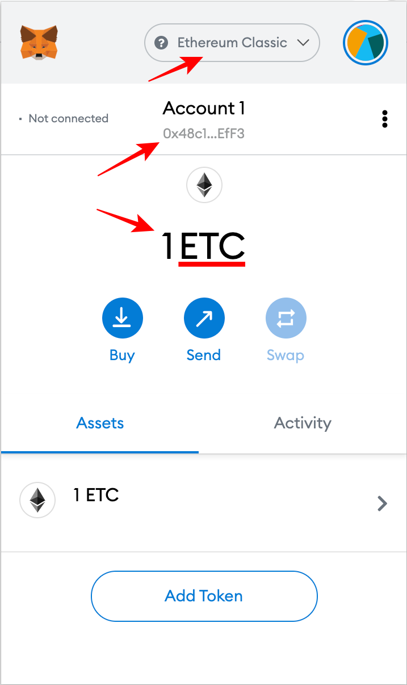
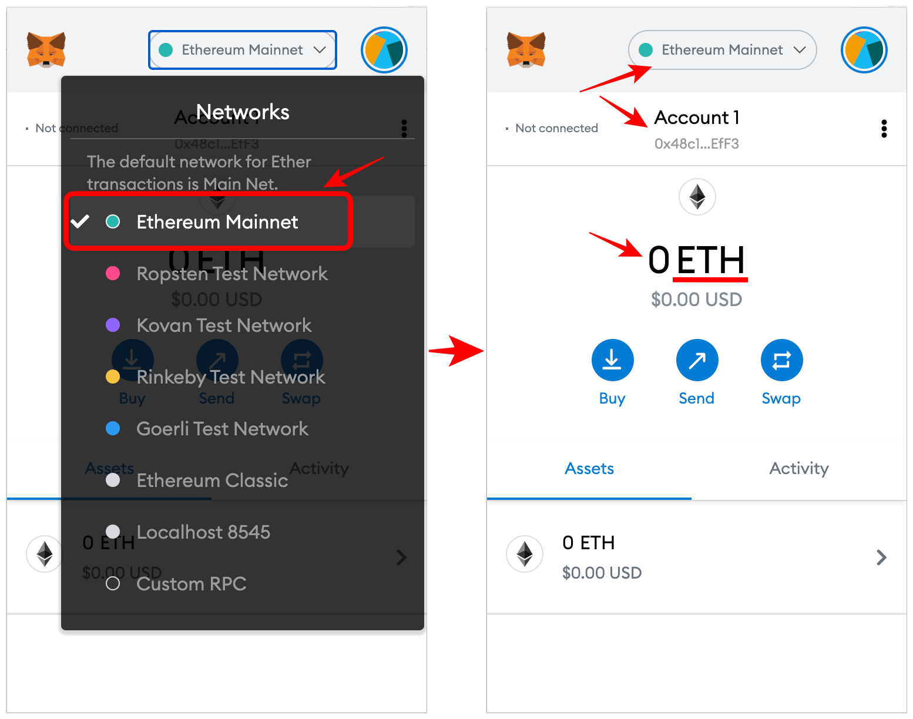
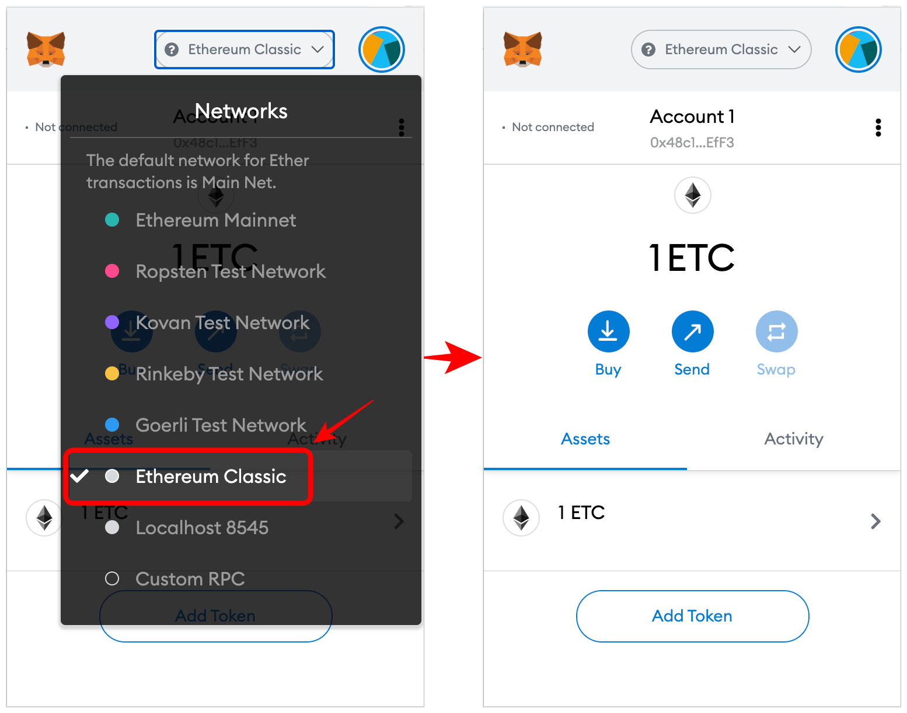

**⚠️ 更新**  
现在您可以通过点击https://chainlist.org/en/chain/61 "Connect-Wallet "轻松将 ETC 添加到 MetaMask 中。

你也可以在本网站每个页面的底部找到这个链接。

---

[MetaMask](https://metamask.io) 可以作为一个钱包来管理你的 ETC 和代币，并与支持它的应用程序互动。 这篇文章解释了如何在 Ethereum Classic(ETC)网络中开始使用 MetaMask。

你也可以考虑 [Nifty Wallet](https://chrome.google.com/webstore/detail/nifty-wallet/jbdaocneiiinmjbjlgalhcelgbejmnid?ucbcb=1)，这是 MetaMask 的分叉，支持 ETC 的开箱即用。

## 1. 登录到 MetaMask

第一步是登录，解锁你的 MetaMask。

## 2. 查看初始屏幕

你会看到正常的初始屏幕。 在这种情况下，默认网络是以太坊(ETH)，你的账户将照常显示。 当你使用其他网络时，如果这些网络是最后使用的，当你解锁 MetaMask 时，它们将显示为默认网络。

在我的案例中，它显示以太坊为初始网络，我的 ETH 账户中的余额为零 `0x48c1...EfF3`。

## 3. 打开网络下拉菜单

下一步是打开网络下拉菜单。 你可以通过点击你看到默认网络的栏来实现。

正如上面所看到的，默认的网络列表是以太坊主网和其最流行的测试网。

如果你在你的机器上运行一个以太坊节点，"本地主机 8545 "将是一个与以太坊节点的连接。

"自定义 RPC "是添加自定义网络的选项，在这里是 ETC。

"RPC "是 "远程过程调用 "的意思，它是机器用于调用远程机器中其他程序的协议的术语。

## 4. 选择自定义 RPC

因此，下一步是点击 "自定义 RPC"。

## 5. 查看新网络表格

选择 "自定义 RPC "后，你会看到添加网络的表格。 它的顶部有一条安全信息，并有五个带有空栏的选项，可以输入你想使用的新网络。

- 网络名称。你想添加的网络的名称。
- 新的 RPC URL。你想添加的网络 RPC 的 URL。
- 链 ID：用于发送和引导交易到你想添加的网络的 ID。
- 货币符号(可选)。你想添加的网络的货币符号。 例如，"ETH "是以太坊的符号，而 "ETC "是以太坊经典的符号。
- 区块链浏览器的 URL(可选)。MetaMask 在每个网络上都有区块链探索器的链接，以检查账户历史、发送的新交易以及其上的余额，所以这里你要为你想添加的网络添加一个区块探索器。

## 6. 输入 Ethereum Classic 网络信息

下一步，是添加 Ethereum Classic 的具体信息。 以下是我使用的网络数据。

- 网络名称。 `Ethereum Classic`
- 新的 RPC URL: `https://www.ethercluster.com/etc`
- 链条编号: `61`
- 货币符号(可选)。 `ETC`
- 封锁浏览器的 URL(可选)： `https://blockscout.com/etc/mainnet/`

对于 "RPC URL"，我使用了由 [ETC 合作组织](https://etccooperative.org/)，这是来自他们建立的一个名为 [Ethercluster 的产品](https://ethercluster.com/)，为此目的提供的一个 URL。

_[编者注] Ethercluster 现在由 [RIVET](https://rivet.cloud/)。 你可以在 [网络](/network/endpoints) 部分找到更多的 RPC 端点。_

链 ID "必须是 "61"，因为这是 Ethereum Classic 网络的特定 ID，用于由钱包和节点发送 ETC 交易到运营区块链。

虽然 "符号 "和 "区块探索器 URL "是可选的，但我建议使用 "ETC "作为符号，因为这是广为人知的网络市场符号，使用 BlockScout 作为区块链探索器，因为这是我通常使用的(但你可以添加你的首选！)。

点击 "保存"，将 ETC 添加到 MetaMask。

## 7. 在网络下拉菜单中查看 Ethereum Classic

一旦 ETC 被添加，你会在网络下拉菜单中看到它被添加到网络列表中。

## 8. 你可以在 ETC 上查看你的同一个账户

如果你去看你的账户，你会发现它和你的 ETH 账户是一样的。 在我的案例中，是同一个 `0x48c1...EfF3` 账户。

这是因为 ETH 和 ETC 都使用相同的账户格式，所以以太坊上的账户也可能用于以太坊经典。

事实上，你可能记得，我的 ETH 账户中的余额为零，但现在在同一个账户中可能会看到 1 个 ETC 的余额，但在 Ethereum Classic 上。 这是因为我为这个演示向以太坊经典网络中的这个账户发送了 1 个 ETC。

还要注意的是，ETC 网络现在是显示在网络栏中的网络，而且现在用 "ETC "符号来显示余额。

## 9. 你可以用同一个账户移回以太坊

因此，由于两个网络都使用相同的账户格式，你可以移回以太坊主网，你将能够再次看到你的 ETH 账户的号码。

## 10. 你可以用同一个账户移回以太坊经典版

要使用 ETC 网络，只需在网络下拉菜单中再次选择 Ethereum Classic，你将再次看到你的 ETC 余额。

//

我祝愿你在投资和使用 ETC 方面取得成功!

---

**守则是法律 **
