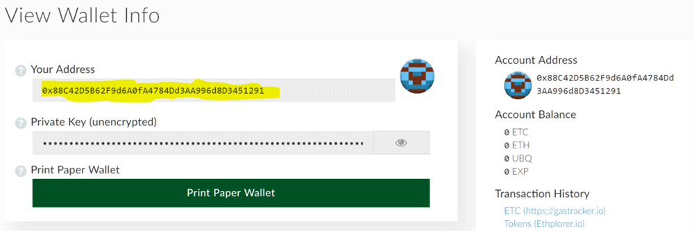
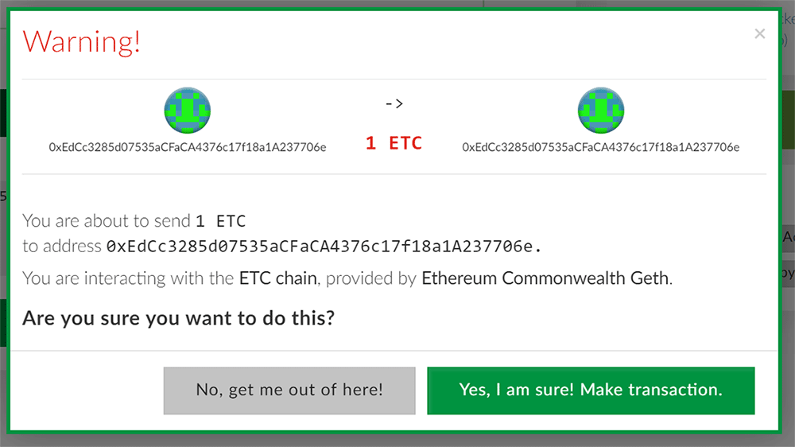

## First Use

Using CEW is easy and it can be accessed directly from here: [https://ethereumclassic.github.io/etherwallet/](https://ethereumclassic.github.io/etherwallet/)

If you’ve never had a CEW wallet before then enter a password on this screen and click “Create New Wallet”.

Please follow the instructions carefully and follow them exactly as they say, doing so is the best way to ensure your ETC is stored safely.

**Remember that Cryptocurrencies, ETC included, are more like cash than credit. You wouldn’t store your cash unsafely, don’t store your Cryptocurrency unsafely. Follow the wallet instructions, protect your private key, and you’ll be just fine.**

Make sure to save your public address (not private key) somewhere easily accessible so that you have it handy if someone wants to send you ETC.

## Receiving ETC

Receiving ETC is simple, just provide your public address to the sender and confirm the transaction on either [https://gastracker.io](https://gastracker.io/) or [http://etherhub.io](http://etherhub.io/)

There’s no need to use a wallet to confirm transactions but if you want you can check via CEW using the “View Wallet Info” function on CEW. The safest way of which is to select the “View with Address Only” option and entering your public address.

## Forgot My Public Address

If you have forgotten your public address you can get it again using the `.json` file you created earlier with CEW, or your hardware wallet (if you have one).

To view your address (without sending any ETC) click on “View Wallet Info” and select your method for viewing. Then click on Unlock. An example is below.

Select your method in the circled area on the left, do what the middle section of the screen tells you, and click “Unlock”.

On the next screen your address will be displayed in the section highlighted in yellow. Copy this and provide it to the sender.

**Do not copy or share anything that says private key, or unencrypted, no matter what. Do not share `.json` files. Anyone with access to any of these can take your ETC.**

## Sending ETC

To send ETC you’ll need your `.json` file, private key, mnemonic phrase, or hardware wallet (Trezor / Ledger Nano S).

Click on “Send Ether & Tokens”, and then select your method on the left, do what the middle section of the screen tells you, and click “Unlock”.

Once unlocked you enter the recipient’s address and the amount in the areas highlighted in yellow.

Then click on “Generate Transaction”, followed by “Send Transaction”. A new screen will pop-up, please check it carefully to ensure that the transaction is as you want it. If it is you can click “Yes, I am sure! Make transaction”. This will send your ETC to the recipient.

After sending the transaction will confirm shortly. You can also double check it after a minute or two by entering the recipient’s address on either [https://gastracker.io](https://gastracker.io/) or [http://etherhub.io](http://etherhub.io/)

**It is always a good idea to send a very small test transaction first, confirm the recipient has received the ETC, and then follow up with a second transaction. Even when sending to exchanges you’ll want to make sure it first reaches your account. This helps prevent accidental loss of ETC.**