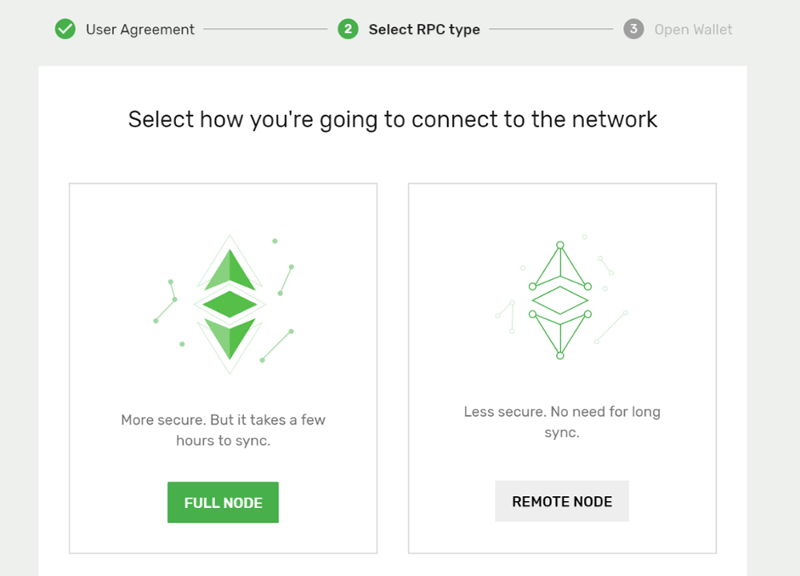
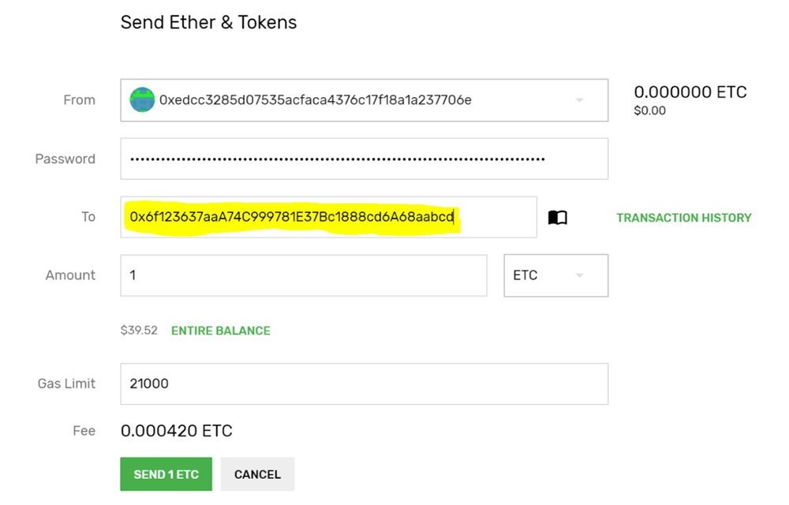

## Installation

The latest version of Emerald Wallet can be downloaded from here. Pick whichever version is suitable for your operating system:
[https://github.com/ETCDEVTeam/emerald-wallet/releases](https://github.com/ETCDEVTeam/emerald-wallet/releases)

**For Windows:** Download the installer file ending in `.exe`, double click it, and follow the prompts.

**For Debian:** Download the `.deb` file and run `sudo dpkg -i /path/to/the_file_you_downloaded.deb`.

**For Linux (generic):** Download the tar file, extract with `tar -xvzf the_file_you_downloaded.tar.gz`, `chmod +x emeraldwallet`, and run `./emeraldwallet`.

**For MacOS:** Download the `.dmg` file and run it.

## First Use

After installing you should be greeted with the following screen:

Here you have two options, “Remote Node” and “Full Node”:

**Remote Node**: If you want to just get going you should click “Remote Node” which will allow you to use the epool/gastracker free nodes. This option lets you start using the ETC network right away.

**Full Node**: If you want to sync a “Full Node” for maximum security, and to benefit the ETC network, then you can click “Full Node” and will need to wait a bit for the network to sync.

- While syncing if you receive ETC the balance will not appear until your node is fully synced. Don’t worry, the funds aren’t missing, your node just needs to catch up with the rest of the network.
- If you encounter issues here you’ll want to make sure that your system clock is properly synced:
  - Windows: Control Panel > Date & Time > Internet Time > Change settings > Update Now
  - Linux/Mac: `sudo ntpdate -vu pool.ntp.org`. In some cases you may need to install the ntpdate program with your package manager.

No matter which option you select you’ll always be free to change by selecting from the menu in the top right.

## Creating a New Account

If you have not used ETC before, and do not have a Ledger Nano S hardware wallet, you can click on “Generate New Account” and get your very first wallet.

Please follow the instructions carefully and follow them exactly as they say, doing so is the best way to ensure your ETC is stored safely.

**Remember that Cryptocurrencies, ETC included, are more like cash than credit. You wouldn’t store your cash unsafely, don’t store your Cryptocurrency unsafely. Follow the wallet instructions, protect your private key, and you’ll be just fine.**

### Using an existing account or Ledger Nano S

Select your option and follow the on-screen directions.

### Changing how you connect to ETC

If you ever want to change between full sync and light clients you can select in the top right of the screen. The “Mainnet” option is a “Full Sync” while the other two options (“Mainnet (epool)” / “Mainnet (gastracker)”) are “Remote Node” options.

Morden is for developer use so unless you’re programming your own smart contracts you’ll not need to use these options.

## Receiving ETC

To receive ETC you need to provide your public address to the sender, which you can find on the main screen of the wallet and copy by clicking the two boxes/pieces of paper; highlighted below.

## Sending ETC

To send ETC click on “Send” from the main screen. Enter your wallet’s password and the address you want to send to (highlighted in yellow).

You’ll get an estimated transaction fee and can then click on “Send”.

After sending the transaction will confirm shortly. You can also double check it after a minute or two by entering the recipient’s address on either [https://gastracker.io](https://gastracker.io/) or [http://etherhub.io](http://etherhub.io/)

**It is always a good idea to send a very small test transaction first, confirm the recipient has received the ETC, and then follow up with a second transaction. Even when sending to exchanges you’ll want to make sure it first reaches your account. This helps prevent accidental loss of ETC.**
