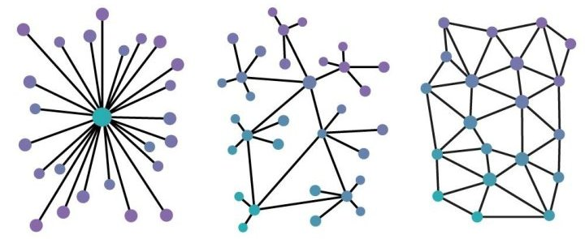
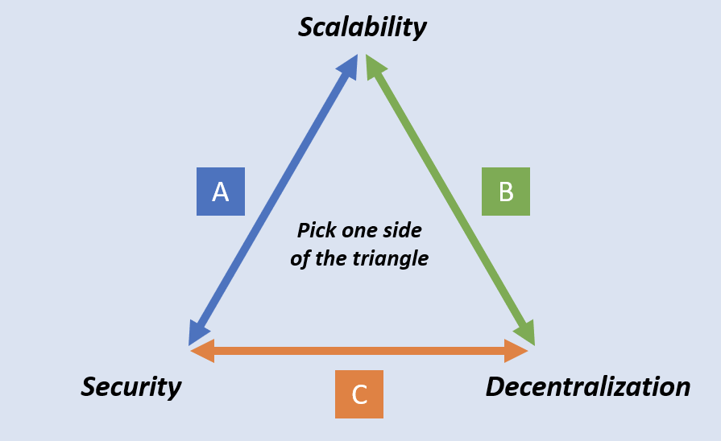
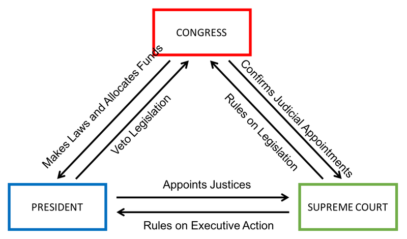

Warning: This page is still being edited, and has not been proofread.

## Key Points

- TODO

## Introduction

One of the first publications about Ethereum Classic that came out after The DAO Hard fork was called [A Crypto-Decentralist Manifesto](/blog/2016-07-11-crypto-decentralist-manifesto), and in protest of The Fork, it underlined the classic decentralized approach to organizing blockchain projects. This document set the tone for ETC's future development, and since it's creation, much has been learned about the nature of the illusive but vital concept.

> Decentralized, Immutable, Unstoppable.
>
> - Ethereum Classic Website, 2016

This series of buzzwords is actually a recipe for unlocking the true value potential of blockchain technology; first you need decentralization, which enables immutability, which in turn enables unstoppability, making possible the [bright future](/why-classic/code-is-law) we discussed earlier.

## Quantifying Decentralization

> Decentralization is the process by which the activities of an organization, particularly those regarding planning and decision-making, are distributed or delegated away from a central, authoritative location or group.
>
> - [Wikipedia](https://en.wikipedia.org/wiki/Decentralization)

Decentralism is the policy of favoring _decentralization_, a property that exists in many systems and in many forms throughout nature. It is not a binary property, but a spectrum, that ebbs and flows through time. It's difficult to articulate a hard and fast definition for _decentralization_ in all contexts, but it can be visually understood fairly intuitively.

In the realm of blockchain projects, there are many ways of measuring decentralization, with one rough quantification being "The ratio of people needed to be compromised in order to take over the system". That is to say, if an attacker wanted to control or censor a chain, a project that required them to compromise 80% of participants is _more decentralized_ than a project that only required 10% to be compromised.

This measurement is known as the [Nakamoto coefficient](https://minima.global/blog/the-nakamoto-coefficient-an-attempt-to-quantify-decentralization), and while it is a good conceptual tool, is a fairly low-resolution one-dimensional measurement, and in reality, decentralized systems can be designed in a way that makes capture less likely by assigning different groups with different responsibilities. Due to their diversity of responsibilities and backgrounds, difficulty in capturing a network then becomes linked not simply to a number of people, but a complicated mesh of overlapping strengths and weaknesses.

A more accurate measurement of decentralization in Proof of Work blockchains, for example, attempt to take into account mining (by reward), clients (by codebase), developers (by commits), exchanges (by volume), nodes (by count), and ownership (by value distribution). But even this more nuanced approach far from perfect, as a single snapshot measurement does not yield much insight about whether a system is able to maintain decentralization over time.

Whichever way it is quantified, attackers that wish to "own" the system have a more difficult job the more decentralized a project is. To defend against take-overs, projects need to reach a sufficient level of decentralization, which means minimizing the number of central points of failure and bottlenecks, which can exist in many places in the system.

### The Blockchain Trilemma

> The underlying structure of decentralized networks comes with unique challenges as compared to centralized networks. As early as the 1980s, computer scientists developed what’s called the CAP theorem to articulate perhaps the most major of these challenges. According to the CAP theorem, decentralized data stores — of which blockchain is an iteration — can only provide two of three guarantees simultaneously: consistency, availability, and partition tolerance (CAP). In the context of modern distributed networks, this theorem has evolved into the blockchain trilemma. This is the popular belief that public blockchains must sacrifice either security, decentralization, or scalability in their infrastructure.
>
> - The Blockchain Trilemma, [Gemini.com](https://www.gemini.com/cryptopedia/blockchain-trilemma-decentralization-scalability-definition#section-what-is-the-blockchain-trilemma)

The Blockchain Trilemma describes a technological limitation that applies to all blockchain protocols, but a similar concept also applies to the social layer of a blockchain project, with a sliding scale of top down vs bottom up decision-making.

Like the creation of a video game character, all projects must place themselves somewhere in the space of these sociotechnological dimensions, allocating ability points and sacrificing some attributes for others; the selection made which defines a blockchain's class, abilities and effectiveness in battle.

As we will see, as far as the protocol's attributes and underlying philosophy goes, Ethereum Classic has 'maxed-out' it's decentralization and security, intentionality sacrificing both scalability and other top down social organizational more essential 'skills' can be strengthened.

These 'skills' were maxed-out because for a blockchain protocol to scale its base protocol, it _must_ make trade-offs in decentralization and/or security, which may not appear as obvious costs immediately, but in the long run is bound to damage the utility and value of the network. In short, for ETC, scalability is less important than security and decentralization, and this technical trade-off is also mirrored in the social layer; decentralization above the expediency of central rule.

Most blockchain projects today have abandoned the idea of maxing-out decentralization in exchange for scalability and/or the benefits of coordinating from a central group. This may well be useful for short term bootstrapping as it allows the funding of extravagant development or marketing budgets, but unless the project tapers-off this dependence on centralization, which may be impossible due to the incentivization structures it creates, the network is exposed to take-over through the capture of this relatively centralized set up.

### Sovereign Grade Censorship Resistance

One question that should be asked when evaluating different blockchain projects is "is it decentralized enough?". The answer to this is entirely dependent on the use case's [threat model](https://en.wikipedia.org/wiki/Threat_model), which depends on the kind of applications that are intended to run on a given chain. The question can be reframed as "who would want to stop the applications on this chain from running, and can the chain resist their attempts at censorship?".

For example, in the case of Bitcoin, its main application is the coin itself; digital scarcity, and the ability to transfer it without censorship. It competes with many currencies and assets, including the US dollar, and therefore must be able to withstand attacks from very powerful entities to persist. Many of Bitcoin's [predecessors](https://blog.dassetx.com/the-known-and-possible-influences-of-satoshi-nakamoto-part-1-privately-issued-digital-currencies-before-bitcoin) were shut down by because they had central points of failure, and Bitcoin was designed specifically to circumvent this kind of censorship by being sufficiently decentralized.

In contrast, some blockchains require less censorship resistance than Bitcoin, and only intend to, for example, enable the transfer of virtual baseball cards, or have other uncontroversial use cases. No powerful external forces really _want_ to stop these applications, so censorship resistance isn't a necessary. It may even be seen as a benefit if some central party can override the state of the chain in certain circumstances, so having the whole chain operated by a handful of Authorities (PoA) is acceptable for this use case. In these cases, where the use case is not important enough for well-funded organizations to want to shut down, it might make sense to sacrifice decentralization for scalability, and other non-blockchain technologies may be more appropriate.

Ethereum Classic, even back in 2015 when it was known as Ethereum, set out to achieve ambitions on a level at least as prone to censorship as Bitcoin.

> Ethereum is a decentralized computing platform that executes smart contracts. Applications are ran exactly as programmed without the possibility of censorship, downtime, or third-party interference.
>
> - Ethereum.org, 2015

Ethereum's Smart Contract Platform was designed to support not just Bitcoin's base currency use case, but _any_ kind of blockchain application, and because of this, it is highly likely to attract attempts at censorship from legacy system incumbents are that are at risk being disrupted.

To provide a solution on a global level that would need to stave off attacks from other sovereign institutions such as nation states and multinational organizations, Ethereum, like Bitcoin, would need to reach a level of decentralization that made it impossible for any of these groups censor it; _Sovereign Grade Censorship Resistance_ is required.

An important threshold is reached with this level of uncensorability. As no other institution can censor the network, applications become significantly more useful, and they become _trustless_; they no longer rely on the trust or permission some other company or government to operate, and on these platforms, it is the _users_, rather than the _providers_ who get to decide what goes on.

_Code is Law_ can only operate on a chain that has achieved _Sovereign Grade Censorship Resistance_, as this level is required to prevent other entities from censoring its operation, and this in turn requires the chain to "max-out" it's decentralization attributes and constantly maintain them without compromise; _Code is Law_ requires _Decentralization Maximalism_.

## Centralization Failure States

Before we explore the solution to the problem of centralization, we must first understand the ways in which a lack of decentralization can easily regress into full-blown failure.

Today, even more so than when Ethereum (Classic) was launched in 2015, it is increasingly obvious that censorship is becoming the weapon of choice of a dying legacy system that is desperately attempting to cling on to relevance. As these old institutions become increasingly threatened by change, it seems likely that ever-more drastic measures will be taken in an attempt defend their position.

Before blockchain technology entered the scene, these institutions had reality pretty much on lockdown as society was heavily reliant on centralized control points for value and information transfer, which was readily exploited. With cryptography, though, and just in the Nick of time, Satoshi graced us with the answer to this reliance, which has turned the tables on the existing [logic of violence](https://cryptonews.net/en/news/bitcoin/2927549/), and provided humanity with an alternative emergent order.

As time goes on, the attacks against free, fair and open alternatives to the status quo will ramp up. The cryptocurrency ecosystem will enter a new phase, a highly antagonistic phase, where the uncensorability of blockchain technology will truly be put to the test, and the central points of failure in cryptocurrency systems that have them will be sought out and exploited. For use cases that are not approved by incumbents, only the _Sovereign Grade_ will survive.

In the future, in order to maintain utility and value, blockchains must be able to resist a range of social, economic and technological attacks that will be deployed against them. The list of attacks is ever-growing and new forms of attack are sure to be conjured up, but at the very least the more obvious failure states must be avoided.

### The Ephemeral Foundation

Historically, the number one cause of death for blockchain projects is when the teams responsible for maintaining them no longer operate. Simply put, if a project depends on a central organizing committee or developer team, it will only last for as long as that organization does.

Organizations can cease to operate for many reasons; be it a simple rugpull, running out of funds, getting hacked, getting hammered by regulators, traffic accidents, or any other number of reasons, these factors are often outside the control of this team, so it is down to luck or the approval of regulators whether a project can survive.

In many cases, the existence of a central team disincentives others from contributing to a project, as they are not on a level playing field. Third parties will always be second class citizens compared to this central organizing committee, who are calling the shots and disproportionately benefitting from price action in the case of a premine or dev tax, which further solidifies reliance on this team to maintain and direct the project, and at the very least prevents a natural organizational hierarchy from emerging.

This reliance on a central team may provide direction and big budgets in the short term, but it burdens the protocol with a kind of "centralization debt" that is difficult to pay off. Eventually, like all organizations, the central team will cease to operate, and the unless the project sheds this reliance, is likely to become either abandoned or maladapted to life without this group.

### Meatspace Capture

For high value projects that have an overreliance on centralized teams, as time goes on, a fate far more insidious than mere abandonment becomes increasingly likely. Like clockwork, as with all top-down centralized institutions, they become captured by special interests through various manipulative techniques.

If a powerful institution feels threatened by a new technology, rather than trying to stamp it out, which may be impossible, it is far more effective to simply compromise and disrupt its operation by influencing the direction of development in a way that does not fundamentally upset the status quo.

This can be achieved by turning influencers and the leadership of an organization into puppets, who's strings are pulled through a variety of carrots and sticks. Humans are fallible and are susceptible to all degrees of manipulation and blackmail; peer pressure, angry mobs, politics, kickbacks, bribes, psyops, honey traps, kompromat, physical threats, imprisonment, or worse.

With enough key targets under the thumb of an attacker, they are then able to control the future of a chain through their authority, making subtle incremental changes that further increase their grip and control over decision-making.

One of the most problematic elements of this type of failure state is that it can be done in a way that is totally undetectable; it may be that the level to which a central team is compromised is unknown, and capture only becomes obvious when it is too late to do anything about it.

Even if a centralized team is not overtly compromised, the very potential of this compromise can sow distrust and uneasiness; conspiracy theories and the questioning of decision-making may undermine a project's leadership and stability if they appear not to be driven by merit alone, and simple divide and conquer tactics deployed against the organizing committee may be enough to paralyze the project.

This failure state shows there is an inherent contradiction within any blockchain project that _relies_ on a central organizing committee; while the protocol may be decentralized on paper, the project is in fact dependent on a central group that can and will be bent to the will of anyone who feels that the cost of doing so is worth it.

### Kabuki Coins

Centralization, like gravity, is constantly pulling and looking for any weakness in a sociotechnological structure to find its breaking point. For a system to overcome this force long term, it must ensure that there is no central point of failure that can be exploited, which means designing robust countermeasures that constantly push back against centralization not just in one place but in all areas.

Because of this, there is no point in having decentralization in half measures; a chain is only as strong as its weakest link, and a blockchain is only as decentralized as it's most centralized bottleneck. For this reason, _all_ parts of a blockchain project, both technically and socially, must strive for _Decentralization Maximalism_.

Unfortunately, within the cryptocurrency ecosystem the importance of _Decentralization Maximalism_ is not widely understood or adopted, to the point where the term _Decentralization Theater_ has become a common way to describe many _so-called_ decentralized systems.

These projects have subtle but highly centralized single points of failure somewhere within their systems, but promoters shift the focus to other "decentralized" areas. This is an effective tactic, as proving that a system has potentially capturable central points of failure requires intimate knowledge of said system, and can be very difficult or impossible for the layman, due to the technical skill and insider knowledge required to properly evaluate.

Like the parable of the buildings built on rock and sand, to the untrained eye, two projects may appear to be properly constructed, and under normal conditions they both operate as intended. But under the surface, one project has a fatal flaw that will only lead to ruin in times of stress, and will likely end up causing damage to those who expect the project to stand the test of time.

## Classic Problems Require Classic Solutions

Corruption is a problem as old as civilization, and while it might not have obviously reared its ugly head in the cryptocurrency space yet, as the technology becomes more influential, it is bound to attract forces that wish to bridle it's power and shape it towards a future where, far from liberating humanity, blockchains become tools for optimizing enslavement.

In the long run, whatever happens, decentralized blockchains will prevail _eventually_, but if humanity wishes to avoid a dark-ages style period of hampered innovation and stagnation, the word must be spread about the dangers of centralization so that it can be dealt with before they take hold. Luckily a window of opportunity exists to counter the inevitable ongoing attempts to capture blockchains; for now, projects that strive for _Decentralization Maximalism_ still exist and are available to those who wish to use them.

While it's still voluntary, rather than relying on authority figures or marketing campaigns, individuals can reason from first principles and reflect on lessons from the past to reach their own conclusions about which blockchains are likely to provide long term value and are worth interacting with.

By going "back to the roots" of not just blockchain technology, but economic theory and the lessons of history, the wisdom in the designs decisions behind Bitcoin become clear, and this logic can be reapplied to other technological advancements in the space, including Smart Contract Platforms such as Ethereum (Classic).

### Principles First

While institutions and the humans that make them are fallible, fickle and fragile, _ideas are bulletproof_. It is self-evident that a technology as important and influential as blockchain must be built upon something more than just people; it must be backed by a well-developed philosophy to guide the actions of otherwise capturable bags of meat.

Good ideas stand on their own, can be debated in public, and are true regardless of who proclaims them, which makes them perfect for constructing a harness to restrain and protect the future of a blockchain project. That is why Ethereum Classic's Foundation is not a group, but it's core principles, which come first and inform decision-making.

Pragmatism is downstream of maintaining and adhering to good principles, as they are what enable both practical survivability, long term sustainability, and act as a form of advertising that attracts quality contributors. The _principles first_ approach goes a long way to ensuring that a project can maintain its course for many generations to come, as it is guided not by the ever-changing interests of a central group, but by external philosophical reference points that, even with high a turnover of contributors, can be perpetuated and refined in public to direct the future of the project.

Having no central group to call the shots means that any individual or group can fill any role, as long as they are seen to be faithfully interpreting and executing ETC's principles and values, as understood by stakeholders. If some feel that a hard fork diverges from the values they signed up for, they are free to continue the existing version of the chain. The risk of a chain split means all participants are incentivized to work together to solve differences, but neither side can of a debate _overrule_ the other if the disagreement is unresolvable.

### Decentralization Maximalism

_Decentralization Maximalism_ is the only known mechanism to shore off the forces of centralization long term. It is not a predefined set of rules, but is a general philosophy or way of thinking that seeks to reduce the number of central points of failure throughout a system.

It demands that decentralization is perused holistically in all areas, in the design of the protocol itself, as well as the social layer, where possible. The goal is to make not just the protocol itself secure from take-over, but also the social layer be secure from capture. Satoshi Nakamoto being anonymous and going silent is the classic example of this philosophy being applied to the Bitcoin project, the success of which is wise to emulate.

Where it makes sense, by definition, this approach demands _no compromise_; even the smallest of sacrifices, infractions or exceptions should be, unless completely unavoidable with some overall worthwhile trade-off in the context of known stopping criteria, intolerable. As centralization is difficult to get rid of, it typically accumulates over time, and will pile up until the system becomes captured in one way or another.

Whatever the crossroad, _Decentralization Maximalism_ requires eternal vigilance and the knowledge that systems naturally tend towards centralization, so every decision that is made must take into account of the cost paid in centralization debt, with the goal of keeping the system debt-free long term.

### Balancing Power

As echoed by the structure of existing institutions such as The Government of The United States of America, in order to rein in bad decision-making and prevent one group from hijacking a system as a whole for its own interests, a balance of power between different players needs to exist in systems that wish to maintain longevity. This concept is known as _Checks and Balances_.

As with The US Government, checks and balances are an important feature of Proof of Work blockchains, where three major power groups exist and balance out each other's power.

| Group      | Role                                      | Veto                   |
| ---------- | ----------------------------------------- | ---------------------- |
| Developers | Maintain clients and infrastructure       | Stop maintaining code  |
| Miners     | Provide security against 51% attacks      | Mine a different chain |
| Financiers | Provide liquidity and finance initiatives | Sell holdings          |

The alignment of three major powers in Proof of Work blockchains provides stability; they each add value to the system in completely different ways, and each holds the system to account through the power of veto, which ensures that no other groups can screw things up too badly. Whether a government or a blockchain, things tend to go wrong when these checks and balances are removed.

Note that this configuration of _three_ is important, as it also means that the group can overcome consensus issues by way of simple majority vote. This odd-number electorate is a common pattern in distributed systems; with only two participants, a deadlock can ensue as each side vetoes the other, and no third party is able to resolve the dispute.

Three really is a magic number, and it creates a beautiful symphony of balanced power, held together by a system of competing interests that incentivize either voluntary engagement or ostracism of bad behavior.

Miners provide security and get a block reward, which only has value if the network is useful thanks to developers and other providers maintaining the protocol and building out infrastructure, which is facilitated by traders providing liquidity and investors speculating and funding projects.

Like struts holding up the base of a tower, these well-placed incentives rely on each other for support, and together, as long as they are correctly distributed, can yield a new structure greater than the sum of their parts, and can stand potentially for millennia.

On top of this, a diversity of roles makes a system more difficult to take down by encouraging participation from parties with differing interests, profiles, and weaknesses. Like multiple layers of defense, the more diverse the pool of participants that secures blockchain is, the harder it is for an attacker to compromise, as a diversity of weaknesses requires a diversity of attacks, and a higher cost is needed to capture the system. Even with the same number of _total_ participants, a system with more separation of concerns can be more decentralized and more difficult to capture because of this diversity.

The blueprint introduced by Bitcoin was also used by many other cryptocurrencies including Ethereum, which largely copied the fundamentals, tweaked some variables, and (brilliantly) added a Turing-complete virtual machine, the EVM. Much like an architectural blueprint, encoding the structure of a real world building, it would be seemingly unwise to remove one or more of the struts that are critical in preventing the structure from collapsing into a centralized mess.

If a project wants to survive long term, it must have enough of these necessary incentive structure struts, and they must be properly balanced. If Bitcoin is a study tripod made of Miners, Developers and Traders, by sawing off one of these legs, by, for example, switching to Proof of Stake and firing the miners, the result is a two-legged barstool; one that can possibly straddled for a while, but even the faintest breeze will cause it to become a dangerous liability.

### The Neutrality Competition

As the night is young in the blockchain game, The problem of [Ephemeral Foundations](/why-classic/decentralism#the-ephemeral-foundation) may not be so obvious. Whether conned, crushed, or otherwise captured, the noble intentions that run the show for many blockchain projects are certain to come to an end, and with them, if their chains are not able to shed reliance, so do their ambitions.

This problem is made worse when the decision-making systems within a blockchain project rely on a central group for extended periods; alternative mechanisms for organizing the project are unable to evolve, as decision-making is expected to come from the top down rather than bottom up. Opaque autocracy becomes the standard, which ossifies and becomes fragile, rather than allowing for an anti-fragile open meritocracy to flourish.

This manifests in an instance of the _Centralization Gravity Well_, where reliance on central decision-making snowballs as outside contribution becomes more difficult, so the project relies more and more heavily on top-down leadership, and the cycle repeats.

Because of this, in the future, projects that rely on centralized organizations will one by one fall victim to this reliance, and the truth will be realized that only projects _without_ this reliance can sustain themselves for long periods. As the wild valuations that cryptocurrencies currently enjoy depends on the hope that these projects have some degree of longevity, it will become increasingly obvious that only truly decentralized projects are worth contributing money, talent or time to, and the market will reallocate accordingly.

Only the projects with long term value propositions will remain, which means only the projects without a reliance on central organizing committees will remain. By the same logic, it will become apparent that, all things being equal, the projects that are perceived to be the _least_ dependent on central groups, will attract the most contribution and value.

Instead of relying on unsustainable cash injections that are from central authorities, projects must evolve to exist purely on natural contributions, such as those through the _Buy and Contribute_ strategy, whereby individuals buy in to a project and economically incentivize themselves to contribute to it.

This strategy works best when an individual is reaping the full reward of their contribution, which can only happen when a protocol is _neutral_; it treats all participants on the same equal footing, and does not, on a protocol layer, grant any special privileges to specific parties. Decentralized blockchain projects will compete with each other on this basis; only the most neutral projects, those without a Foundation, Dev Tax, or undiluted premine, will attract the type of natural contribution that enables long term sustainability.

TODO PROOF READ FROM HERE

## ETH + BTC = ETC

For those already somewhat familiar with the blockchain ecosystem and can distinguish between the two major projects, a quite simple heuristic exists that cuts to the chase of what Ethereum Classic is attempting to acheive.

> Ethereum Classic takes the philosophy of Bitcoin and applies it to the technology of Ethereum
>
> - The CEO of Ethereum Classic, if one existed

Many of those who were involved with Ethereum before the DAO Hack were under the impression that Ethereum was hoping to do exactly this; be built on top of the well-established core ideas that Bitcoin provided, but add on additional functionality in the form of a Turing Complete Smart Contract Platform.

But as The DAO Hack showed, this was not the case; what is now known as Ethereum has very little to do with the decentralist values that Bitcoin was created to embody.

This was probably an honest misunderstanding, but ... . Link to Charler's world computer vs code is law split.

The decision for the Ethereum Foundation to abandon the decetnralist values that were used to entice contributions was unfortunate, but created a vacuum that ultiamtely further refined the meaning and importance of those values and birthed a project who's mission was to explicity continue that original vision.

Ethereum Classic, even more so than Bitcoin itself, exists as an explicit reminder about the importantce of decentralist values. Clearly there were many who didn't quite get their importance at the time, although many others saw the truth that decentralilzation _was_ the point, not just an annoying obstable to overcome.

And so, in the persuit of centralization, Ethereum Clasic recognises the genious decisions made when constructing the original Bitcoin protocol, and has since attempted to emulate this in the persuit of not just decetralization but also the empiricial success that has come from following them.

Ultiamtely, we hope that Ethereum Classic can live up to that original vision of Ethereum: Bitcoin, but with Smart Contracts.

Ethereum was originally supposed to be "Bitcoin, but with Smart Contracts", but when this goal was abandoned, Ethereum Classic merrily continued the vision.

### Immaculate Conception 2.0

Even more immaculate!

### No Official Anything

Just like Bitcoin, Ethereum Classic has no official developers, maintainers, or leaders. It has no official logo, no official website, no official conferences. Ethereum Clasic _cannot_ have an official _anything_, becuase no individual or group has the authority to claim they represent ETC in any official capacity.

This is a rare quality, and massive strength in the world of blockchains, as it means there is no official _thing_ that can be taken down, captured, or compromised, and there is no official entity that can sue competing forks for copyright enfringement.

_No official anything_ is the source of much of the strength of the Ethereum Classic project, but also has drawbacks as there is no central source of truth to coordinate from. Instead, a do-ocracy exists where anyonee can contribute, and based on what is actually done and what is picked up and used becomes what makes up Ethereum Classic. This makes it a unique project and attractive to contributors; literally nothing can stop _you_ from being as close to official as anyone else.

Some say that Ethereum Classic goes evern more extreme in this type of decentnralization than Bitcoin, which has Satoshi, who could come back one day and begin to make suggestions or guide development in a way that is not purely meroticratic.

### Secure Base Layer

The current consensus within the Ethereum Classic and wide computer sceience community is that the aforementioned _Blockchain Trilemma_ is insurmountable, at least on the base later. For this reason, Ethereum Classic's current roadmap does not include some of the more exotic "solutions" that will be attmpted by Ethereum.

Sharding, is one such example, where contracts are siloed into their own execution environments and can be executed in parralel. In theory this idea seems plausible, but for that added complexity, it is not suitable for globally interoperable contracts, including many of today's useful systems that need shared execution, such as anything that touches DeFi liquidity.

Essentially, there are very few _one size fits all_ approaches to scaling throughput that can be applied on the base layer without compromising an important security assumption, so for ETC as a protocol, it is best left up to applications or secondary protocols to provide various different tradeoffs and implement their own optimizations depending on the use case and the needs of users.

Many in the Ethereum Classic community are also wary of attempts to increase the block size, due to the negative effects that are likely to appear down the road in terms of "bloat" and the increased _time to sync_ and hardware requirements, which if left unchekced may make it difficult to run an Ethereum Classic node, leading to centralization. Some argue the block gas limit should be reduced even further, whilst others look towards _Zero Knowledge Proof_ technologies that can reduce the amount of data needed to be stored on chain.

There is general agreement that a layered approach to scaling blockchains is able to increase throughput while satisfying the _Blockchain Trilemma_ in a way that does not mess with the base layer; individuals are free to experiment with different "L2" systems that provide various tradeoffs depending on the application and user requirements.

### KISS

The base layer needs to be secure in a number of ways; both technologically stable in terms of fewer bugs, but also socioeconomically secure against various forms of attacks.

Because single points of failure can exist in many areas and are often hidden, all things being equal, it is easier to maintain decentralization in systems that are _less complex_. Additional complexity not just creates more potential for technical bugs and exploits, but also for central points of failure, in unforseen game-theory quandries and in the form of higher upkeep requirements leading to a reduced pool of developers able to contribute to maintenance; if a system is too complex for anyone to reason with, it may as well be captured by it's authors, who have sole authority on how it should be operated.

Bitcoin, as with ETC, positions itself as the "good old reliable" system that does not need to innovate quickly, but instead, do so slowly and methodically without breaking any of it's previously established guaruntees. This is acheived through a conservative appraoch to protocol upgrades, a "Move Slowly and Don't Break Things" ethoss, and the delivery of innovation in layers, rather than to attempting to implement radical changes to the base protocol.

### Don't Trust, Verify

One of the hallmarks of projects that are decentralized in the social layer is that a healthy level of distrust exist amongst participants. Whilst this may sound counter-intuitive, it is what secures the social layer against many forms of attack.

At any point, any individual could become compromised, so all participants must maintain an ever-skeptical perspective in communications and decision making, judging _ideas_ rather than indivudals and reputations. To do otherwise is to make one of the key failures of centrlaized decision making, which may be expedient, but is fragile, as when decisions are made based on authority rather than merit alone, it allows bad decision to not just occur occasionally, but continue unchecked, double-downed on, and snowball out of control.

It is this reason that the concept of "Toxic Bitcoin Maximialism" as a general appraoch to the adversarial cryptocurrency social space remains an open debate and is considered by some to be an honest, valid, albeit unsavory strategy for navigating discussions. Some consider toxicity a form of immune response that weeds out certain types of smooth-talking bad actors who rely on populism to forward a particular idea. Toxicity is not compatible with all personalities, and the Ethereum Classic has it's fair share of both toxic and non-toxic participants. Be advised that it in most cases, abrasiveness in the cryptocurrency space is not personal, but on the contrary, about defaulting to a purely idea-based rather than personality-based discussion.

## Onward

If humanity wishes to avoid another dark age, it must embrace systems can that are able to resist the corrupt forces thretern to capture the future of blockchain technology. Only systems that strive for _decentrlization maximalism_ are able to acheive this, but of all blockchain projects that exist today, only a handful exhibit a recognition of this requirement.

The innovations that Ethereum brought to the world in the form of a Turing Complete Smart Contract Platform provide a great leap forward in terms of the utility and potential of blockchain uses cases, but as evidenced The DAO Fork and the switch to Proof of Stake, the direction the project is being taken makes it suceptible to capture and unable to acheive _Sovereign Grade Censorship Resistance_.

In the the not too distant future, as attacks against blockchains ramp up, this need for will be all too clear. As one by one, so called decentralized projects reveal their true colors and succum to corruption in the form of capture by special interests, only the truly decentralized will remain.

Ethereum Classic offeres an alternative to centralization by combining the technology of Ethereum with the philosophy of Bitcoin, for a secure, multipurpose, decentralized blockchain and a free, fair and flouorishing future.

Let us now zoom in on two of the most important elements from Bitcoin that Ethereum abandoned but Classic adopted to counter the inevitable pull of centralization; Sound Money and Proof of Work.
