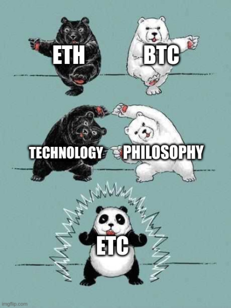

TODO: somewheere: s few questions that amsall time supporter of pos chains can ask to royall lpiss off the establishment

TODO: imageary of the various layers PoW, Social Layer, etc.

TODO nakamoto coefficient

Since the stormy days of The DAO Fork, Ethereum Classic has persisted and it's community has coaleased around a number ideas, with the most fundamental but difficult to pin down being _decentralization_.

> Decentralized, Immutable, Unstoppable.
>
> - Ethereum Classic Website, 2016

This series of buzzwords is actually a recipie for unlocking the value potential of blockchain technology; first you need decentralization, which enables immutability, which in turn enables unstoppability, making possible the [bright future](/why-classic/code-is-law) we discussed earlier.

This section will attempt to lay out the case for decentralization; the what, why, and how of an illusive but vital ingreedient that is the key to reaching the next level of civilization.

## Quantifying Decentralization

Decentralization is a property that exists in many systems and in many forms throughout nature. It is not a binary property, but a spectrum, that ebbs and flows through time. It's difficult to articulate a hard and fast definition for _decentralization_ in all contexts, but it can be visually understood fairly intuitively.

-- image of decentralization --

In the realm of blockchain projects, there are many ways of measuring decentralization, with one rough quantification being "The ratio of people needed to be compromised in order to take over the system". That is to say, if an attacker wanted to control or censor a chain, a project that required them to compromise 80% of participants is _more decentralized_ than a project that only requried 10% to be compromised.

TODO: it's more complicated than this, if an attacked has a technique that can own a bunch of people then it's less decentralized

Attackers that wish to "own" the system have a more difficult job the more decentralized a project is. To defend against take-overs, projects need to reach a sufficient level of decentralization, which means minimizing the number of central points of failure and bottlenecks, which can exist in many different places in the system.

The most decentralized a project can be is _fully decentralized_; attackers must compromise _everyone_, and the system can continue to faithfully operate with only one honest actor. These kinds of systems are vanishingly rare and seldom practical; in practice, either a technological or social limiting factor stands in the way of the persuit of secure, decentralized, and scalable systems, so compromise must be made somewhere.

### The Blockchain Trilemma

> The underlying structure of decentralized networks comes with unique challenges as compared to centralized networks. As early as the 1980s, computer scientists developed what’s called the CAP theorem to articulate perhaps the most major of these challenges. According to the CAP theorem, decentralized data stores — of which blockchain is an iteration — can only provide two of three guarantees simultaneously: consistency, availability, and partition tolerance (CAP). In the context of modern distributed networks, this theorem has evolved into the blockchain trilemma. This is the popular belief that public blockchains must sacrifice either security, decentralization, or scalability in their infrastructure.
>
> - The Blockchain Trilemma, [Gemini.com](https://www.gemini.com/cryptopedia/blockchain-trilemma-decentralization-scalability-definition#section-what-is-the-blockchain-trilemma)

TODO: image of trilemma

...

TODO: A similar decision of sorts also effects the SOCIAL layer of the blockchain, where chains must pick between decentralization and centralization in terms of decision making.. maybe add another axis for 'financing', premines, ?

TODO: leaving aside security as a given, blockchains then have a choice of scalability, and decentralization...

### Character Creation

CAP theorem, _The Blockchain Trilemma_ and the various approaches to organizing socially means that all blockchain projects are forced to hedge their bets by 'specializing' into certain classes with a scarse number of 'ability points'. Every project must place itself somewhere in the the space of these dimensions, sacrificing some for others. Much like a video game character, which attributes are selected will define much of a blockchain's character, abilitites and effectiveness in battle.

As we will see, as far as the protocol's attributes and underlying philosophy go, Etheruem Classic has 'maxed-out' it's decentralization and security, intentionality sacrificing scalability so that these other 'skills' can be strengthened. The basic theory is that for a blockchain protocol to scale it's base protocol, it _must_ make trade-offs in decentralization and security, which in the long run is bound to damage the utility and value of the protocol.

Most blockchains today have abandoned the idea of decentralization maximalism in exchange for scalability and/or the benefits of coordinating from a central group. This may well be useful for short term bootstrapping as it allows the funding of extravegant development or marketing budgets, but unless the project tapers-off this dependance on decentralization, which may be impossible due to the incentivisation strucutres it creates, it is exposed to take-over through the capture of this relatively centralized controlling group.

### Sovereign Grade Censorship Resistance

One question that should be asked when evaluating different blockchain projects is "is it decentralized enough?". The answer to this is entirely dependent on the kinds of applications that are intended to run on a given chain, so this question can be reframed as "who would want to stop the applications on my chain from running, and can the chain resist their attempts at censorship?".

For example, in the case of Bitcoin, it's main application is the coin itself; digital scarcity, and the ability to transfer it without censorship. It competes with many currencies and assets, including the US dollar, and therefore must be able to withstand attacks from very powerful entities to persist. It's [predecessors](#TODOs) were able to be shut down by because they had central points of failure; Bitcoin was designed specifically to circumvent this kind of censorship.

In contrast, some blockchains require less censorship resistance, and only intend to, for example, enable the transfer of in-game assets, or have other uncontrovertial use cases. No powerful external forces really _want_ to stop these chains, so censorship resistance isn't a big deal; it may even be seen as a benefit if some central party can override the state of the chain in certain circumstances, so having the whole chain operated by a handful of Authorities (PoA) is acceptable for this use case. In these cases, where the use case is not important enough for well-funded organizations to want to shut them down, it might make sense to sacrifice dencetralization for scalability.

Ethereum Classic, even back in 2015 when it was known as Etheruem, set out to acheive ambitions on a level at least as prone to censorship as Bitcoin.

> Ethereum is a decentralized computing platform that executes smart contracts. Applications are ran exactly as programmed without the possibility of censorship, downtime, or third-party interference.
>
> - Etheruem.org, 2015

Etheruem's Smart Contract Platform was designed to support not just Bitcoin's base currency use case, but _any_ kind of blockchain application, and because of this, it is highly likely that attempts at censorship will be made by incumbants are disrupted.

To provide a solution on a global level that would potentially need to sustain attacks from other sovereign institutions such as nation states and multinationals, Ethereum, like Bitcoin, has to reach a level of decentralization that made it impossible for any of these groups censor it; _Sovereign Grade Censorship Resitance_ is required.

An important threashold is reached with this level of uncensorability; as no other institution can censor the network, applications become significantly more useful, and they becomes trutless; they no longer rely on the permission of some big company or government to operate, and on these platforms, it is the _users_, rather than the _providers_ who get to decide what goes on.

_Code is Law_ can only operate on a chain that has acheived _Sovereign Grade Censorship Resistance_, so that other entities cannot censor it's operation, and this in turn requires the chain to max-out it's decentralized attributes and constantly maintained them without compromise; it reuqires _Decentralization Maximalism_.

## Centralization Failure States

Today, even more so than when Etheruem was launched in 2015, it is increasingly obvious that censorship is becoming the weapon of choice of a dying system that is desperately attempting to cling on to relevance. As these old institutions become increasingly threatened by change, it seems likely that ever-more drastic measures will be taken in an attempt defend their position.

Before blockchain technology entered the scene, these institutions had reality pretty much on lockdown as society was reliant on centralized control points for sensemaking, which could be exploited. With cryptography, though, and just in the Nick of time, Satoshi graced us with the answer to this reliance, which has turned the tables on the existing [logic of violence](https://cryptonews.net/en/news/bitcoin/2927549/), and provided reality with an alternative emergent order.

As time goes on, the attacks against free, fair and open alternatives to the status quo will ramp up. The cryptocurrency ecosystem will enter a new phase, a highly antagonistic phase, where the uncensorability of blockchain technology will truly be put to the test, and the central points of failure in cryptocurrency systems that have them will be sought out and exploited. For use cases that are not approved by incumbants, only the _Soverign Grade_ will survive.

In the future, in order to maintain utility and value, blockchains must be able to resist a range of social, economic and technological attacks that will be deployed against them. The list of attacks are ever growing and new forms of attack are likely to be conjured up, but a few of the more obvious potential failure states must be avoided.

### The Ephemeral Foundation

Historically, the number one cause of death for blockchains is when the teams responsible for maintaining them no longer operate. Simply put, if a project depends on a central organizing comittee or developer team, it will only last as long as this organization does.

Organizations can cease to operate for many reasons; be it a simple rugpull, running out of funds, getting hacked, getting hammered by regulators, traffic accidents, or any other number of reasons, these factors are often outside the control of this team, so it is down to luck or the approval of regualtors as to whether or not a project can survive.

In many cases, the existance of a Foundation disincentivises other teams from contributing to the protocol on a level playing field. Third parties will always be second class citizens compared to this central organizing comitte, who are calling the shots and disproportionately benefitting from price action, which further solidifies reliance on the Foundation to maintain and direct the project, and at the very least prevents a natural organization heirarchy from emerging.

This reliance on a central team may provide direction and big budgets in the short term, but it burdons the protocol with a kind of "centralization debt" that is difficult to pay off. Eventually, like all organizations, the central team will cease to operate, and the project is likely to become either abandoned or maladapted to life without this group.

### Meatspace Capture

For high value projects that have an overreliance on centralized teams, as time goes on, a fate far more insidious than mere abandonment becomes increasingly likely. Like clockwork, as with all top down centralized institutions, they become captured by special interests through various manipulative techniques.

If a powerful institution feels threaterened by a new technology, rather than trying to stamp it out, which may be impossible, it is far more effective to simply compromise and disrupt it's operation by influencing the direction of development in a way that does not fundamentally upset the status quo.

This can be acheived by turning influencers and the leadership of an organization into puppets, who's strings are pulled through a variety of carrots and sticks. Humans are fallable and are suceptible to all degrees of manipulation and blackmail; peer pressure, politics, kickbacks, bribes, psyops, honey traps, kompromat, phyiscal threats, imprisonment, or worse.

With enough key targets under the thumb of an attacker, they are then able to control the future of a chain through their authority, making subtle incremental changes that further increase their grip and control over decision making.

One of the most problematic elements of this type of failure state is that it can be done in a way that is totally undetectable; it may be that the level to which a central team is compromised is unkown, and it only becomes obvious that the chain is captured when it is too late.

Even if a centralized team is not fully compromised, the very potential of this compromise can sow distrust and uneasiness; conspiracy theories and the questioning of decision making may undermine a project's leadership and stability if they appear not to be driven by merit alone, and simple divide and conquer tactics deployed against the organizing comittee may be enough to paralyze the chain.

This failure state shows there is an inherant contradiction within any blockchain project that relies on a central organizing comittees, as it necessatates that these supposedly decentralized projects are in fact depending on a central group that can and will be bent to the will of anyone who feels like the cost of doing so is worth it.

### Unsound Money

Be it fiat or crypto currencies, redistribution of funds via infaltion or currency debasement is one of the oldest tricks in the book for meddling central planners with a misplaced authority. They inevtiably use this mechanism to ensure that when the ship goes down, those who control the keys to the castle will be the first on the life rafts, as they are able to redistribute whatever dregs of value remain to themselves at the expense of holders - for their own safety, of course.

This failure failrue state is a type of rugpull that can only exist in projects that are not sufficiently decentralized, as the redistribution of value away from holders to some specific group (be it miners, stakers or devleopers) can only happen when the [balance of power](#TODO-gravity) is uneven, and some participants are able to push through changes to the protocol that put their interests before others.

Sound money, or it's ability to hold value over time, is a core property of the inventivisation mechanisms that encourage participation, as whilst it does not guaruntee that an asset will appreciate in value, it at least provides a means to calculate future earnings potential given the future growth of a project, and it does guaruntee that holders will benefit fairly from a project's upside.

For blockchain projects, one of the required properites for sound money is that of a known future supply; a.k.a. a fixed emisson curve, where both the protocol and the social layer are programmed to only accept a predefined block reward, which limits inflation. A know future supply means that no group can gain the power to meddle with inflation or debase the currency, and any hard fork that attempts to do so will surely result in a chain split, which staves off attempts do so as it will be highly risky, may be fruitless, and will always result in a version of the chain that does not implement the change.

Some projects do not have a known future supply, which means the risk of Zimbabwe-like hyperinflation is an ever-present dark cloud that hangs over all holders of the currency. For whatever reason in the future, be it development funding issues or the race to the bottom of competing with other chian's proof of stake yeilds, the central organizing comittee of such projects just need to conjour up some justification that inflating away value from holders is simply the only way the project to continue, while ensuring that any significant influencers get paid off.

Some promoters even gaslight their fellow holders into believing that the checks and balances of a fixed future supply is actually a bad thing. In a cynical and orewellean attempt to trick innocent holders into holding an asset that is potentially far _less_ sound than it's known-future-supply alternatives, the idea of _ultrasound money_, a synonym of _unsound money_, simply means that the future supply of a currency is unknown; the emission curve is subject to tinkering based on some undefined and unpredictable critera, meaning it's central organizing reserves the right to rob holders in the future.

> Yeah, your boring old car might be safe, but check out this bad boy over here; we removed the breaks, and now it's ultrasafe.
>
> - Advocates of Ultrasound Money

-- used car salesman meme -- ?

### Proof of Stake: Compromised Consensus

Nothing opitemises the subtle and insidioius nature of centralization like the dogma of Proof of Stake. On the surface, it is a noble attempt to correct the worst aspect of blockchain technology and make it compatible with a sutainable future. But upon closer inspection, this dangerous idea actually sacrificaes the most liberating aspect of the technology, and it's popularity risks condeming the future to one that is captured, where development contributes not towards human flourishing but to the ever-growing power of an ultra-elite, at the expense of utility for all.

TODO, proof of stake is the amputation of choice for sadomasochistic blockchain architects, creating a two-legged stool that quickly falls down the gravity well of centralization...

A blockchain's consensus mechanism is it's engine; it is the most critical piece of infrastrucutre, from which all security, value and ultility depends on. Like an engine, if it stops working properly, all other systems that rely on it functioning become useless, or worse, a danger to it's users.

As with autombile engines, different types of consensus mechanisms are available to blockchain architects when designing a protocol, and the choice of which to use reveals much about which attributes in the _Blockchain Trilemma_ tradeoff are considered a priority. As a chain's consensus mechanism is so important, for _Sovereign Grade_ systems, is the very last thing that should be on the chopping board when it comes to design constraints and security trade-offs.

The first blockchain, Bitcoin, uses Proof of Work; a relatively simple, tried and true type of consensus mechanism that essentially converts electricity into security. Proof of Work is both empirically and theoretically secure from an economic game theory perspective, and even in the face of disruption from nation states, history has shown that it is able to stand strong.

An alternative to Proof of Work that became popular is Proof of Stake, which became a "must have feature" for many blockchain projects. The primary justification for PoS is environmentalism; it was hoped that it would be able to provide the same or better security guaruntees than PoW without consuming large amounts of energy, because consuming energy is inherantly bad.

Even if the environmentalist argument for Proof of Stake is taken at face value, as we will see, it is clear that PoS requires chains to sacrifice some of the security guaruntees provided by PoW. In other words, Proof of Stake chains trade away censorship resistence in return for the promise of less energy consumption; a tradeoff that, aside from marketing gimmicks, seems to make little sense when evaluating the responsibility and utility of blockchains compared to other available technologies.

But it is when the the environmentalist claim is _not_ taken at face value that the choice to use PoS really starts to make sense. Much like a hotel that requests that guests reuse towels to "save the planet", the PoS environmentalist position is conveniently one that also happens to enrich the holders of Proof of Stake currencies, who are able to generate passive income by staking, in their eyes reaping the reards that miners would otherwise be getting, with next to no expense. It is this cynical take that explains why despite the security downgrade, it is no wonder that PoS became such a popular choice, and has manged to recruit many avid economically incentivsed promoters.

> Proof of Stake is like the hotel asking you to reuse towels to save the planet, on the surface it's for some good reasons, but in reality it's making them money and giving you a worse service

But there is no such thing as a free lunch, and after many years of theorizing and real life experimenting with Proof of Stake systems, the results are in; PoS on a fundamental level cannot come close to matching the security guauntees provided by PoW. The issues with Proof of Stake are too numerous to dive into detail here, and a seperate article [debunking Proof of Stake](#TODO) is available, but some of the more egregious problems include:

https://etherplan.com/2019/10/07/why-proof-of-stake-is-less-secure-than-proof-of-work/9077/

- Self-Refferential Security
- 33% Attacks vs 51% Attacks
- Centralization of staking on Exchanges
- Subjective fork choice
- Unforgible costilness
- [More Censorable](https://github.com/libbitcoin/libbitcoin-system/wiki/Proof-of-Stake-Fallacy)
- Accumulated Work
- Socially Scalable
- Balance of Power
- Nothing at Stake
- Permissioned Onboarding
- The Rich Get Richer
- Staking is a form of Rent Seeking
- Race to the bottom inflation (capital liquid compared to hardware)
- No dispute resolution mechanism via Chain Split
- Becuase the default rules of a hard fork are to "Do nothing", this means the defending side of a fork in Proof of Stake requries to do a hardfork to avoid being slashed on the new chain, whereas the new chain can enjoy either slashing or no-slashing options. The major dispute resolution mechanism

For all these known downsides, projects that _still_ opt for Proof of Stake must either be _extremely_ concerned about energy usage, or possibly more beleivably, are primarily concerned that that staking will economically benefit stakers. But this concern itself is misguided, as a project can only have long term value if it provides utility, and this is undermiend by Proof of Stake.

In any case, because of the inherant trade-offs required in Proof of Stake systems, it is clear that _Soveriegn Grade Censorship Resistance_ is not a priority on these chains, and as such, they cannot be recommended for deployments that are likely to provide any significant value or have the potential disrupt powerful incumbant institutions.

## Classic Problems Require Classic Solutions

Corruption is a problem as old as civilisation, and whilst it might not have obviously reared it's ugly head in the cryptocurrency space yet, as the technology becomes more influential, it will attract forces that wish to bridle it's power and shape it towards a future where, far from liberating humanity, blockchains become tools for optimizing enslavement.

In the long run, whatever happens decentralized blockchains will prevail eventually, but if humanity wishes to avoid a dark-ages style period of hampered innovation and stagnation, the woird must be spread about the dangers of centralization. Luckily a window of opporunity exists to counter the inevitable ongoing attempts to capture blockchais; for now, projects that strive for _decentrlization maxlimalism_ still exist and are available to those who wish to use them.

While it's still voluntary, rather than relying on authority figures or marketing campaigns, individuals can reason from first principles and reflect on lessons from the past to reach their own conclusions about which blockchains are likely to provide long term value and are worth interacting with. By going "back to the roots" of not just blockchain technology, but Austrian economic theory and ultimately the primatives of reason itself, the wisdom in the designs decisions behind Bitcoin become clear, and this logic can be reappllied to other technological advancements in the space, including Smart Contract Platforms such as Ethereum (Classic).

### Civillization requires Decentralization

Centralization is lot like gravity; it is a force constantly tugging on social systems, and without anything to push back, without checks & balances or the correct incentive structures in place, organizations devolve into a default state of _might makes right_; a chimp-like violent authoritarian heirarchy.

Civilization provides the antitode to this "return to monke" existance in the form of anti-entropic procedures and systems that form complex social heirarchies that are based not just on purely on muscle, but evolved to optimize the survial of the system as a whole. Developments in legal systems throughout history demonstrate that for societies to scale, _rule of law_ and the decentrlization that it enables must be upheld.

-- todo explain this point more? many different towns and principalities share the same common law but this enables a decentralized nature as they have freedom of association; you can pop to any random starbucks without needing to be part of the guild, etc, etc. even xxx is actually decentralized, deferring responsibiltiy down the ranks --

In the past it may have been possible for a family of monkeys or even a paleolithic tribe to survive thanks to top down micromanagement, and the desire for these old ways are sure to exist in the minds of would-be troop leaders of today. But history has shown that large societies cannot be sustainably micromanaged; civilization-scale human action is chaotic, and far too complex to measure let alone predict or interfere with without unforseen conceuqnces. Centrally planned economies always result in catastrophe; decentralization, a form of horizontal scaling, is the _only_ way for socities to florish at scale.

What is true for societies is also true for those novel sociotechnological systems known as blockchains; in the long run, it's _decentralize or die_.

### A Different Kind Of Foundation

History has shown that whilst institutions and the humans that make them are fallible, fickle and fragile, ideas are bulletproof. It it self-evident that a technology as important and influential as blockchain must be built upon something more than just people; it must be backed by a well developed philosophy to guide the actions of otherwise [capturable](#meatspace-capture) bags of meat.

Good ideas stand on their own, can be debated in public, and are true regardless of who proclaims them, which makes them perfect for constructing a harness to restrain and protect the future of a blockchain project. That is why Etheruem Classic's Foundation is not a group, but it's core principles, which come first and inform decision making.

Pragmatism is downstream of maintaining and adhering to good principles, as they are what enable both practical survivability, long term sustainabiltiy, and act as a form of advertising that attracts quality contributors. The _principles first_ appraoch goes a long way to ensuring that a project can maintain it's course for many generations to come, as it is guided not by the ever-changing interests of a central group, but by external philosophical reference points that, even with high a turnover of contributors, can be be perpetuated and refined in public to direct the future of the project.

Having no central group to call the shots means that any individual or group can fill any role, as long as they are seen to be faithfully interpreting and executing ETC's principles and values, as understood by it's stakeholders. If some feel that a hard fork diverges from the values they signed up for, they are free to continue the existing version of the chain. The risk of a chain split means all participants are incentivised to work together to solve differences, but neither side can of a debate _overrule_ the other if the disagreement is unresolvable.

### The Gravity of Centralization

The original blockchain, Bitcoin, is one of the purest examples of a system that strategically placed incentives in a way that created a virtulous circle of contribution and profit from and to it's various stakeholders, including miners, traders, holders, developers, and other infrastructure providers. Miners provide security and get rewarded in Bitcoin, which only has value if the network is useful thanks to developers and other providers maintaining the protocol and building out infrastructure, facilitated by traders providing liquidity and investors speculating and funding projects.

Like struts holding up the base of a tower, these well-placed incentives rely on each other for support, and together, as long as they are correctly distributed, can yeild a new structure greater than the sum of their parts, and can overcome the centralizing forces of gravity, potentially for millenia.

TODO mention balance of power, examples of inflation, proof of stake, cuasing runaway centralization...

The blueprint introduced by Bitcoin was also used by many other cryptocurrencies including Ethereum, which largely copied the fundamentals, tweaked some variables, and (brilliantly) added a turing complete virtual machine. Much like an architectural blueprint, encoding the structure of a real world building, it would be seemingly unwise to remove one or more of the struts that was critical to keeping the structure from collapsing in on itself into a centralized mess.

If a project wants to survive long term, it must have enough of these necessary incentive structure struts. If Bitcoin is a study tripod made of Miners, Developers and Traders, by sawing off one of these legs, switching to Proof of Stake and firing the miners, the result is a two-legged barstool; one that can possibly straddled for a while, but even the faintest breeze will cause it to become a dangerous liability.

### Kabuki Coins

Centralization, like gravity, is constantly pulling and looking for any weakness in a structure to push it to breaking point. For a system to overcome this force long term, it must ensure that there is no central point of failure that can be exploited, which often means designing rhobust countermeasures that constantly push back against centralization not just in one place but in all areas.

Because of this, there is very little point having decentralization in half measures; a chain is only as strong as it's weakest link, and a blockchain is only as decentralized as it's most centralized point. For this reason, _all_ parts of a blockchain project, both technically and socially, must strive for _decentralization maximalism_.

Unforunately, within the cryptocurrency ecosystem the importance of _Decentrlaization Maximalism_ is not wideley understood or adopted, such that the term _Decentralization Theatre_ has become a common throwdown for many _so-called_ decentralized systems.

In reality these projects have subtle but highly centralized single points of failure somewhere within their system, but promoters focus on other "decentrazlied" parts of the project, which is an effective tactic, as proving that a system has been captured by centralization is very difficult or impossible due to the technical skill and insider knowledge required to evaluate the system as a whole.

Like a building made entirely of steel apart from one column made of cardboard, on the surface things might seem properly built, but on closer inspection, there is a glaring flaw that will only lead to ruin, and will likely end up causing damage to those who expect the project to stand the test of time.

_image of someone about to place final card on house of cards and it falls_

### Decentralization Maximalism

_Decentralization maximalism_ is not a predefined set of rules, but is a general philosophy or way of thinking that seeks to reduce the number of central points of failure throughout a system.

Decentralization should be persued holistically in all areas, both in deisigning the protocol itself and in the social layer, where possible. The goal is to make not just the protocol itself secure from take-over, but also the social layer be secure from [meatspace capture](/#meatspace-capture). Satoshi being anonymous and going silent is the classic example of this philosophy being applied to the Bitcoin project.

Where it makes sense, by definition this appraoch demands _no compromise_; even the smallest of sacrifices, infractions or exceptions should be, unless completely unavoidable with some overall worthwhile trade-off, intolorable ; TODO limiting function?. As centralization is difficult to get rid of if a system depends on it, it typically accumulates over time, and will pile up until the system is captured in one way or another.

Whatever the crossroad, _Decentralization Maximalism_ requires eternal vigilance and the knowledge that systems naturally tend towards centralization, so every decision that is made must take into account of the cost paid in centralization debt, with the goal of keeping the system debt-free long term.

### The Neutrality Competition

As the night is young in the blockchain game, The [Ephemeral Foundation](#the-ephemeral-foundation) problem may not be so obvious. Whether conned, crushed, or captured, the noble forces that run the show for many blockchain projects are certain to come to an end, and with them, if their chains are not able to shed reliance, so do their ambissions.

This problem is made worse when decision making systems with a blockchain project rely on a central group for extended periods; alternative mechanisms for organizing the project are unable to evolve, as deicion making is expected to come from the top down rather than bottom up. Opaque autocracy becomes the standard means of decision making within a project, which ossiffies and becomes fragile, rather than allowing for an anti-fragile open meritocracy to flourish.

This manifests in yet another instance of the cetnralization gravity well, where reliance on decision making snowballs to be increasingly centralized as outside contribution becomes increasingly difficult, so the project relies even more on centralized decision making, and the cycle repeats.

Blockchain projects that expect to survive longer your average grey market company must not be reliant on any central group for decision making, and the only real alternative to this is to not have a central "foundation" calling the shots at all. Instead, rather than a Foundation consisting of people that is the source of direction for the project, some projects have a foundation that is rooted more deeply; it anchors itself to an immortal set of principles and ideas rather than temporal bags of flesh.

A _foundation of ideas rather than people_ means that for time immemorial _any_ group or individual has the ability to fill any role they like, and can so so without permission or being directed by any central authority, but these ideas and the bottom up mechanism it enables cannot appear immedaitely, and can only emerge from an environment that encourages it.

In the future, projects that rely on centralized oranizations will ony by one fall victim to this reliance, and the truth will be realized that only projects _without_ depending institutions can sustain themselves for long periods. In turn, it will become increasingly obvious that only these decentralized projects are worth contributing money, talent or time to, and as the wild valuations that cryptocurrencies currently enjoy is dependant on the hope that these projects have some degree of longevity, the market will reallocate accordingly.

Only the projects with long term value propositions will remain, which means only the projects without a reliance on central organizing comittees will remain. By the same logic, it will become apparent that, all things being equal, the projects that are perceived to be the _least_ dependent, will attract the most contribution and value.

Instead of relying on artificial cash injections that are finite and handed out from some central authority, projects must evolve to exist purely on natural contributions, such as those through the _Buy and Contribute_ strategy, wherebuy individuals buy in to a project and economically incentivise themselves to contribute to it.

This strategy works best when an individual is reaping the full reward of their contribution, which can only happen when a protocol is _netural_, in that it treats all praticipants on the same equal footing, and does on a protocol layer grant any special privilidges to specific parties. Decentralized blockchain projects will compete with each other on this basis; only the most netural projects, those without a Foundation, Dev Tax, or undiluted premine, will attract the type of natural contribution that enables long term sustainability.

## ETH + BTC = ETC

For those already somewhat familiar with the blockchain ecosystem and can distinguish between the two major projects, a quite simple heuristic exists that cuts to the chase of what Ethereum Classic is attempting to acheive.

> Ethereum Classic takes the philosophy of Bitcoin and applies it to the technology of Ethereum
>
> - The CEO of Ethereum Classic, if one existed

Many of those who were involved with Ethereum before the DAO Hack were under the impression that Ethereum was hoping to do exactly this; be built on top of the well-established core ideas that Bitcoin provided, but add on additional functionality in the form of a Turing Complete Smart Contract Platform.

But as The DAO Hack showed, this was not the case; what is now known as Etheruem has very little to do with the decentralist values that Bitcoin was created to embody.

This was probably an honest misunderstanding, but ... . Link to Charler's world computer vs code is law split.

The decision for the Ethereum Foundation to abandon the decetnralist values that were used to entice contributions was unfortunate, but created a vacuum that ultiamtely further refined the meaning and importance of those values and birthed a project who's mission was to explicity continue that original vision.

Ethereum Classic, even more so than Bitcoin itself, exists as an explicit reminder about the importantce of decentralist values. Clearly there were many who didn't quite get their importance at the time, although many others saw the truth that decentralilzation _was_ the point, not just an annoying obstable to overcome.

And so, in the persuit of centralization, Ethereum Clasic recognises the genious decisions made when constructing the original Bitcoin protocol, and has since attempted to emulate this in the persuit of not just decetralization but also the empiricial success that has come from following them.

Ultiamtely, we hope that Ethereum Classic can live up to that original vision of Ethereum: Bitcoin, but with Smart Contracts.

Ethereum was originally supposed to be "Bitcoin, but with Smart Contracts", but when this goal was abandoned, Ethereum Classic merrily continued the vision.

### No Official Anything

Just like Bitcoin, Ethereum Classic has no official developers, maintainers, or leaders. It has no official logo, no official website, no official conferences. Ethereum Clasic _cannot_ have an official _anything_, becuase no individual or group has the authority to claim they represent ETC in any official capacity.

This is a rare quality, and massive strength in the world of blockchains, as it means there is no official _thing_ that can be taken down, captured, or compromised, and there is no official entity that can sue competing forks for copyright enfringement.

_No official anything_ is the source of much of the strength of the Ethereum Classic project, but also has drawbacks as there is no central source of truth to coordinate from. Instead, a do-ocracy exists where anyonee can contribute, and based on what is actually done and what is picked up and used becomes what makes up Ethereum Classic. This makes it a unique project and attractive to contributors; literally nothing can stop _you_ from being as close to official as anyone else.

Some say that Ethereum Classic goes evern more extreme in this type of decentnralization than Bitcoin, which has Satoshi, who could come back one day and begin to make suggestions or guide development in a way that is not purely meroticratic.

### Secure Base Layer

The current consensus within the Ethereum Classic and wide computer sceience community is that the aforementioned _Blockchain Trilemma_ is insurmountable, at least on the base later. For this reason, Ethereum Classic's current roadmap does not include some of the more exotic "solutions" that will be attmpted by Ethereum.

Sharding, is one such example, where contracts are siloed into their own execution environments and can be executed in parralel. In theory this idea seems plausible, but for that added complexity, it is not suitable for globally interoperable contracts, including many of today's useful systems that need shared execution, such as anything that touches DeFi liquidity.

Essentially, there are very few _one size fits all_ approaches to scaling throughput that can be applied on the base layer without compromising an important security assumption, so for ETC as a protocol, it is best left up to applications or secondary protocols to provide various different tradeoffs and implement their own optimizations depending on the use case and the needs of users.

Many in the Ethereum Classic community are also wary of attempts to increase the block size, due to the negative effects that are likely to appear down the road in terms of "bloat" and the increased _time to sync_ and hardware requirements, which if left unchekced may make it difficult to run an Ethereum Classic node, leading to centralization. Some argue the block gas limit should be reduced even further, whilst others look towards _Zero Knowledge Proof_ technologies that can reduce the amount of data needed to be stored on chain.

There is general agreement that a layered approach to scaling blockchains is able to increase throughput while satisfying the _Blockchain Trilemma_ in a way that does not mess with the base layer; individuals are free to experiment with different "L2" systems that provide various tradeoffs depending on the application and user requirements.

### KISS

The base layer needs to be secure in a number of ways; both technologically stable in terms of fewer bugs, but also socioeconomically secure against various forms of attacks.

Because single points of failure can exist in many areas and are often hidden, all things being equal, it is easier to maintain decentralization in systems that are _less complex_. Additional complexity not just creates more potential for technical bugs and exploits, but also for central points of failure, in unforseen game-theory quandries and in the form of higher upkeep requirements leading to a reduced pool of developers able to contribute to maintenance; if a system is too complex for anyone to reason with, it may as well be captured by it's authors, who have sole authority on how it should be operated.

Bitcoin, as with ETC, positions itself as the "good old reliable" system that does not need to innovate quickly, but instead, do so slowly and methodically without breaking any of it's previously established guaruntees. This is acheived through a conservative appraoch to protocol upgrades, a "Move Slowly and Don't Break Things" ethoss, and the delivery of innovation in layers, rather than to attempting to implement radical changes to the base protocol.

### Don't Trust, Verify

One of the hallmarks of projects that are decentralized in the social layer is that a healthy level of distrust exist amongst participants. Whilst this may sound counter-intuitive, it is what secures the social layer against many forms of attack.

At any point, any individual could become compromised, so all participants must maintain an ever-skeptical perspective in communications and decision making, judging _ideas_ rather than indivudals and reputations. To do otherwise is to make one of the key failures of centrlaized decision making, which may be expedient, but is fragile, as when decisions are made based on authority rather than merit alone, it allows bad decision to not just occur occasionally, but continue unchecked, double-downed on, and snowball out of control.

It is this reason that the concept of "Toxic Bitcoin Maximialism" as a general appraoch to the adversarial cryptocurrency social space remains an open debate and is considered by some to be an honest, valid, albeit unsavory strategy for navigating discussions. Some consider toxicity a form of immune response that weeds out certain types of smooth-talking bad actors who rely on populism to forward a particular idea. Toxicity is not compatible with all personalities, and the Etheruem Classic has it's fair share of both toxic and non-toxic participants. Be advised that it in most cases, abrasiveness in the cryptocurrency space is not personal, but on the contrary, about defaulting to a purely idea-based rather than personality-based discussion.

### Sound Money

The backbone of strong economies, the provider of stability, the incentiviser of long term time preference, the creator of prosperity. Sound Money is the antitode to many of the problems created by the abuses of centralization in the wider world, and is the core concept that spurred on the creation of Bitcoin.

It is from the [Austrian School of Economics](https://mises.org/topics/bitcoin) that many of the theories behind Bitcoin, including [Sound Money](https://mises.org/library/principle-sound-money), saw their philosophical gestation. Decades before Bitcoin was technologically conceivable, economists suchas Ludwig von Mises, Fredreick Hayak and Milton Friedman were professing the dangers of fiat money and advantage of systems of finance that are free from manipulation by central authorities.

It was identified that for economies to function over time, their monetary unit must be able to act as a reliable medium of exchange and store of value, by exhibiting the following [properties](https://cryptowhat.com/properties-of-sound-money/), which were intentionally engineered into the design of Bitcoin, and inherited by ETC:

- Divisibility: ETC is divisible up to 18 decimal places. This means that ETC can be split into 1,000,000,000,000,000,000 smaller units if needed. Denominations of ETC can be written in wei, the smallest ETC unit currently available.
- Transferability: Since ETC isn’t tied to any banks or governments, it’s easily transferable across countries and between users on a global scale. This gives ETC an advantage over paper money and precious metals, which aren't as easily transferable across long distances.
- Fungibility: Each ETC is worth exactly what it’s valued at on the market. One ETC won’t have different values based on previous ETC transactions—unlike some currencies where older bills are often worth less than newer ones. This is called fungibility, and it’s a property ETC shares with physical commodities like gold and silver.
- Durability: ETC is incredibly durable. It is ultimately just information, so it can be stored on a computer or in a digital wallet, or even offline on a piece of paper or metal. This makes ETC much more durable than traditional forms of money like paper currency which can be easily destroyed or lost.
- Portability: ETC is highly portable. You can carry it on a thumb drive, phone,write it down on paper, or just remember it as a seed phrase!
- Scarcity: ETC has a finite supply which will be released over time. This makes ETC more scarce than most other forms of currency.

ETC has all of the properties of sound money. It’s decentralized, free from political influence and banking regulations, divisible, transferable, fungible, durable and scarce.

The cornerstone of a blockchain's sound monetary policty is scarcity via a _fixed emission curve_. Just like Bitcoin, but [unlike Ethereum](#unsound-money), Ethereum Classic has a _known future supply_, which means that holders of ETC can accurately calculate the total amount of ETC in existence at any point in time; past, present and future.

A fixed emissions curve means that the rate of inflation is predictable and continually decreasing over time. As the value of the network increases, the value of all ETC increases according to this rate, rather than some unknown future rate that could be much higher.

ETC's commitment to a fixed emission curve is enshrined into both the protocol and it's social layer, and thanks to Proof of Work, any hard fork that attempts to manipulate inflation will result in a permenant chain split, massively disincentivising such a change to the point of it being _extremely_ unlikely to be contemplated, let alone attempted, let alone succesful.

In the context of blockchains, a _known future supply_ not only provides a prosperous alternative to the legacy fiat system, but also a critical technical role in the systems that utilise it, as the basis for keeping a project decentralized. The monetary policy of a blockchain is a common agreement that all participants voluntary engage with, and it what keeps all parties aligned economically and prevents any groups from accumulating undue influence over others; it's unwavering neutrality is what keeps all participants on an equal footing.

### Proof of Work

Arguably the most important technical component of Etherem Classic (and all useful blockchains) is Proof of Work; the only known concensus mechanism that is able to provide the qualities needed to appraoch _Sovereign Grade_ decentralization. The application of Proof of Work as a consensus mechanism for Blockchain execution was the keystone crowning acheivement in the genious design of Bitcoin. It's applicaiton, for the first time, solved the [Byzantine Generals Problem](#TODo) and thus provided a decentralized [solution to double spending](#TODO), making blockchains possible.

Proof of Work is unique in that it is able to objectively bridge the gap between the "real world" and the "digital world" using the common language of CPU cycles, which when translated into hashrate, can be verified trustlessly by software. Blockchains that use Proof of Work rely on unforgeable measurements from outside the system to reach consensus about the state of interneal system, converting energy into security in the most direct and efficient way possible, whilst offloading the responsibiltiy and potential security concerns for generating that measurement to the outside world.

- Externally sourced security
- Permissionless
- Less complex attack surface
- Battle tested
- Miner Attrition
- Fair Distribution (rich dont get richer)
- Separation of Responsibilities

One the technological experiments persued by Ethereum Foundation that was quickly rejected by the Ethereum Classic community in light of centralization risks, is that of Proof of Stake. As [previously disucssed](#PoS), PoS trades away many of the above qualities that Proof of Work can guaruntee in exchange for the promise of a ecological sustainabiltiy, a responsibility that is outside the scope of blockchain projects as it can be solved elsewhere via clean energy sources, [which are incentivised](#TODO) by Proof of Work mining.

Proof of Work is very much like a combustion engine that consumes energy and converts it into useful work in the form of security for the chain against 51% attacks.

Instead of sourcing security from outside their system like Proof of Work, Proof of Stake blockchains determine their state by self-referencing this internal state, and as such onboards additional responsibilities and attack surfaces that can compromise how this measurement is generated. This self-referencing of security can be described as a kind of perpetual motion machine that breaks the laws of termodynamics; on the surface, the veil of complexity may trick observers into assuming it can self sustain for long period, but in reality, it is bound to quickly grind to a halt.

The misguided hubris in Proof of Stake's attempts to fix the energy use "problem" of Proof of Work fundamentally misunderstands the sociotechnological issue that was so elegantly solved by Bitcoin, which solved the "oracle problem" by injecting an external source of truth into a digital system in a completely objective way. Proof of Stake's off-target attempts to chase the dragon of ever-more-complex implementations that recursively fix the problems they generate can only be described as a fool's errand, which has already wasted far more energy than even the hungriest of mining farms.

## Conclusion

If humanity wishes to avoid another dark age, it must embrace systems can that are able to resist the corrupt forces thretern to capture the future of blockchain technology. Only systems that strive for _decentrlization maximalism_ are able to acheive this, but of all blockchain projects that exist today, only a handful exhibit a recognition of this requirement.

The innovations that Ethereum brought to the world in the form of a Turing Complete Smart Contract Platform provide a great leap forward in terms of the utility and potential of blockchain uses cases, but as evidenced The DAO Fork and the switch to Proof of Stake, the direction the project is being taken makes it suceptible to capture and unable to acheive _Sovereign Grade Censorship Resistance_.

In the the not too distant future, as attacks against blockchains ramp up, this need for will be all too clear. As one by one, so called decentralized projects reveal their true colors and succum to corruption in the form of capture by special interests, only the truly decentralized will remain.

Etheruem Classic offeres an alternative to centralization by combining the technology of Etheruem with the philosophy of Bitcoin, for a secure, multipurpose, decentralized blockchain and a free, fair and flouorishing future.

https://twitter.com/DocumentingBTC/status/1476582874983849987#m
