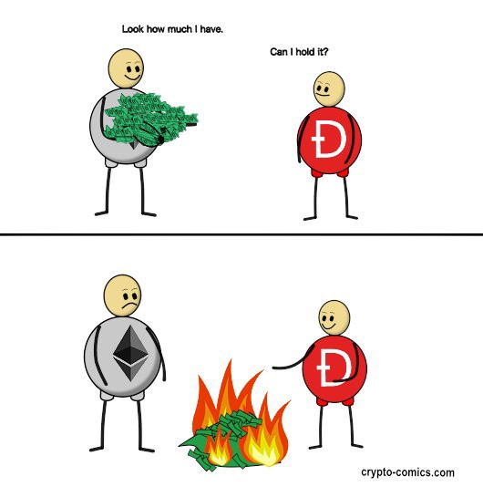

Ethereum Classic's miraciulous origin story will surely be referenced by future crypto historians as a case study that illuminates the sociotechnological fabric of blockchains. Like a Large Hadron Collider experiment, _the incident_ that birthed ETC tore apart what was previously considered a more or less atomic entity, permenantly splitting the Ethereum project in two, and scattering a cascade of valuable insights to observers.

From a purely historical perspective, ETC's story is fascinating and essential reading for any cryptocurrency researcher. But for those who are interested in really understanding what makes blockchains useful and valuable, there is no story more relevant; against all the odds, despite the wishes of many, _Code is Law_ and "Build Unstoppable Applications" ended up prevailing. Through the simple act of persisting, Ethereum Classic validated not just it's own value proposition, but the strength and tenacity of truly decentralized blockchains generally.

## Prologue

### Forgotten Details

In the wider Ethereum community, whilst the existence of Ethereum Classic is reluctantly acknowledged, the important details surrounding it's creation are largely unknown and seldom brought up because they reveal a darker side to the rainbows and unicorns. ETC's origin story is is one of ~~greed, betrayal,~~ TODO the sacrificing of values, but worst of all, in order to justify what happaned, a cultural shift away from _Code is Law_ and as such ETH's abandomnet of the higher purpose of truly decentralized blockchains.

The details of this story reveal a deep rooted flaw in the Ethereum narrative, and to some who are over-exposed to ETH it poses a threat - this is why Ethereum Classic itself is the target of dismissal, smear and ridicule. But whilst the details of ETC's genesis may be inconvenient, the facts of history must be remembered; it is the details that matter, as they warn about the very real dangers centralization.

As time goes on it will become increasingly clear that those who attack ETC are really attacking a simple truth that reveals an insecurity - that when Ethereum abandoned _Code is Law_, it also abandoned it's long term value propopsition, a proposition that ETC will be around to defend when, once again, Etheruem is bent to the will of special interests.

> Those who cannot remember the past are condemned to repeat it.

### Blame the Game

With this being said, in many ways Ethereum Classic _is_ Ethereum, and whilst coordination failures may have taken place, there is absolutely no need for ill-will towards anyone involved in or around the nascent stages of Ethereum. Far from it, all of those who contributed to Ethereum, developers and non-developers alike, should be revered for their important work in helping create one of the most important acheivements of our generation.

There are points in this story that may suggest potential financial conflicts of interest, but as it is impossible to determine how much these did or did not play a part, the individuals involved deserve the benefit of the doubt; decisions made at the time were in all likelihood driven by honest disagreement about what the best outcome would be for Ethereum at a time when there very little real world precedent to go by.

The creation of Ethereum Classic was a strange and (at the time) unpredictable outcome, so rather than blaming individuals or groups it may be more accurate to view the birth of Ethereum Classic as a happy accident that the universe saw fit to grace us with.

## The Original Ethereum Vision

In the beginning there was "Build Unstoppable Applications", and for a time it was good. It was a real revolution, as for the first time, your average developer now had the ability to create a new type of software that could not be stoppped or censored by anyone. In the early days, there was a united understanding and support of _Code is Law_ within the Ethereum community; it was was not just unconvovertial, but the very mission of Ethereum.

This is evidenced by tweets from prominent thoughtleaders and Ethereum Foundation staff at the time, and moreover, by the phrase "Build Unstoppable Applications" [appearing on the official Ethereum website](https://web.archive.org/web/20150802035735/https://www.ethereum.org/). The phrase, as we [previously](/why-classic/code-is-law) looked at, is one and the same as _Code is Law_; unstoppability means that contract code is the ultimate arbiter of transaction outcomes, as opposed to courts or other forces outside the network who would otherwise be able to stop applications.

Thousands flocked to the project based on this understanding and contributed time, talent and money, united by the _Original Ethereum Vision_ of "Build Unstoppable Applications". They told their friends, vouched for it's integrity, and thanks to this, the good word of Ethereum spread like wildfire.

Everything was going well in ETH land; people were excited, new ideas were sprouting, projects were launching, and one of those projects in particular was soon to _prove classic_; The DAO.

## The DAO

A DAO or "Decentralized Autonomous Organisation" describes a Smart Contract system that, much like a company, manages the distribution of funds for many stakeholders, and is usually goverened by voting mechanisms. The idea of DAOs had been around for a while but were only theoretical until Ethereum made it easy to program and launch them, which many teams began to in 2015/16.

### Slock.it

Stephan Tual was Ethereum Foundation's Chief Communications Officer; he [announced](https://blog.ethereum.org/2015/07/30/ethereum-launches/) the Genesis Block and was an [advocate](https://twitter.com/stephantual/status/711874685156376576) of Code is Law. Stephan, like many others, saw the bright future promised by "Build Unstoppable Applications", indeed, as CCO of Ethereum, ultimately it was his call to use this term to promote the Ethereum project.

In November 2015, Stephan teamed up with some Ethereum Foundation coders and formed a company called slock.it, and they wanted to launch not just _a_ DAO, but _The_ DAO, that would be used as a kind of Venture Capital fund targeting Etheruem projects. It was pitched as a way to both grow the Ethereum ecosystem and net returns for investors, who would deposit ether into The DAO contract in exchange for DAO Tokens, which would yeild rewards from investments made by The DAO.

### Curator Cronyism

The DAO became big news in the Ethereum world, not least because it received significant endorsements from Ethereum Foundation members. Aside from the project being led by Stephan, The DAO had recruited "curators", who were given the ability to veto certain actions and act as a failsafe, in effect reassuring investors that funds would not be at risk. [All 11 curators](https://medium.com/ursium-blog/vitalik-buterin-gavin-wood-alex-van-de-sande-vlad-zamfir-announced-amongst-stellar-dao-curators-44be4d12dd6e#.1mjq6cfn6) had worked for the Ethereum Project or Foundation; including notable heavyweights Vitalik Buterin and Gavin Wood.

### The World's Biggest Crowdsale

At the time, many saw The DAO as a "no risk" investment, as not only did it have trustworthy curators, but investors would be able to withdraw their funds from The DAO in future via a "split" mechanism; this further incentivised contributions as investors could "opt-out" later, but only had one chance to "opt-in" during the initial crowdsale.

Slock.it launched The DAO crowdsale in April 2016, and the ETH began to roll in. But soon there were signs that something wasn't quite right. During the crowdsale, [slock.it announced a security proposal](https://medium.com/ursium-blog/dao-security-a-proposal-to-guarantee-the-integrity-of-the-dao-3473899ace9d), a curator [called for a moratorium](https://hackingdistributed.com/2016/05/27/dao-call-for-moratorium/), and another curator [stepped down](https://gavofyork.medium.com/why-ive-resigned-as-a-curator-of-the-dao-238528fbd447):

> You have been warned ;-)
>
> - Gavin Wood, Ethereum Founder & (Ex) DAO Curator

But despite these warnings, by the time the crowdsale was over, The DAO had raised an incredible $150 million USD worth of ETH, breaking all world records to become the largest crowdsale ever. This USD amount may not sound staggering by today's standards, but it was 14% of all ETH, which would be worth about of $70 billion USD at today's market cap (in December 2021).

### "No Funds At Risk"

About a week after the crowdale ended, a security researcher [publicly disclosed](https://vessenes.com/more-ethereum-attacks-race-to-empty-is-the-real-deal) a new type of vulnerability that many Smart Contract developers had previously not really thought about; the so-called "reentrancy bug".

The bug can occur when a contract does not properly update it's own state in the correct order when other contracts interact with it, allowing attackers to execute the same function many times over against the _intent_ of the contract's authors. It's a bit like a vending machine that does not check that a coin was properly inserted; an attacker can tie a piece of string around the coin to pull it back out, and use the same coin to sweep all the delicious goodies.

- image of coin hack

Becuase Ethereum was so new and best practices hadn't formed around developing Smart Contracts, this bug was quite common; once the news got out, many contracts were exploited and funds were lost. Luckily, [The DAO was not affected](https://medium.com/ursium-blog/no-dao-funds-at-risk-following-the-ethereum-smart-contract-recursive-call-bug-discovery-29f482d348b), according to slock.it.

### ...and it's gone

Unfortunately, a few days later it turned out that The DAO was affected by the reentrancy bug after all. One or more attackers began to drain The DAO, and just like a piece of string tied to a coin, used specially crafted contracts to repeatedly call The DAO's split function to extract away more ETH than it's contract authors _intended_ to allow.

As a result of The DAO Hack, a significant amount of ETH had been extracted from The DAO at the expense of DAO Token Holders, who were likely to lose a much of their original investement if nothing could be done to rescue it.

### Altering the Deal

A very important point to note here is that The DAO Hacker did not exploit anything in the underlying Ethereum protocol itself as the exploit was limited to the The DAO contract. They also did not "break the rules" of the The DAO either; they simply interacted with The DAO in a way that it's authors did not anticipate. Regardless of the _intent_ of it's author's, [The DAO's Terms](http://web.archive.org/web/20160501124801/https://daohub.org/explainer.html) made it clear that the contract code itself is the final arbiter; _Code is Law_:

> The terms of The DAO Creation are set forth in the smart contract code existing on the Ethereum blockchain at 0xbb9bc244d798123fde783fcc1c72d3bb8c189413. Nothing in this explanation of terms or in any other document or communication may modify or add any additional obligations or guarantees beyond those set forth in The DAO’s code. Any and all explanatory terms or descriptions are merely offered for educational purposes and do not supercede or modify the express terms of The DAO’s code set forth on the blockchain; to the extent you believe there to be any conflict or discrepancy between the descriptions offered here and the functionality of The DAO’s code at 0xbb9bc244d798123fde783fcc1c72d3bb8c189413, The DAO’s code controls and sets forth all terms of The DAO Creation.  
> ...  
> By Creating DAO tokens through interaction with The DAO’s smart contract code, you expressly agree to all of the terms and conditions set forth in that code. If you do not understand or do not agree to those terms, you should not Create DAO tokens.  
> ...  
> The DAO’s smart contract code governs the Creation of DAO tokens and supercede any public statements about The DAO’s Creation made by third parties or individuals associated with The DAO, past, present and future.  
> ...  
> The field of Digital Cryptography is very new and for this reason, there is a risk of unforeseen attack both in terms of the underlying cryptographic protocol that back the functioning of the DAO as well as 'game theory' related vectors which have not been documented to date. Both these vectors represent a risk that could lead the loss of DAO tokens or ETH in one or more or even all of the DAO Token Holder’s accounts.

Many share the perspective that investors in The DAO, having agreed to the above terms, were aware of the risks involved, and as such, just as they were happy to accept the upside that these risks might reward, must also have been willing to accept the downside concequences of those risks being realized. For many The DAO Token Holders, however, this was not the case.

## The DAO Wars

In a twist of fate, The DAO's split function had a time delay, meaning that The DAO Hacker would be unable to fully extract their loot until about a month after the initial attack took place, assuming that nothing prevented them from doing so in the meantime. This provided a window of opportunity for the Ethereum community to fight back against the Hacker and make DAO Token Holders whole, which became the primary focus for many.

There were several options were on the table, but the main debate centered around whether or not it was acceptable to implement a "Hard Fork" that would violate the principles of "Build Unstoppable Applications"; should Ethereum stop the unstoppable? For many, this was unthinkable, but others saw it as necessary to undo a major injustice that threaterened the future of the Ethereum project.

### Robin Hood and His Merry Men

While the Hard Fork debate was unfolding, a group of noble whitehat hackers quickly went on the offensive and [were able to secure](https://www.reddit.com/r/ethereum/comments/4p7mhc/update_on_the_white_hat_attack/) the majority of the The DAO's Funds by using the same reentrancy exploit against The Hackers split Child DAO.

To cut a long story short, _before_ a Hard Fork was decided, it was confirmed that 70% of the lost funds had already been safely recovered, and the remaining 30% would be locked in a stalemate with The DAO Hacker; that remaining 30% could be [split and re-split](https://blog.slock.it/a-dao-counter-attack-613548408dd7#.sthdgppgx) in perpetuity until one side gave up.

> But even if this fork is not implemented, the community can stop the attacker from ever withdrawing their ether [...] One thing is for certain. This move can ensure that the attacker does not ever get any money out of this.

The stalemate meant that the whitehats had made sure that The DAO Hacker would be denied receiving any significant windfall, and knowing that other avenues including chain forensics and real world policing could be used, The Hacker would either give up voluntarily or face off-chain concequences that would prevent them from upholding their side of the stalemate; it was just a matter of time before Robin Hood Group would be able to return all of the funds.

One of the absurd but important details often forgotten about The DAO Fork is that it was entirely unecessary as the funds were already as good as recovered; without a Hard Fork, the _worst case scenario_ for DAO Token Holders was a temporary 30% haircut, but as we will see, the implmentation of the Hard Fork ended up causing a far worse outcome for not just DAO Token Holders but the entire Ethereum community.

### To Fork, or not to Fork?

Unfortunately, this relatively modest worst case scenario was not acceptable to many DAO Token Holders, and The Hard Fork Debate raged on. The Ethereum community was split into two opposing tribes; pro-forkers vs anti-forkers. The pro-forkers were convinced that the best (or only) way to serve justice and to "make DAO Token Holders whole" was be to implement a Hard Fork; any other opinion was unethical, and anti-forkers were protrayed as being antisocial and pro-theft, essentially accompilcaes to The Hacker; they were the kind of people that would cheer on a theif that stole granny's hadbag from a park bench.

One obvious problem that clouded the debate was a huge financial incentive for the many DAO Token Holders to support a Hard Fork, as they were incorrectly led to believe that this was the only way to guaruntee they would recoup their investment. Additionally, many influential figures including the 11 curators had in one form or another endorsed The DAO and would (at least) lose face if they were seen to not do everything they could to make the investors they influenced whole.

Some pro-forkers incorrectly believed that to allow The DAO hacker to get away such large amounts of ETH would be to condem the future of Ethereum, which would not be able to withstand a bad actor controlling such a large pool of funds in Proof of Stake. This was false, of course, but was popularised to bolster support for a fork.

The anti-forkers, on the other hand, argued that _Code is Law_ must be respected, and that implementing a Hard Fork would not only break the promises made by the Ethereum project, but represented a [moral hazard](https://en.wikipedia.org/wiki/Moral_hazard) that opened up the door to future interventions in future. Some even warned that the nature of blockchains meant that controvertial hard forks are all but guaunteed to result in a chain split.

Anti-forkers also raised the point that the negative effects of implementing a Hard Fork would be unfairly burdoned by everyone on the network, regardless of whether or not they were DAO Token Holders, whereas the beneficiaries of said fork would only be a small subset of stakeholders. This "privatized profits and socialialized losses" reality was reminiscent of the 2008 financial crisis, with the Hard Fork being referred by many as a "bailout", with it's various connotations.

In response to this concern, pro-forkers were incentivsed to downplay the risks of a chain split, shelving it under the category of "pretty much impossible". Moreover, any preperation for a chain split, such as implementing replay attack protection, or informing exchanges of this potential outcome to protect them from double spending, was not made, as to do so would affirm the possibility of a chain split and in turn make one more likely to happen.

### Ethereum's Darkest Hour

As the deadline loomed, the debate quickly devolved into an extremely toxic argument that was fueled by financial interests and philosophical angst. The rift was so intense accusations of criminality and lack of ethics were thrown from both sides. Any and all tactics were used to win the fight, which became an almost (and some claimed literally) a life and death battle.

The sad affair was topped off by threats of doxxing and other forms of retribution against those who were against a Hard Fork. [Calls were made](https://twitter.com/slockitproject/status/743790901877706752) from slock.it to reveal the identities of those who opposed the Hard Fork, creating chilling effects and intimidating anti-forkers against speaking out:

> I'd be VERY interested to know the identify of anyone coordinating an effort to oppose a hardfork. PM me stephan@slock.it

Ironically, at the same time this witchunt from slock.it was underway, [The DAO's website](web.archive.org/web/20160622212427/https://daohub.org/manifesto.html), which was operated by slock.it, hilighted it's supposed values:

> We, as a DAO, ascribe to the following values:  
> ...  
> Privacy and the right to anonymity

By now, the Hard Fork Debate resembled a no-holds-barred religious crusade rather than a healthy discussion about what was in the best interest of the Ethereum project; but perhaps it was never about that to begin with.

### Manufactured Consensus

Looking back today at those old threads on reddit, we can see that much of the community seemed to be against the Hard Fork, but there were clearly strong forces involved that felt they had no choice but to push it forward in order to protect their financial interests.

Unfortunately it is probably impossible to get to the bottom of what the consensus really was at the time, as the main forums of discussion - reddit and twitter - were totally susceptible to sybil attacks in the form of astroturfing. Did the Hard Fork have genuine popular support, or was it just manufactured consensus? We will probably never know, but at the very least there was a significant pushback, and it cannot be denied what was going to be foisted on the community was a _controvertial Hard Fork_.

### The "Debate" Concludes

By the time the deicion about whether or not to implement a Hard Fork was made, it appeared to be far more than just about a Hard Fork; it had became a tribalistic power game where the both sides were so entrenched in their positions, many were beyond reason and unable to concede.

As we will reflect upon later, through a game thoery lense, the whole ordeal seemed like a coordination trap, as from the beginning the incentives were aligned such that both sides were driven to "victory or death". The forkers downplayed the possible negative outcomes of a Hard Fork, whilst simultaniously making it seem like the only viable option, glossing over the reality of the situation thanks to Robin Hood's efforts.

As the split function deadline loomed, consensus was declaired, and Ethereum would implement the unthinkable: a Hard Fork to change the rules of the game and undo the hack. The forkers had won the debate; or at least, they got their way. For now.

### Neutral Decisions

During the debate the Ethereum Foundation attempted to maintain a stance of neutrality; whatever the outcome, it was a question for the Ethereum _communtiy_ to deicde, not something that came from the top. Despite this, evidence of lack of neutrality from Etheruem Foundation was shown throughout, but particularly in the way that the default settings for the Ethereum client, go-ethereum aka geth, was set.

One problem with implementing the Hard Fork was that if many users needed to "opt-in" with additional confuguration, many (perhaps most) users and miners would be operating on the "unforked" chain, which would all but guaruntee that a chain split would occur and create problems. The "solution" was to update the default settings of the Ethereum clients to follow the new Hard Fork rules, and require users to "opt-out" of the fork.

In a veiled attempt to maintain some level of neutrality, the decision of which default to use for geth was made based on the outcome of a "coin vote", which was announced and concluded within 12 hours, giving very little time to coordinate any reponse from anti-forkers, and was heavily skewed by pro-fork whales. The important decision of which chain to default was then claimed to be made "by the community".

Whilst it was clear that some pro-forkers did not want geth or any Etheruem Foundation products to even have the option of running the "unforked" chain, to provide plausible neutrality, the infamous `--oppose-dao-fork` flag was added to geth, enabling users to opt-in to the _Code is Law_ chain by enabling this config paramter. It was removed in later versions.

--- screenshot of mist ---

To be fair, other teams within Etheruem Foundation were intentionally less biased; Mist, the dapp browser, forced users to make an explicit choice of which version of the chain to run when opening the client, rather than opting them in to the fork by default.

Very neutal:
https://nitter.42l.fr/stephantual/status/743764898316877824

## The Fork

On block 1,920,000, or 30th July 2016 for those still using the gregorian calendar, history was made. While the Ethereum website still proudly proclaimed "Build Unstoppable Applications", it's authors changed the Ethereum protocol for the sole purpose of stopping The Hacker's Child DAO in it's tracks. The forkers reached into the application layer, punt kicked _Code is Law_, rewrote The DAO's contract midflight, and confiscated Ether from The Hacker. Mission Accomplished!

--- image of popping corks ---

Contrary to popular misconception, The DAO Hard Fork was technically _not_ a "rollback", as it is commonly referred to - there was no "going back" to an old state - rather, in the words of Vitalik, it was a "surgical irregular state change". In many ways, this is far worse outcome from a _Code is Law_ perspective, as unlike a long reorg, this was the manual intervention of a contract mid-flight, overriding the logic of the contract, _changing the rules of the game_, and inserting some arbitray replacement code deteremined by an off-chain governance process with next to no transparency. On this new fork, where the application layer had been desecrated, _Code is Law_ was dead.

### The Chain Split

As if by some divine universal law, a dynamic of opposites is seen all throughout nature. The Light and the Dark, the Yin and Yang, the Decentralized and Centralized.

-- THE DAO LOGO --

When an attempt was made to crush the Original Ethereum Vision by it's very authors, the universe provided an equal and opposite response - the defiant continuation of the original Ethereum chain, following unforked _classic_ rules. In contrast to the freshly forked Ethereum, the unforked Etheruem was opposite in many ways; in it's unstoppability, it's level of decentralization and therefore in it's unbounded potential to change the world.

The technology, for the first time, had demonstrated it's ultimate dispute resolution mechanism. Through the chain split, all parties got what they wanted; either a version of Ethereum where _Code isn't Law_, or a chain where the promise of "Build Unstoppable Applications" was upheld.

The DAO Fork was a sacred cleansing moment for Ethereum; a shedding of the corruption and centralization that allowed The Fork to happen. Those who didn't like _Code is Law_ started a new chain with new rules, leaving the unforked chain to operated as it was, with less baggage, a refined community and a clear mission.

-- iamgery of forking off --

Confusingly, the Ethereum Foundation determined that their new forked chain would be called "Ethereum", and from then on it would exclusively receive official support from the Foundation - not limited to development and marketing. But _Code is Law_ is not something that could be forked away on a whim, and the original chain they abandoned continued to chug along, and became known as _Ethereum Classic_.

### The Immaculate Conception

The emergence of Ethereum Classic was miraculous in many ways, both in circumstance and substance. Had it not been for The DAO, The Reentrancy Bug, The Hacker, The Split Function Time Limit, The Hard Fork Debate Coordination Trap, The Hard Fork itself, and of course the brave and handsome/beautiful supporters of ETC, without this series of profoundly improbable events, the world would not be blessed with a truly decentralized Smart Contract platform that champions _Code is Law_.

Ethereum Classic itself also has many miraculous properties that are impossible to conjour up artificially. With a commitment to _Code is Law_, no centralized foundation, an "ultrafair distribution", and a community who self-select based on concern for principles over financial interests, ETC stands highger even than the Bitcoin Standard on many of the pillars of decentralization, giving ETC one of greatest potentials of all blockchains for sovereign grade censorship resistance and the reality-bettering power it unleashes.

The circumstances of Etheruem Classic's emergence are so rare that they are unlikely to ever happen again; Ethereum Classic, being the first to demonstrate the power of _Code is Law_ and the danger of pushing for controvertial hard forks, serves as a warning to prevent similar situations from happening in the future, making ETC the only chain likely to acheive these properties.

### Replay Attacks

- intentionally did not implement replay attack protection
- Nowadays, thanks to the fork, blockchains include a ChainID, which is specified in each transaction to prevent them from being relayed to other chains

## The Chain of Liars and Theives

Ethereum Classic was made the enemy of the people. And of course - it's existance proved that the Hard Fork was a load of baloney and that ETH has no long term value. But hold on a second... What happened to the The DAO on the ETC side?

### Free Money

Fun times

### Whitehat Group and their Not So Merry Men

In full resolution, this part of the saga is fairly complex but, is documented in detail in a [piece by BitMEX research](https://blog.bitmex.com/revisiting-the-dao/). The main takeaways are as follows.

The Whitehat Group, who after sourcing help from the community and acquiring the Child DAO controller keys that enabled them to keep The DAO Hacker in a stalemate, presumably under the assumption that any activity on ETC would be legitimizing the unlegitimate, decided not give up the stalemate, effectively [handing over about 3.5 million ETC to The DAO Hacker](https://receipt.emerald.cash/balance/0x5e8f0e63e7614c47079a41ad4c37be7def06df5a) (now worth around $120 Million USD).

Bity, a company with ties to Slock.it, helped out...

Not only this, but after realizing that ETC actually had value, in what can only described as a highly questionable move, WHG attempted to dump massive amounts of ETC on the market to liquidate them for ETH. This attempt was mostly unsuccesful, as major exchanges Kraken and Poloniex froze these funds before they were able make any trades. instead created a withdrawal contract and allowed DAO Token Holders to get back their ETC. As of today, https://receipt.emerald.cash/balance/0x9f5304da62a5408416ea58a17a92611019bd5ce3

By doing a Hard Fork and giving up on the Child DAO stalemate, The Hacker was able to get away with a significant amount of Ethereum Classic, value that would otherwise almost certainly have been able to be recovered and returned to DAO Token Holders.

## The Philosophical Fallout

To the layman, Ethereum is and has marketed itself all about code being the final arbiter of contract interactions. All of the marketing around decentralization, the DeFi ecosystem, "unstoppable" domains, etcetera, rests on top of this flawed assumption.

In reality, as we have seen, Ethereum's history suggests that this is mere lip service. The inherant contradiction of it's past actions means that the main Ethereum project is now in a schizophrenic position where it is simultaneously be for and against the idea of _Code is Law_. Ethereum cannot take a confident position on this point, and to this day resorts to strategic ambiguity.

Some Etherians say that The DAO Fork was a one-off that will never happen again; Ethereum really does follow _Code is Law_, or at least it does since The Fork. Others in Ethereum Foundation say that _Code is Law_ is an [inhumane](https://twitter.com/VladZamfir/status/936029138623774721), [sociopathic](https://medium.com/@Vlad_Zamfir/my-intentions-for-blockchain-governance-801d19d378e5) concept; that future DAO Fork level "corrections" _are_ on the table and that is a good thing.

Whichever position is taken, major problems remain. By the way, why do influential members of Ethereum Foundation think this position is sociopathic, and does this fact not suggest that they _would_ be willing and able to override _Code is Law_?

This is the double-bind that Ethereum finds itself in and will be the root of it's failure; it cannot square the circle of it's past actions contradicting it's messaging, and this dangling thread tempts the kitten of fate the longer it remains unpulled.

This is this core reason why Ethereum Classic, being openly advocating for the principle of _Code is Law_ in all circumstances, can remain philosophically internally consistent and therefore stand the test of time.

### Build Stoppable Applications

- ETH still pretends to follow Code is Law, even though some of their thought leaders realize this is a contradtiction

In 2017, researcher and blockchain philosophy thought leader Vlad Zamfir of Ethereum Foundation [admitted](https://twitter.com/VladZamfir/status/930590981816180737) that the phrase should have been "Build _Almost_ Unstoppable Applications". Whilst a full debate about the difference between "Stoppable", "Almost Unstoppable" and "Unstopppable" deserves it's own blog post, for now we will just point out that "Almost Unstoppable" is not the same as "Unstoppable".

Despite this, the phrase "Build Unstoppable Applications" remained as Ethereum's main slogan [until mid 2019](http://web.archive.org/web/20190415163751/https://www.ethereum.org/), when the website was [updated](http://web.archive.org/web/20190511071935/https://ethereum.org/) and this original vision was officially retired. Thanks to Ethereum Classic, the original messaging did turn out to be accurate in claiming unstoppability; on ETC, The DAO was not stopped, so in the end the promises made on Ethereum.org were kept - contrary to the wishes of it's authors.

## Lessons Learned

- ETC has founders, but has no founders.
- Moreso than bitcoin, who's ultimate , ETC embodies the principles of bitcoin in a more explicit way.
- ETC has no satsohi
- ETH is already captured
- It was not neccessary at all, so

### Coordination Failure

The hard fork debate wa sa coordination failure based on a game theory trap.

As of writing, in 2021, the events that unfolded do not seem to make much sense, given the poor outcomes. Wasn't it obvious a Hard Fork was a bad idea? One theory is that the thinking of those who pushed so hard for a Hard Fork was clouded - a combination of lack of understanding, poor forseight, and most influentially, hijacked amigdulas thanks to immense pressure high stakes financial tribalistic infighting caused by the game theory around the hard fork debate, which discouraged any whiff of backing down.

The hard fork debate was essentially a game of chicken, and the "fork" side could only get a "win" if they doubled down on the idea that a chain split would not occur, meaning they made no plans to deal with it, and had to downplay it's (in hindsight quite obvious) likelihood. This is why Ethereum Classic is to this day such a viscerally hated project by many pro-forkers; it is immutable proof that they made a huge mistake.

A Hard Fork not only caused the network to split and Ethereum to lose it's _Code as Law_ status, but in a bout of poetic justice, actually returned less funds to DAO Token Holders than otherwise would have if they had maintained _Code is Law_.

The only antidote to these mad game theory quandries is to have a reference point to prevent ourselves from falling into the traps - that is why principles are so important, and they can innoculate a chain against many potential failure states.

### From the Ashes

On the flip side, however, one project, and more specifically, one philosophy, whilst it was far from obvious at the time, did massively benefit from the Hard Fork; Ethereum Classic and _Code is Law_. In the end, the real winners of the vicious Hard Fork debate were the anti-forkers. The moment it was obvious the Original Ethereum Vision would not go silently into the night, it was settled; _Code is Law_ prevails.

But hold on a minute, this can't be serious - just look at Ethereum Classic's market cap compared to Etheruem mainnet! In what world is Ethereum Classic considered a "winner"? To those who "get" _Code is Law_, and understand the true value of blockchains, the answer is obvious. There is a difference between price and value, and the market can stay irrational for a long time, but eventually, all blockchains will be forced to make the choice between long term decentralization or short term convenience, and Ethereum made their choice, and will forever, including times where decentralization is needed for survival, will live with the concequences.

https://twitter.com/stephantual/status/727863897710047233
https://twitter.com/stephantual/status/711874685156376576
https://twitter.com/fluffypony/status/936224945209782273
https://twitter.com/stephantual/status/743764898316877824

## History Repeats

The story of The DAO shows how Ethereum was hijacked by a special interest group, who forced through a misguided change on the network at everyone else's expense.

The fight for _Code is Law_, upheld by decentralization, is not over - it never will be over - as these values must be continually spread, nurtured, evolved and reinforced.

How do we prevent this from happening in ETC? by defending our principles.
