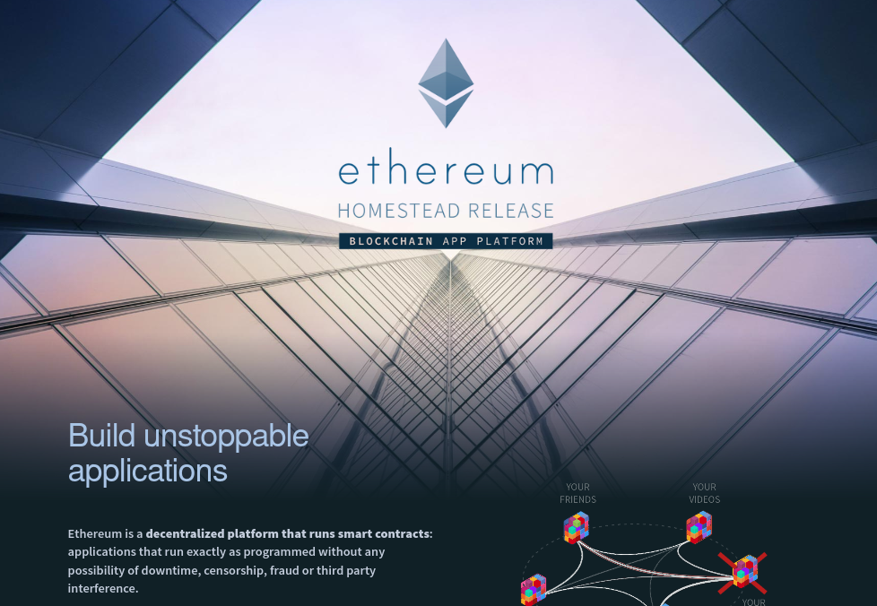
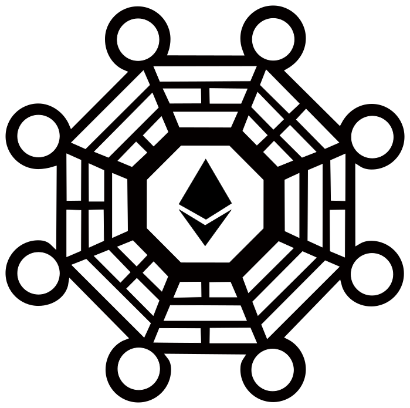
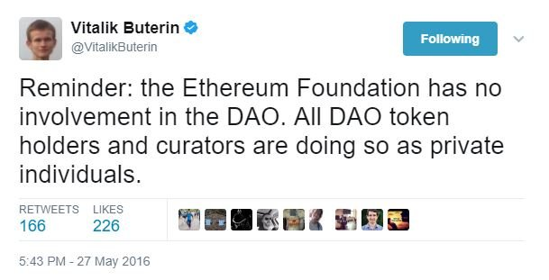
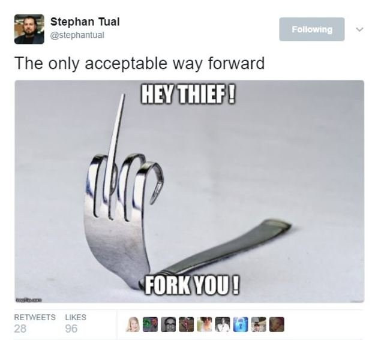
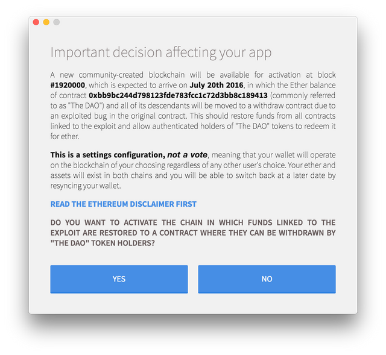
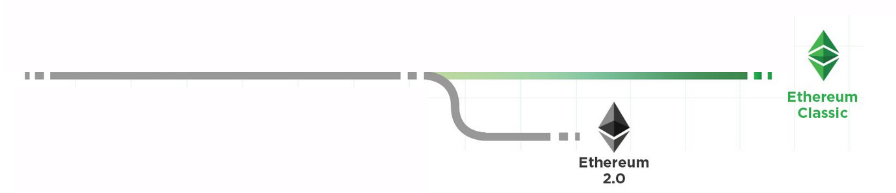
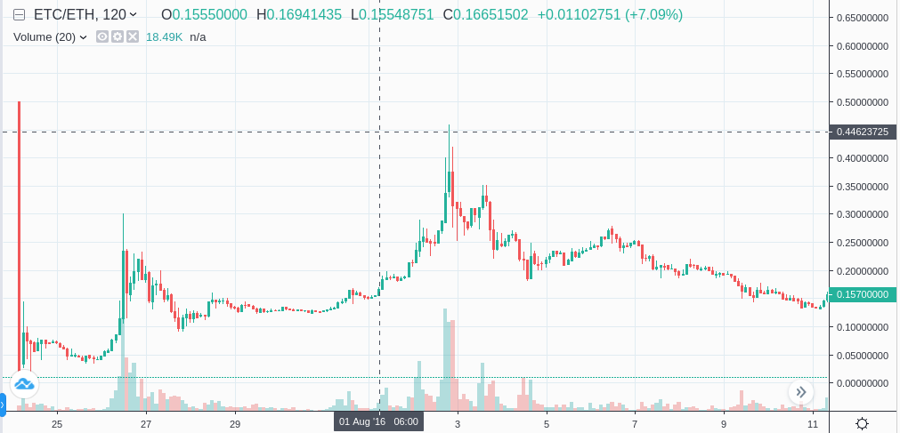
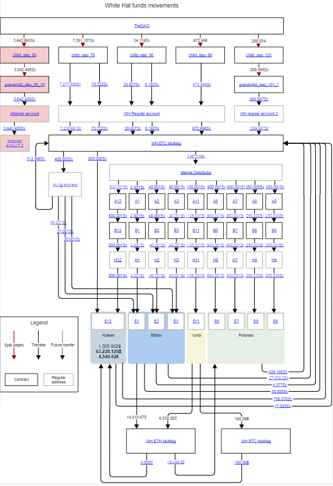
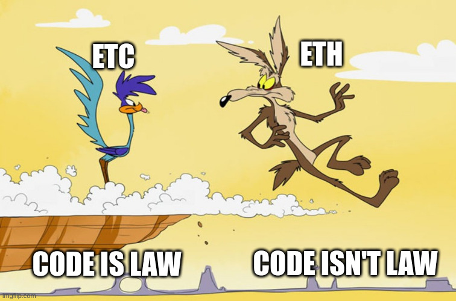

## 关键点

- Ethereum™ 和 Ethereum Classic 曾经是同一个区块链。
- DAO 是一个筹集了大量资金的合约，但它有一个被利用的错误。 ETH 有可能输给了黑客。
- 70%的损失资金被追回，但 30%的资金仍处于困境中。
- 作为回应，有人提出了硬分叉，通过停止黑客的申请来没收剩余的 30%。
- 硬分叉是有争议的，因为它不是在修复以太坊协议本身的问题，而以太坊以 "构建不可阻挡的应用程序 "为营销理念。
- 一个备受质疑的 "硬币投票 "导致以太坊基金会支持硬分叉，打破了他们的中立性。
- 硬分叉造成了链式分裂，导致了 Ethereum Classic。
- 硬分叉是没有必要的，因为被黑的资金可以在以太坊经典上找回，但由于分叉，这一努力被放弃了。
- 在放弃了 _《代码就是法律》_，Ethereum™ 发现自己在涉及到未来的干预时，在哲学上处于一个值得怀疑的位置，这可能是有问题的。
- 以太坊经典仍然是运行时间最长的智能合约平台，坚持 "建立不可阻挡的应用程序 "的承诺。

## 简介

未来的加密货币历史学家肯定会参考以太坊经典的神奇起源故事，将其作为一个案例研究，阐明区块链的社会技术结构。 就像大型强子对撞机实验一样， _，孕育了 ETC 的事件_ ，将以前被认为是一个或多或少的原子实体撕碎，永久地将以太坊项目一分为二，并将一连串有价值的见解散布给观察者。

从纯粹的历史角度来看，ETC 的故事很吸引人，是任何加密货币研究者的必读书。 对于那些有兴趣真正了解区块链的价值的人来说，没有什么故事比这更有意义。 尽管困难重重，尽管许多人希望， _代码就是法律_ ，"建立不可阻挡的应用程序 "最终占了上风，通过坚持不懈的简单行为，Ethereum Classic 不仅验证了它的价值主张，而且验证了真正去中心化的区块链的普遍力量和韧性。

## 建议

只有通过围绕其起源故事的事件才能充分理解 Ethereum Classic 的使命，根据定义，它与它的兄弟姐妹 [Ethereum™](https://ethereum.org) ，在几个重要方面是不一致的。 但这些差异不应该被误解为以太坊经典与以太坊 ™ 整体的对立。 相反，这两个项目的共同点远远多于它们之间的区别。 两个以太坊项目都有相同的总体雄心，即为更好地改变世界；区别在于每个项目认为实现这一变化需要什么。

以太坊经典并不反以太坊 ™。 Ethereum Classic _是_ Ethereum。

### 被遗忘的细节

在更广泛的以太坊社区，虽然人们不情愿地承认以太坊经典的存在，但围绕其创建的关键细节在很大程度上不为人知，也很少反思，因为它们揭示了一个许多人宁愿忘记的事实。

这个故事的细节暴露了 Ethereum™ 叙述中一个根深蒂固的缺陷。 对于一些过度接触 ETH 的人来说，它构成了一种威胁，这也是为什么以太坊经典本身成为解雇、抹黑和嘲笑的目标的一个原因。 但是，尽管 ETC 的起源细节可能是不方便的，但必须记住历史的事实。 这些细节很重要，因为它们警告了集中化和捕获的危险。

> 那些不能记住过去的人，注定要重复它。

随着时间的推移，它将变得越来越清楚，许多批评 ETC 的人被一个简单的事实弄得很不舒服。 当 Ethereum™ 放弃 _Code is Law_，它也放弃了区块链的一个主要(如果不是唯一)长期价值主张。 对许多人来说，以太坊经典是对这种失去价值的恼人提醒，但无论如何，它都会坚持下去，并在以太坊 ™ 再次屈服于特殊利益集团的意志时，愉快地捡起碎片。

### 责备游戏

既然如此，虽然过去可能发生过协调失败的情况，但没有必要对参与或围绕以太坊新生阶段的任何人产生怨恨。 远的不说，所有为以太坊做出贡献的人--觅食者、反觅食者、开发者和非开发者--都应该受到尊敬，因为他们在帮助创造一代人中最重要的成就之一方面做了重要工作。 以太坊经典版对以太坊项目及其创造者负有感谢之情。

这个故事中有些地方可能暗示了潜在的财务利益冲突，但这些激励措施是所有区块链项目的必要元素，即使不受欢迎，也是可以预期的。 在任何情况下，由于不可能确定他们在多大程度上发挥了作用或没有发挥作用，所有参与的个人都应该得到怀疑的好处。 此外，当时做出的决定很可能是出于对什么会导致以太坊的最佳结果的真诚分歧，而当时在现实世界中可参考的先例很少。

以太坊经典的诞生是一个奇怪的、基本上没有预料到的结果。 与其指责个人或团体，不如将 Ethereum Classic 的诞生视为一个快乐的意外，可能会更健康。

由于这些原因，本反思将有意避免指名道姓，未来关于该主题的讨论也应如此。 只有当组织或高级行政人员的角色对了解情况不可或缺时，才会被确认。

## 最初的以太坊愿景

一开始，有 "建立不可阻挡的应用"，有一段时间，这很好。 这是一场真正的革命，因为你的普通开发者能够创造一种新型的软件，任何人都无法阻止或审查。 在早期，以太坊社区内对 _"代码即法律 "的概念有统一的支持_。 这不仅是没有争议的，而且是任务本身。

"构建不可阻挡的应用程序 " [，这句话出现在以太坊官方网站上](https://web.archive.org/web/20150802035735/https://www.ethereum.org/) ，正如我们 [以前](/why-classic/code-is-law) ，这是一个取决于 *代码就是法律*的功能。 不可停止性意味着智能合约代码是交易结果的最终仲裁者，而不是法院或合约层之外的其他力量，否则他们就能阻止或推翻应用程序。

> 为什么区块链是有用的？    
> \- 你可以在上面运行应用程序，并说服你的用户，即使你失去了维护它的兴趣，你被贿赂或威胁以某种方式操纵应用程序的状态，或者你获得了以某种方式操纵应用程序状态的利润动机，你的应用程序仍将继续工作。
> 
> - [区块链技术的价值，以太坊博客，2015 年 4 月](https://blog.ethereum.org/2015/04/13/visions-part-1-the-value-of-blockchain-technology/)

> 使用区块链技术的人可以放心地知道，他们的身份、资金或设备所有权的状况被安全可靠地维持在一个以 Math™ 为后盾的超安全、无信任的分布式账本中，而不是受制于任何一个任意方的奇想。
> 
> - [信任的问题，以太坊博客，2015年4月](https://blog.ethereum.org/2015/04/27/visions-part-2-the-problem-of-trust/)

基于这种认识，成千上万的人涌向该项目，并贡献了时间、才能和金钱，他们被 _原有的以太坊愿景_ "构建不可阻挡的应用程序 "所团结。 他们告诉他们的朋友，为其完整性做担保，并且，由于这一点，以太坊的消息像野火一样传播。

在 ETH 的土地上，一切都很顺利。 人们很兴奋，新的想法在萌芽，项目在启动，特别是其中一个项目很快就 _，证明经典_。

## DAO

DAO(发音为"_Dow_ Jones")或 "去中心化自治组织 "描述了一个智能合约系统，它很像一个公司，为许多利益相关者管理资金分配，通常由投票机制管理。 DAO 的想法已经存在了一段时间，但并不实用，直到以太坊使其易于编程和启动，许多团队在 2016 年开始做。

以太坊基金会在众筹中筹集资金创建了以太坊，其首席通信官 [，宣布了以太坊创世区块](https://blog.ethereum.org/2015/07/30/ethereum-launches/) ，并且是 与其他许多人一样，英孚的首席运营官看到了 "构建不可阻挡的应用程序 "所承诺的光明前景，事实上，最终是他们呼吁使用这个术语来推广以太坊项目。 与其他许多人一样，英孚的首席运营官看到了 "构建不可阻挡的应用程序 "所承诺的光明前景，事实上，最终是他们呼吁使用这个术语来推广以太坊项目。

2015 年 11 月，这位现在的前首席执行官与一些编码员合作，成立了一家名为 slock.it 的公司。 Slock.it 想推出的不仅仅是 _a_ DAO，而是 _The_ DAO，它将被用作一种针对以太坊项目的风险投资基金。 它被说成是发展以太坊生态系统和为投资者提供净回报的一种方式，投资者将以太坊存入 DAO 合约，以换取 DAO 代币，这将允许对 DAO 的投资进行投票并获得回报。

### 馆长裙带关系

DAO 成为以太坊世界的大新闻，主要是因为它得到了许多以太坊基金会成员的重要支持。 除了该项目由英孚最近的首席运营官领导之外，DAO 还招募了 "馆长"，他们被赋予了否决特定行动的能力，并作为一个故障安全装置，实际上是向投资者保证资金不会受到某些类型攻击的风险。 [所有 11 位策展人](https://medium.com/ursium-blog/vitalik-buterin-gavin-wood-alex-van-de-sande-vlad-zamfir-announced-amongst-stellar-dao-curators-44be4d12dd6e#.1mjq6cfn6) ，都曾直接为以太坊项目或基金会工作，包括一些著名的重量级人物。

官方称，以太坊基金会本身并没有参与 The DAO，但也许是因为许多策展人都与 EF 有关系，所以必须明确这一立场。

以太坊基金会试图与 The DAO 保持距离，这一点很重要，因为尽管有这些中立的说法，但随后的行动似乎告诉我们一个不同的故事。

### 世界上最大的众筹活动

当时，许多人认为 The DAO 是一种 "无风险 "的投资，因为它不仅有值得信赖的策展人，而且投资者将来可以通过 "拆分 "机制从 The DAO 提取他们的资金；这进一步激励了捐款，因为投资者以后可以 "选择退出"，但在最初的众筹中只有一次 "选择加入 "的机会。

Slock.it在2016年4月推出了The DAO众筹，ETH开始滚滚而来，但很快，就有迹象表明事情不太对劲。 在众筹期间，slock.it宣布了一项 [安全建议](https://medium.com/ursium-blog/dao-security-a-proposal-to-guarantee-the-integrity-of-the-dao-3473899ace9d)，一位策展人呼吁暂停 ，另一位著名策展人发出了 [警告](https://gavofyork.medium.com/why-ive-resigned-as-a-curator-of-the-dao-238528fbd447) ，并下台了。

但尽管有这些警告，到众筹结束时，The DAO已经筹集了价值1.5亿美元的ETH，打破了所有世界纪录，成为有史以来最大的众筹。 这个美元数额以今天的标准听起来可能并不惊人，但它是所有ETH的14%，按今天的市值计算，价值约700亿美元（截至2021年12月，ETH的价格约为4,000美元）。

### "没有资金风险"

在众筹结束一周后，一位安全研究员公开 ，披露了许多智能合约开发者之前没有考虑到的一种新型漏洞，即所谓的 "重入漏洞"。

当其他合同与之互动时，合同没有正确地更新其状态，就会出现这个错误，从而使攻击者可以多次执行相同的功能，违背合同作者的 _意图_。 这就像自动售货机不检查硬币是否被正确插入一样；攻击者可以在硬币上系一根绳子，把它拉回来，用同一枚硬币扫荡所有的美味。

由于以太坊是如此之新，而且围绕开发智能合约的最佳实践还没有形成，这种错误是相当普遍的。 一旦消息传出，许多合同被利用，资金损失，但幸运的是，DAO 没有受到影响， [根据](https://medium.com/ursium-blog/no-dao-funds-at-risk-following-the-ethereum-smart-contract-recursive-call-bug-discovery-29f482d348b) to slock.it。

### ......就这样消失了

就像现实世界的合同一样，魔鬼在细节中，事实证明，DAO 毕竟是 [，受到重入性错误的影响](https://blog.b9lab.com/the-dao-hack-in-eight-minutes-94919018692d)。 在 [666 行](https://github.com/TheDAO/DAO-1.0/blob/master/DAO.sol#L666-L670) ，一个漏洞处于休眠状态，而那笔巨额募集的 ETH 就在那里等待着眼尖的程序员去抢夺。

几天后，一个或多个攻击者开始耗费 The DAO，就像一根绑在硬币上的绳子一样，利用特制的合约反复调用 The DAO 的分裂功能，提取走比其合约作者 _、_ 、允许的更多 ETH。

由于 DAO 黑客攻击，大量的 ETH 从 DAO 中被提取出来，牺牲了 DAO 代币持有者(DTH)的利益，如果不采取任何措施进行拯救，他们可能会失去大部分的原始投资。

### 改变交易

这里需要注意的一个关键点是，The DAO Hacker 并没有利用以太坊底层协议中的任何东西，因为该漏洞仅限于 The DAO 合约。 他们也没有 "违反 "DAO 合同的规则，因为他们只是以 DAO 作者没有预料到的方式与 DAO 互动。 不管作者的 _意图_ ， [The DAO 的条款](http://web.archive.org/web/20160501124801/https://daohub.org/explainer.html) ，明确指出合同代码本身应该是最终的裁判。 根据 The DAO 的作者， _Code is Law_。

> 创建 DAO 的条款在以太坊区块链上现有的智能合约代码中规定，代码为 0xbb9bc244d798123fde783fcc1c72d3bb8c189413。 本条款解释或任何其他文件或通信中的任何内容均不得修改或增加 The DAO 代码中规定的义务或保证之外的任何其他义务或保证。 任何和所有解释性条款或描述只是出于教育目的，并不取代或修改区块链上规定的 The DAO 代码的明确条款；如果你认为这里提供的描述与 The DAO 代码的功能之间存在任何冲突或差异，0xbb9bc244d798123fde783fcc1c72d3bb8c189413，The DAO 的代码控制并规定了 The DAO 创作的所有条款。   
> ...  
> 通过与 The DAO 的智能合约代码互动来创建 DAO 代币，你明确同意该代码中规定的所有条款和条件。 如果你不理解或不同意这些条款，你不应该创建 DAO 代币。   
> ...  
> DAO 的智能合约代码管理着 DAO 代币的创造，并取代第三方或与 The DAO 有关的个人在过去、现在和将来对 The DAO 创造的任何公开声明。   
> ...  
> 数字密码学领域是非常新的，因此，在支持 DAO 运作的底层密码协议以及迄今为止尚未记录的'博弈论'相关载体方面，都存在着不可预见的攻击风险。 这两个向量都代表着一种风险，可能导致一个或多个甚至所有 DAO 代币持有者的账户中的 DAO 代币或 ETH 的损失。

许多人都认为，DAO 的投资者在同意上述条款后，知道会有风险，因此，就像他们乐于接受这些风险可能带来的好处一样，他们也必须愿意接受这些风险实现后的负面后果。 然而，对于许多 DAO 代币持有者来说，情况并非如此。

## DAO 战争

在命运的转折中，The DAO 的分裂功能有一个时间延迟，这意味着 The DAO 黑客将无法完全提取他们的战利品，直到最初的攻击发生后约一个月，假设在此期间没有什么阻止他们这样做。 这为以太坊社区提供了一个机会窗口，以反击黑客并使 DAO 代币持有者得到补偿，这成为许多人的首要关注。

桌面上有几个选项，但主要的辩论集中在是否可以接受实施 "硬分叉"，一个向后不兼容的协议变化，唯一的目的是违反 "建立不可阻挡的应用程序 "的承诺，以停止黑客之子 DAO 并归还资金。

以太坊会阻止不可阻挡的力量吗？ 对许多人来说，这是不可想象的，但其他人认为这是消除可能威胁到整个网络未来的重大不公正的唯一途径。

### 罗宾汉和他的快乐的人

在硬分叉辩论展开的同时，一群高贵的白帽黑客迅速展开攻势，通过对黑客分裂的儿童 DAO 使用同样的重入漏洞，确保了 The DAO 的大部分资金。

在决定硬分叉之前， [确认](https://old.reddit.com/r/ethereum/comments/4p7mhc/update_on_the_white_hat_attack/d4ip04w/) ，70%的损失资金已经被安全追回，可以进行反击，所以剩下的 30%将被归还，或者锁定在与 The DAO 黑客的僵局中。 剩下的 30%可以永久地分割和再分割，直到一方放弃。

> 但是，即使[软分叉或硬分叉]没有实施，社区也可以阻止攻击者永远提取他们的乙醚  
> ...  
> 有一件事是肯定的。 这个 [counter-attack] ，可以确保攻击者永远不会从中得到任何金钱。 从那时起，可以继续与攻击者谈判，也可以发生硬分叉，以偿还所有 DAO 代币持有者。
> 
> - [一个 DAO 的反击，Slock.it](https://blog.slock.it/a-dao-counter-attack-613548408dd7#.sthdgppgx)

存在一种不切实际的担心，即 DAO 黑客会 _，永远不会_ ，30%的资金会被永远锁定。 但实际上，罗宾汉集团能够夺取剩余资金的控制权只是一个时间问题，因为罗宾汉集团可以在追求其他途径揭开黑客的面纱或破坏黑客的同时，将他们这边的僵局自动化。

这种僵局意味着白帽子们拒绝让 DAO 黑客获得任何重大的意外收获，并且知道可以使用其他途径，包括谈判、链式取证和现实世界的警察，黑客最终将被迫要么自愿放弃，要么面临链外的后果，这将使他们无法坚持自己一方的僵局。

关于 DAO 分叉，有一个荒唐但重要的细节常常被遗忘，那就是它是不必要的，因为大部分资金已经被收回，剩下的也和收回的一样。 如果没有硬分叉， _，DAO 代币持有者最坏的情况是 _，暂时\_ 30%的发币量，但正如我们将看到的，硬分叉的实施最终不仅给 DAO 代币持有者，而且给整个以太坊社区和整个加密货币文化造成了更糟糕的结果。

_更新：_ 这一分析已被证明是正确的，因为 DAO 黑客的身份已被研究人员和 RHG 成员推断出来了。 如果没有分叉，揭开黑客面纱的压力会更大，而且可能会更早发生。

### 叉子，还是不叉子？

虽然这种相对温和的最坏情况对许多 DAO 代币持有者来说是可以接受的，但任何低于 100%资金立即返还的情况对有影响力的特遣队来说都是不能接受的，因此 "硬分叉 "的辩论持续进行。

以太坊社区被分裂成两个对立的部落：伪造者和反伪造者。 伪造者确信，伸张正义和 "使 DAO 代币持有者得到补偿 "的最佳方式是实施硬分叉。 任何其他意见都是不道德的，而反叉者被描绘成反社会和支持盗窃，基本上是黑客的帮凶。

一个明显的问题给辩论蒙上了阴影，那就是众多 DAO 代币持有者支持硬分叉的巨大经济动力。 他们被错误地引导，认为这是保证他们能收回投资的唯一方法。 此外，许多有影响力的人物，包括 11 位策展人，都支持 The DAO，如果他们被发现没有尽一切努力使他们影响的投资者获得完整的利益，他们将失去面子。

一些支持分叉的人错误地认为，允许 The DAO Hacker 带着如此大量的 ETH 逃跑将是对以太坊未来的谴责，因为以太坊将无法承受一个坏的行为者控制如此大量的权益证明资金池。  ，以太坊的权益证明实现的架构师否认了这一说法，但还是被推广开来，以加强对分叉的支持，并且是一个至今仍在延续的神话。

另一方面，反分叉者认为，必须坚持 "建立不可阻挡的应用程序"，实施硬分叉不仅会打破以太坊项目的承诺，而且代表着 [，为未来的干预打开了大门，是一种道德风险](https://en.wikipedia.org/wiki/Moral_hazard)。 一些人甚至警告说，区块链的性质意味着，有争议的硬分叉保证会导致 _链分裂_，这可能是灾难性的。

反分叉者还提出，实施硬分叉的不利影响将对网络上的每个人造成不公平的负担，无论他们是否是 DAO 代币持有人。 相比之下，分叉的受益者将只是一小部分利益相关者。 这种 "利润私有化，损失社会化 "的现实让人想起了 2008 年的金融危机，许多人将硬分叉称为 "救助"，有各种含义。

作为对这种担忧的回应，支持分叉的人被激励着淡化链式分裂的风险，将其搁置在 "不要担心，那是比特币极权主义者制造的阴谋论 "的范畴内。 此外，没有为链式分裂做任何准备，如实施重放攻击保护，或通知交易所这种潜在的结果，以保护他们免受双重消费，因为这样做将肯定链式分裂的可能性，并反过来使其更可能发生。

### 以太坊最黑暗的时刻

随着 Child DAO 拆分截止日期的临近，这场辩论很快就演变成了一场由经济利益和哲学焦虑所助长的极其有毒的争论。 裂痕是如此激烈，以至于双方都抛出了犯罪和缺乏道德的指责。 为了赢得战斗，任何和所有的战术都被使用，这几乎成为一场生与死的战斗。

这个悲惨的事件被威胁要对那些反对硬分叉的人进行 doxxing 和其他形式的报复而推向高潮。 slock.it 呼吁披露那些反对硬分叉的人的身份，造成了寒蝉效应，并恐吓著名的反分叉者不要发言。

> 我非常想知道有谁在协调反对硬分叉的努力。 PM 我 [redacted]@slock.it
> 
> - [slock.it, 2016 年 6 月](https://twitter.com/slockitproject/status/743790901877706752)

具有讽刺意味的是，在这场猎巫行动进行的同时，由 slock.it 运营的 DAO 网站也强调了它的所谓价值。

> 我们，作为一个 DAO，认同以下价值观。   
> \- 隐私和匿名权
> 
> - [DAO 网站](https://web.archive.org/web/20160622212427/https://daohub.org/manifesto.html)

到现在为止，硬分叉的辩论就像一场毫无顾忌的宗教讨伐，而不是关于什么是以太坊项目的最佳利益的健康讨论，但也许它一开始就不是这样的。

### 制造的共识

看看 Reddit 上的 The DAO Fork Debate，我们可以看到，仅根据 [upvotes](https://old.reddit.com/r/ethereum/comments/4p7mhc/update_on_the_white_hat_attack/d4iqgx1/) ，以太坊社区的相当一部分人是反对硬分叉的。 然而，尽管如此，有影响力的力量参与其中，他们认为除了推动硬分叉以保护金融利益，没有其他选择。

不幸的是，可能无法弄清当时 _实际的_ 共识是什么，因为讨论的主要论坛--Reddit 和 Twitter--非常容易受到 [Sybil 攻击](https://en.wikipedia.org/wiki/Sybil_attack) ，其形式是星际网络。 硬分叉是否有真正的民众支持，还是只是制造的共识？ 我们可能永远不会知道，但至少有一个重要的反击，而且不能否认将要强加给社区的是一个 _有争议的硬分叉_。

### "辩论 "结束

到了决定是否实施硬分叉的时候，它的意义似乎远远超过了硬分叉。 这已经成为一个熟悉的部落主义权力游戏，双方都固守自己的立场，许多人已经失去理智，无法让步。

正如我们稍后将反思的那样，通过博弈论的视角，整个事件似乎是一个 _协调陷阱_。 从一开始，经济上的激励措施就被统一起来，以至于双方都被驱赶到 "要么胜利，要么死亡"。 因此，伪造者理性地淡化了硬分叉可能带来的不利结果，同时又使其看起来是唯一可行的选择，由于罗宾汉的努力，掩盖了现实情况。

### 完全公平的硬币投票

在辩论期间，以太坊基金会试图保持中立的立场。 无论对 The DAO Hack 采取什么措施，这都是一个由 Ethereum _社区_ 决定的问题，而不是来自高层的问题。 这是一个重要的立场，因为推迟选择会在纸面上解决他们的责任。 然而，尽管有这种说法，但有明显的证据表明，以太坊基金会的各个分支之间缺乏中立性。

实施硬分叉的一个问题是，如果用户需要用额外的配置来选择，许多节点运营商和矿工在例行升级他们的软件时，会默认为 "未分叉 "的链，这几乎保证了链的分裂会发生并造成问题。 该 "解决方案 "是更新以太坊客户端的默认设置，以遵循新的硬分叉规则，并要求希望使用未分叉的以太坊版本的用户选择退出分叉。

为了保持某种程度的中立性，决定对盖斯 [，是根据有争议的 "硬币投票 "结果作出的](https://blog.ethereum.org/2016/07/15/to-fork-or-not-to-fork/)。

硬币投票，即 1ETH=1 票，是众所周知的反映社区意见的糟糕工具，尤其是在投票者受到经济激励的情况下。 假设一只鲸鱼有 90,000 个 ETH，而 10,000 个热心的社区成员每人只有 8 个 ETH。 在这种情况下，鲸鱼可以保证获胜并支配 "以太坊社区 "的共识。 较小的职位选民参与的积极性也较低，因为他们个人的动摇性较小，而集体参与需要的协调、努力和天然气费用要高得多。

结果是，有一个地址用大量的以太币投票，相当于所有选票的 25%。 除此之外，这次币圈投票没有最低的法定人数，只有 6%的以太币总量参与。 最令人震惊的是，它是在 12 小时内宣布和结束的，几乎没有时间来协调反分叉者的任何反应，并且使它无法从正在睡觉的半个地球上获得投入。

可以预见的是，结果被少数可能知道或不知道该公告的鲸鱼严重歪曲了。 Geth 默认使用哪条链的关键决定当时被声称是由 "社区 "做出的，后来被用来证明 Ethereum 基金会支持分叉链而不是 ETC 的理由。

值得称赞的是，在 Ethereum.org 网站的最新版本中，围绕这一重要的硬币投票的争议被记录了下来。

> 这一行动方案是由以太坊社区投票决定的。 任何 ETH 持有人都能够通过投票平台上的交易进行投票。 叉子的决定达到了 85%以上的票数。
> 
> 值得注意的是，虽然协议确实分叉以恢复黑客行为，但投票在决定分叉时的分量是值得商榷的，原因有以下几点。   
> \- 投票率非常低  
> (大多数人不知道投票的发生  
> (投票只代表 ETH 持有者，而不是系统中的任何其他参与者
> 
> - [Ethereum.org 网站](https://ethereum.org/en/governance/#dao-fork)

虽然很明显，一些支持分叉的人不希望 Geth 或任何以太坊基金会的产品甚至有运行未分叉链的选项，但为了提供中立性，臭名昭著的 `--oppos-dao-fork` 标志被添加到 Geth 中，使用户能够通过启用这个配置参数选择加入未分叉链。 然而，在后来的版本中，它很快被删除。

公平地说，其他一些以太坊基金会团队也试图提供真正的中立选择。 例如，Mist，dapp 浏览器，要求用户在打开客户端时明确选择运行哪个版本的链，而不是默认选择他们进入分叉的一方。

不幸的是，Mist 客户端的决定远没有 Geth 的决定那么重要，因为 Mist 的目标用户群既不是矿工也不是交易所，所以这个选项对 hashrate 或用户采用没有重大影响，这主要是由交易所和其他使用 Geth 新默认值的钱包服务决定的。

一些以太坊基金会成员甚至公开反对硬分叉，巩固了共识的想法， _，而不是_。 对于那些不顾同行压力坚持 "建立不可阻挡的应用 "的人，我们向你们致敬。

### 如此中立，多有共识

另一把指向以太坊基金会围绕分叉决定缺乏中立性的烟幕弹在交易所 Poloniex 的公告中得到了证明，该公告表明，EF 不仅没有简单地警告交易所关于链分裂的可能性，而且在私下里，积极淡化其潜力，并且与 Reddit 上的讨论相反，声称以太坊社区对未分叉的链几乎没有兴趣。

> ...以太坊基金会的代表一再保证，社区对未分叉链上的以太币几乎没有任何兴趣...
> 
> - [淘宝网](https://poloniexus.circle.com/press-releases/2016.07.26-responses-to-common-etc-questions/)

无论怎样，忽略谣言和阴谋论，证据就在布丁中；那些推动硬分叉的人似乎 [，在以太坊基金会的 "帮助 "下实施这样一个有效的解决方案，他们非常高兴](https://twitter.com/stephantual/status/743764898316877824)。

随着 Child DAO 的分裂功能截止日期的临近，共识被宣布，Ethereum™ 将实施不可想象的事情：硬分叉，改变游戏规则，试图撤销黑客。 伪造者赢得了这场辩论；或者至少，他们得到了他们的方式。 就目前而言。

## 叉子

2016 年 7 月 20 日，第 192 万块上，历史被创造了。 虽然 Ethereum™ 网站仍然自豪地 [，宣称](http://web.archive.org/web/20160731205712/https://ethereum.org/) "构建不可阻挡的应用程序"，但其作者改变了 Ethereum 协议，其唯一目的是阻止 The Hacker's Child DAO 的发展。 伪造者将手伸入合约层，将 _《代码即法律》_ ，在飞行途中重写了 The DAO 的合约，并没收了黑客的 ETH。 [任务完成了!](https://twitter.com/initc3org/status/758000698881613824/photo/1)

与流行的误解相反，DAO 硬分叉在技术上是 _，而不是_ ，即通常所说的 "回滚"--不存在 "回到 "旧状态。 相反，这是一个 "外科手术式的不规则状态变化"。 在许多方面，从 _《代码是法律》_ 的角度来看，这比回滚要糟糕得多，因为与长期的重组不同，这是人工干预合同，推翻其逻辑， _改变游戏规则_，并插入一些由主观的链外治理过程决定的任意的替代代码，几乎没有透明度。

在这个新的分叉上，契约层被亵渎了，不可阻挡的承诺被玷污了， _《守则》是法律_ ，已经死了。 F.

DAO 硬分叉与以太坊上经常发生的典型硬分叉不同，后者涉及协议修复或功能增强；从技术角度来看，没有对协议进行 "升级"。 相反，第一次（现在也是最后一次），"升级 "是政治性的，只涉及推翻合同层中发生的事情，这与协议 ，并被推销为不可阻挡的。

### 链条分裂

仿佛根据某种神圣的普遍法则，整个自然界都有一种对立的动态。 光与暗，阴与阳，分权与集权。

当它的作者试图粉碎 _原有的以太坊愿景_，宇宙提供了一个平等和相反的反应，在那个决定性的日子里，一个奇迹发生了。 在 *Code is Law*的蔑视性延续中，原始链的区块继续被开采，遵循 _Classic_ unorked 协议规则。

这是第一次，该技术适当地展示了其最终的争端解决机制。 通过链的分裂，各方都得到了他们想要的东西；要么是一个以太坊的版本， _代码不是法律_ ，要么是一个坚持 "建立不可阻挡的应用程序 "的承诺的链。

DAO 分叉是以太坊的一个神圣的清洁时刻，是对允许分叉发生的腐败和中心化的舍弃。 那些不喜欢 _《代码即法律》的人_ ，开始用新的规则建立一个新的链子，让未分叉的链子照常运作，减少包袱，完善社区，并有明确的使命。

与新分叉的 Ethereum™ 相比，未分叉的 Ethereum 在很多方面都是相反的；在它的不可阻挡性、它的去中心化程度，以及因此在它改变世界的无限潜力方面。

令人困惑的是，以太坊基金会决定，他们的新分叉链将被称为 "以太坊"。 从那时起，它几乎只接受基金会的官方支持，包括众筹期间筹集的巨额资金。 但是，未分叉的链条保留了更有价值的东西，因为 _Code is Law_ ，不是随随便便就能分叉掉的，而他们放弃的原始链条也继续驰骋。

运行时间最长的智能合约平台现在是、过去是、将来也是 _Ethereum Classic_。

### 无暇受孕

以太坊经典的出现在很多方面都是奇迹，无论是环境还是实质。 如果没有比特币、以太坊、The DAO、666 线的 Bug、黑客、分裂功能时间限制、硬分叉辩论协调陷阱、硬分叉本身，以及 ETC 勇敢而迷人的支持者，没有这一系列深刻的不可能事件，世界就不会有一个真正的去中心化智能合约平台，倡导 _代码就是法律_。

以太坊经典版也有许多神奇的属性，是不可能人为地变出来的。 由于承诺 _代码就是法律_，没有创始人，没有以太坊基金会，没有premine/*，公平分配，以及一个基于关注原则而不是便利的社区，ETC在去中心化的许多支柱上甚至高于比特币标准，使ETC成为所有区块链中最有潜力的 _主权级审查阻力_ ，以及它所释放出的改善现实的力量。

以太坊经典版出现的情况非常罕见，不太可能再次发生。 以太坊经典版作为第一个展示 _《代码是法》的力量_ ，以及推动有争议的硬分叉的危险，作为一个警告，防止未来发生类似的情况，使ETC成为唯一可能实现这些特性的链，这要感谢它的原作者放弃了它。

### 复活

在 The DAO Hard Fork 之后的三天三夜，原始以太坊愿景再次上升，以太坊经典在最大的 altcoin 交易所之一 Poloniex 得到了其第一个交易所上市。 在这第一次上市之后，ETC 的未来就被封死了，因为市场力量将占据主导地位，导致其他交易所急于上市，并使挖矿链的经典侧分裂出流动性和盈利性。

两天后，Geth 的一个版本被分叉，默认为经典链并删除了 The DAO Fork 代码。 在这之后的三天，Ethereum Classic 被 Parity 正式支持，这是 Ethereum 的第二个主要客户端。 著名的 ETH 矿工在是否 "51%攻击 "ETC 以阻止其上涨的问题上争论不休，但最终决定任其自然。

### 独立宣言

以太坊经典社区迅速组织成一个新的去中心化的新兴社会秩序，推出了 EthereumClassic.org，并宣布独立于以太坊基金会。

> 让全世界都知道，2016 年 7 月 20 日，在 1,920,000 区块，我们作为一个由主权个体组成的社区，因一个共同的愿景而团结在一起，以延续真正不受审查、欺诈或第三方干扰的原始以太坊区块链。 在意识到区块链代表着绝对的真理时，我们支持它，支持它的不可更改性和它的未来。 我们并不是轻率地作出这一声明，也不是没有考虑到我们行动的后果。
> 
> - [以太坊经典的独立宣言](/blog/2016-08-13-declaration-of-independence)

## 艰难的分手

现在四分五裂的以太坊社区，由于硬分叉的辩论，已经厌倦了战争，被以太坊经典的出现搞得焦头烂额。 许多人曾希望是斗争的结束，但结果却是另一个艰难篇章的开始，这一令人沮丧的发展远比几周前宣称的和预期的要糟糕。

链条的分割远非无痛。 如果事先知道所有的副作用，即使是最热心的硬分叉支持者，似乎也极不可能认为这是一个可以接受的解决方案，尤其是与不会造成分裂的替代方案相比。 ETC 是活生生的证据，支持分叉的人对顺利进行硬分叉的保证只是一厢情愿的想法。 在造成这样的混乱之后，谁还会再相信他们的判断呢？

### 盗贼之链

伪造者没有接受责任，而是宣称这个新的 "经典 "东西是个麻烦；它是比特币极端主义者对以太坊的攻击，是一个空洞的抗议链，一个会在短时间内消失的僵尸，甚至是一个 "小偷链 " [sic]。 ETC 有很多东西，但绝对是 _，而不是_ 合法。 支持 Ethereum™ 的人不可能诚实地支持 Ethereum Classic。 _这_ 是异端。

对许多人来说，那些对 Ethereum Classic 负责的人是 "白痴"、"疯子"、"坏蛋"，或者更糟，他们必须为他们的罪行付出代价。 当时评论员们捕捉到了许多这种分叉后的敌意，但为了避免挑起结痂，我们强烈建议不要在谷歌上搜索本节的标题。

### "免费的钱 "和超公平的再分配

但对 Ethereum Classic 的攻击并不仅仅限于骂人。 一些人认为可能会摧毁 Ethereum Classic，通过在市场上倾销大量 ETC，将其价格降至零。 当然，现实情况是，区块链的弹性远大于此，但这并没有阻止人们为了乐趣和利益而发动经济战争的企图。

由于链的分裂，每个在硬分叉前持有以太币的地址现在都看到了双倍；他们将拥有他们之前持有的以太币，也就是所谓的 ETC，以及同等数量的新分叉的以太币，占用符号 ETH。 由于交易所在分叉后不久就上市了 ETC，出现了一个流动市场，使两个链之间的价格发现成为可能。

在这些价格发现的早期，许多支持分叉的人热衷于以可笑的低价出售他们 "毫无价值 "的 ETC，在假设这是一个垂死的市场的 "竞价 "下大量倾销 ETC，将价格推低至每 ETC 0.01 ETH。 这可能引起了暂时的担忧，但它使 ETC 的钻石级支持者能够挑选到一些千载难逢的交易。

这在市场销售狂潮中达到了高潮，著名的经纪人声称出售他们的 ETC 是 "免费的钱"。 对他们来说，这是一个没有成本的交易，因为 ETC 没有价值，但实际上，他们是加密货币有史以来最公平的基于市场的再分配事件之一的参与者。 毫无价值的 "ETC "基本上被免费转让给了那些在 *Code is Law*中看到未来的人，这在今天可以被认为是一种 "超公平的再分配"。

令许多支持分叉的人感到恐惧的是，在他们扔掉 ETC 后，最初的抛售失去了动力，ETC 的价格又报复性地回来了。 一周后，ETC 的价格达到了 0.4ETH 的顶峰，给原始买家带来了 40 倍的回报，并提出了 "炒作 "ETH 的重大威胁，极大地削弱了硬分叉的合法性。 唉，ETC/ETH 的翻转在当时并没有完全发生，现在也还没有，但有人预测，随着时间的推移，这种 _，不_ 的可能性接近 0。

### 白帽集团和他们不那么快乐的人

但请稍等一下。 罗宾汉集团之前获得的那些资金发生了什么？ 作为快速提醒，罗宾汉集团已经获得了 70%的损失资金，现在是以 ETC 的形式。 对于剩下的 30%，他们从社区寻求帮助，以获得 Child DAO 的 "控制器钥匙"。 他们可以选择与 "DAO 黑客 "保持永久分裂的僵局。

不过，在分叉之后，罗宾汉集团（RHG）将车轮（和 ETC 的监管权）交给了新成立的白帽集团（WHG）。 到底是谁在为白帽集团发号施令不得而知，但白帽集团的公告是由一家名为 Bity 的公司发布的，该公司当时恰好与 slock.it 的 合作。

在 Ethereum Classic 分裂的一方，决定由 RHG/WHG _，而不是_ ，以维护他们这边的僵局，尽管有要求，他们也没有将 Child DAO 密钥转移给其他受信任的团体，代表他们继续僵局。

> RHG [...] 本来可以使用上述 "DAO 战争 "的极限策略继续攻击 ETC 链，但决定不这样做。
> 
> - ["重新审视 DAO", BitMEX Research](https://blog.bitmex.com/revisiting-the-dao/)

他们是如何做出这个决定的并没有公开，但只能假设部分是疲劳，希望硬分叉意味着传奇的结束，但也可能部分是游戏理论的发挥，目的是不给ETC任何合法性。

不显示做任何准备的策略是首先减少连锁分裂发生的机会的最好方法，因为从理论上讲，表现得好像未分叉的连锁会消亡，会使它更有可能消亡，因为它被认为是被抛弃了。 硬分叉本应是 \_，使 DAO 代币持有者得到补偿的方式，而采取预防措施或在 ETC 上追逐资金将破坏最近实施的理由。

无论意图如何，The Hacker 的儿童 DAO 被允许达到最后期限而没有被重新分割，这种不作为实际上意味着将大约 350 万 ETC 交给了 The DAO Hacker，这些 ETC 至今仍在他们的 [，保管](https://receipt.emerald.cash/balance/0x5e8f0e63e7614c47079a41ad4c37be7def06df5a)。

如果 RHG 没有实施硬分叉，而是简单地继续僵持下去，不仅不需要 Ethereum Classic，而且 DAO 代币持有者很可能已经收回了 \_，而这些价值却以 ETC 的形式损失给了 DAO 黑客，破坏了 Ethereum 项目的声誉。

但有趣的事情才刚刚开始。

### ETC 的失败清算

在没有警告或询问 DAO 代币持有者意见的情况下，WHG 首先试图通过几个地址 "翻腾 "资金以混淆 ETC 的来源，将大约 400 万（70%的一半）存入几个交易所， [，打算](https://archive.is/tKKWY) ，"代表 "DAO 代币持有者将这些 ETC 转换成 ETH。

这一行动使许多人怀疑这些 "白帽子 "不一定在一个完全黑白分明的道德世界中行事，他们的动机超过了为 DAO 代币持有人的最佳利益行事。

他们的行动引起了两个问题。

- 为什么不给 DAO 代币持有者一个选择权，或者至少就如何做展开讨论？ 许多持有者并不支持硬分叉，更不用说想把他们的 ETC 转换成 ETH 了。 事实上，许多人至今仍持有该 ETC，因此很明显，这一行动不可能与 _所有_ DAO 代币持有者的愿望相一致。
- 为什么要尝试翻转 ETC？ 这似乎很可疑，除了欺骗交易所不标记存款外，没有什么作用。 如果所有这些都是合法的，那么混淆视听又能得到什么？

只有最愤世嫉俗的观点似乎才能充分回答这些问题，因为似乎 WHG 很可能试图通过从 ETC 持有者那里榨取尽可能多的价值来对 Ethereum Classic 进行财务攻击。 由于事先没有公布，这就避免了市场对抛售的定价，使投机者能够保护自己。 跌宕起伏可能是为了防止交易所标记这些资金，这将减轻提前向任何人解释其行动的需要，这可能使经济攻击得到反击。

值得庆幸的是，在另一个令人尴尬的事态发展中，尽管试图隐藏ETC的真实出处，这些存入的资金大部分被交易所冻结，即使是被清算的ETC也最终在后来被交易回ETC，因为WHG显然无法执行他们的最初计划。

虽然WHG提供了一个 [理由](https://archive.is/tKKWY) ，说明他们为什么要出售回收的ETC，但由于后来实施了ETC的提款合同，所有这些借口都被证明是毫无根据的，这最终允许DAO代币持有者安全地拿回他们的ETC，并自己决定如何处理。

### 回放攻击

没有为链式分裂的可能性做好准备的一个影响是重放攻击的前景，这可能会意外地和故意地造成资金损失或从链的任何一方盗窃。 重放攻击的可能性事先 ，但大概是为了淡化连锁分裂的可能性，没有采取任何行动来减轻甚至警告社区。

拆分后，ETH 的持有者将拥有与相同地址相关的相同数量的 ETC，并且在链的任何一边进行的大多数交易都是有效的，可以复制到另一边。 一个已签署的交易可以在签署者不知情或没有意图的情况下被广播到分裂的另一边并发布到这个链上。 这种危险起初并不广为人知，似乎有些客户有时会将有效的交易发布到两条链的内存池中，造成混乱，使无辜者以各种方式损失资金。

这种混乱的一个例子是部署到 ETH 但没有部署到 ETC 的合同的情况。 向合约发送 ETH 的价值转移，比如说一个 multisig 地址，可以在 ETC 上重放，但 ETC 可能会永远丢失，因为接收合约地址没有私钥，在 Classic 上也没有向该地址部署合约代码。 在这种情况下，不需要恶意的行为者，这只是由于缺乏准备而造成的可预防的坏结果。

还有记录在案的重放交易被恶意利用的案例，通常是交易所成为受害者。 例如，攻击者可以多次存入和提取 ETH，每次 _，也_ ，通过重播交易所从 ETH 到 ETC 的提款交易，从交易所提取 ETC。 由于大多数交易所不知道 ETC 是或可能是一个东西，一旦投机的黑客发现这个技巧，热钱包中的许多 ETC 已经成熟，可以采摘。

当时，防止交易被重放的唯一保证方式是确保资金被分离到每个链上的不同地址，这可以通过 "分割器合约 "来实现，但这是一个恼人的过程，特别是对于技术水平较低的用户。 几个月后，一个协议层的解决方案， [EIP-155](https://eips.ethereum.org/EIPS/eip-155)，被推出。 这就是为什么 EVM 区块链现在尊重一个 `CHAIN_ID`，这是每个链的唯一数字，在签署交易时指定，使其在其他链上无效。

## 汲取的经验教训

自 2016 年的硬分叉及其直接影响以来，尘埃基本落定，敌意逐渐消失，Ethereum™ 和 Ethereum Classic 继续发展，并以各自的方式成长。 过去的事情已经过去，被卷入旋风的个人的行为得到了宽恕，DAO Fork 教给我们的实际和道德教训决不能忘记，这样才能避免未来类似的灾难。

### 协调陷阱

从 The DAO Fork 的失败中得到的一个重要启示是， _协调陷阱的危险_，现在只有事后才能正确识别。 这个术语是在这里创造的，用来描述区块链背景下的一种现象，但同样的概念在许多激励结构产生不良结果的系统中也是如此。

区块链旨在解决 _协调问题_，正如比特币和以太坊所做的那样，除了实施经济激励的明确定义的协议外，什么都没有，让数百万个人一起工作，总之，做了一堆很酷的事情。 但是，如果不加控制，这些确切的机制似乎可以自行扭曲和变形，并产生明显的不酷的东西。

回顾过去，似乎很清楚，The DAO Hard Fork 是一个 _协调陷阱的例子_，它导致个人在自己的直接经济理性的自我利益下从事的行动，从整体上看，对所有参与的人都是更糟糕的。 事后看来，考虑到糟糕的结果，所发生的事件并没有什么意义，那么，为什么当时并不明显，硬分叉是一个坏主意？

这个问题的答案很复杂，但有一种理论认为，那些热衷于推动硬分叉的人的思维被蒙蔽了，这是一种错位的权威、糟糕的远见，以及也许是最有影响的，由于巨大的高压金融风险和围绕硬分叉辩论的游戏理论激励结构造成的部落内斗，劫持了杏仁核，这使得任何退缩的迹象都不复存在，并挖掘了勇士精神。

硬分叉的辩论本质上是一个复杂的 ["鸡 "的游戏](https://en.wikipedia.org/wiki/Chicken_(game))，而分叉者被引导相信他们只有加倍坚持不会发生链式分裂的想法才能 "赢"。 因此，他们淡化了连锁分裂的可能性，并且为了确保统一的信心，恐吓和阻止其他人制定任何计划来应对连锁分裂。

在喝了自己的 [Kool-Aid](https://www.urbandictionary.com/define.php?term=drinking%20the%20kool-aid)，许多人真的相信那些反对硬分叉或警告可能发生链式分裂的人要么是与黑客或比特币最高主义者结盟，他们想看到以太坊死亡。 结果，伪造者在保护其财富的理性愿望但被误导的策略的推动下，愿意传播和消费越来越荒谬的宣传，支持硬分叉，这造成了一个恶性循环，使效果更加复杂。

由于缺乏过去的参考，当时的核心误解是，假装链式分裂不会发生的策略会降低链式分裂发生的可能性，这在当时是合理的。 希望如果能够影响足够多的人放弃未分叉的链条，它就会死亡。 正如我们今天所知道的，在其他链上发生了几次突出的分裂之后，这种假设已经被证明是不正确的，因为只需要一小撮专门的人继续一个非分叉版本的区块链，而市场力量将欢快地完成重任。

区块链项目如何在未来避免类似的灾难？ 强大的哲学基础为这一问题和其他疯狂的博弈论窘境提供了解药。 原则作为一个参考点，可以将经济利益扼杀在萌芽状态，否则会将社区推向这些陷阱。 这就是为什么原则很重要，对于期望持久的区块链来说，它是一切的上游。 他们可以制定社会性的游戏规则，并使一个产业链免受一系列不可预见的失败状态的影响，当这些规则含糊不清时，这些失败就会发生。

### 代码是法律吗？

对于普通人来说，Ethereum™ 仍然以智能合约和他们的代码应该是合约互动的最终仲裁者的想法来推销自己。 "构建不可阻挡的应用程序 "是 Ethereum.org 的主要口号，一直到 2019 年，在 The DAO 合约停止多年后，它仍然如此。 明显的现实是，智能合约的有用性取决于 _代码是法律_ 被维护，因为否则他们可以被外部力量任意审查。

然而，Ethereum™ 的历史表明，它与不可阻挡的概念和 _《代码就是法律》的关系值得怀疑_。 在 Ethereum™ 的过去，这一概念的直接矛盾意味着该项目现在处于一种精神分裂的状态，它同时支持和反对 _Code is Law_。

一些以太人说，DAO 分叉是一次性的，不会再发生了；Ethereum™ 确实遵循 _Code is Law_，或者至少从分叉开始就是如此。 这一立场的问题是，在关键时刻，Ethereum™ 的历史表明，它很容易受到干预，可以推翻 _《代码就是法律》_。 如果有些东西 *，可以推翻 *法典就是法律*，你就没有 *法典就是法律*，你只是暂时假装拥有它而已。 \* 无论是在哲学、社会还是金融层面，Ethereum™ 的核心故障点已经 *，表明它被捕获。

以太坊基金会的其他思想领袖说， _代码就是法律_ 是一个 [非人道的](https://twitter.com/VladZamfir/status/936029138623774721)， [反社会的](https://medium.com/@Vlad_Zamfir/my-intentions-for-blockchain-governance-801d19d378e5) 概念；未来 DAO 叉子级别的 "修正 " _是以太坊 ™ 的_ ，这是一个特点，不是一个错误。 _代码不是法律_ 的立场的问题是，它误解了区块链的基本价值主张，区块链是有用的 _，因为_ 特殊利益不能推翻它。 对于其他一切，有更有效的选择。

除此之外，尽管气话一直持续到今天，但 The DAO Fork 是一份客观的狗粮，这只会增加支持 _Code is Law_ 案的经验证据。 对所谓的不可阻挡的应用的主观干预本身就是混乱的，必须避免。

### 双重束缚

对于 Ethereum™ 来说，无论代码 _是_ 还是 _不是_ 法，主要问题仍然存在；它在哲学上处于双重困境。 它无法解决其过去的表现与价值主张相矛盾的问题，只剩下一条悬空的线，越是不拉越是诱惑着命运的小猫。

就像 Wile E. Coyote 跑下悬崖一样，未回答的问题的 repo-man 迟早会以未来 DAO Fork 级别选择的形式来敲门。 Ethereum™ 目前对 _代码是法律_ 的战略含糊不清，可能会暂时起到安抚利益的作用，但它在未来只会造成更多的重大问题，当对 _代码是法律_ 的问题有一个明确的答案时，将节省一堆麻烦。

与Ethereum Classic相比，在Ethereum™中，"什么时候应该停止应用？"这个问题仍然没有得到回答。 例如，决定是否应该在Ethereum™上发生分叉的任何程序已经决定，The DAO硬分叉造成的重放攻击的受害者不应该得到另一个硬分叉，使 _，他们_ 整，更不用说所有主要的智能合约错误和DeFi黑客。 据推测，允许 _这些_ 损失，是 _《法典》不是法律_ 大队可以接受的社会病水平。

如果这个问题没有得到解决，势必会造成未来的问题，这也是Ethereum Classic在任何情况下公开倡导 _代码即法律的原则的核心原因_。 虽然它在任何时候都不一定是最方便的立场，但它是唯一能够中立地对待所有参与者的立场，在哲学上保持一致，因此有可能经得起时间的考验。

## 总结

DAO 分叉的故事显示了以太坊是如何被一个动机强烈的特殊利益集团劫持的，他们以牺牲所有人的利益为代价，强行在网络上进行了错误的改变。 对 Ethereum™ 来说，"硬分叉 "是一场灾难。 它不仅导致了社区和网络的分裂，放弃了其宝贵的 _Code as Law_ 的地位，而且在一阵诗意的正义中，The DAO 分叉最终返回给 DAO 代币持有者的资金比尊重 _Code is Law_ 的非分叉替代方案要少。

所发生的真正的、持久的损害是对加密货币空间的文化造成的，远远超出了以太坊的界限。 遗憾的是，一代新进入者并不关心或公开嘲笑 "代码即法律 "是不可取的，生态系统为另一个大规模的 The DAO 规模的失败做好了准备，导致在不久的将来出现主观干扰，或者更糟的是，对依赖不可更改性的用户进行审查。

尽管出现了混乱，但有一个项目，或者更确切地说，有一种理念，虽然当时还远不明显，但确实从硬分叉中大量受益；Ethereum Classic 和 _Code is Law_。 最后，在恶性的硬分叉辩论中，真正的 "赢家 "是反分叉者，他们被证明是正确的，因为链的分裂和恢复的 ETC 的回归，证明了硬分叉是没有必要的。 此外，当人们发现 _The Original Ethereum Vision_ 不会无声无息地进入黑夜的那一刻，它就被解决了； _Code is Law_ 为准。

_但等一下，这是真的吗？ 看看与以太坊相比，Ethereum Classic的市值就知道了! 看看与以太坊相比，Ethereum Classic 的市值就知道了! 看看与以太坊相比，Ethereum Classic 的市值就知道了! 在什么世界里，Ethereum Classic 被认为是一个赢家？_

对于那些得到 _《代码就是法律》_ ，并理解区块链的真正价值的人来说，这个答案是显而易见的。 市值和网络价值之间有天壤之别，虽然市场可以长期保持非理性，但最终所有区块链都将面临生存挑战，只有通过 \_，坚定不移地致力于不可阻挡，才能克服。 缓慢而稳定地赢得这场比赛。

既然选择了放弃 _Code is Law_，Ethereum™ 必须带着这个决定继续前进，包括在未来的危机中，放弃它可能被证明是一个致命的错误。 不过，对人类来说，幸运的是，当这种情况发生时，Ethereum Classic 将在那里捡起碎片。

要了解如何，我们接下来必须仔细看看是什么维护了区块链的核心有用属性--去中心化，以及为什么 ETC 处于长期维护它的独特地位。
