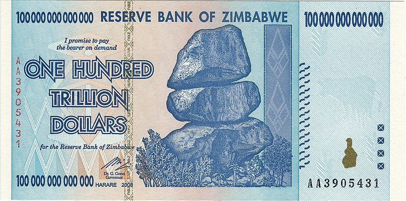

## Punti chiave

- Il Sound Money è un concetto precedente a Internet che ha ispirato l'invenzione del Bitcoin e della tecnologia blockchain.
- Il denaro può essere considerato solido se possiede diverse proprietà quantificabili, che sono codificate nell'ETC.
- Una proprietà importante è la _scarsità_, che l'ETC ottiene dalla sua _curva di emissione fissa_ che porta a una _fornitura futura nota_.
- Se un progetto non ha una _fornitura futura nota_, i manutentori possono gonfiare arbitrariamente il valore di una valuta allontanandola dai possessori.
- Questo rischio rimane presente su tutte le catene che non hanno una curva di emissione fissa __, compreso Ethereum™.

## Introduzione

La spina dorsale di economie forti, il fornitore di stabilità, l'incentivatore di una sana [preferenza temporale](https://www.youtube.com/watch?v=k5XbLm3pEfI), il creatore di prosperità. Il denaro sano è l'antidoto a molti dei problemi creati dagli abusi finanziari della centralizzazione nel mondo, ed è il concetto centrale che ha stimolato la creazione di Bitcoin.

Dalla [Scuola Austriaca di Economia](https://mises.org/topics/bitcoin) molte delle teorie alla base di Bitcoin, tra cui [Sound Money](https://mises.org/library/principle-sound-money), hanno visto la loro gestazione filosofica. Decenni prima che il Bitcoin fosse tecnologicamente concepibile, economisti come Ludwig von Mises, Fredreick Hayek e Milton Friedman professavano i pericoli del denaro fiat e i vantaggi di sistemi finanziari liberi dalla manipolazione delle autorità centrali.

## Proprietà della moneta sana

Il denaro è la linfa vitale che trasporta l'energia e le informazioni all'interno di un'economia, motivo per cui una moneta ben congegnata è fondamentale per una società funzionale. È stato individuato che il denaro deve servire a tre scopi: come unità di conto, come riserva di valore e come mezzo di scambio. Queste tre funzioni sono facilitate da diverse proprietà , che sono state intenzionalmente inserite nel design di Bitcoin ed ereditate da ETC:

- **Divisibilità:** ETC è divisibile fino a 18 cifre decimali. Ciò significa che l'ETC può essere suddiviso in 1.000.000.000.000.000.000 di unità più piccole, se necessario. I tagli di ETC possono essere scritti in `wei`, la più piccola unità di ETC attualmente disponibile.
- **Trasferibilità:** Poiché l'ETC non è legato ad alcuna banca o governo, è facilmente trasferibile in tutti i Paesi e tra gli utenti su scala globale. Questo dà all'ETC un vantaggio rispetto alla cartamoneta e ai metalli preziosi, che non sono facilmente trasferibili su lunghe distanze.
- **Fungibilità:** Ogni ETC vale esattamente quanto è valutato sul mercato. Un ETC non avrà valori diversi in base alle transazioni ETC precedenti, a differenza di alcune valute in cui le banconote più vecchie spesso valgono meno di quelle più recenti. Si tratta della cosiddetta fungibilità, una proprietà che l'ETC condivide con le materie prime fisiche come l'oro e l'argento.
- **Durata:** ETC è incredibilmente resistente. In definitiva, si tratta solo di informazioni, che possono essere memorizzate su un computer o in un portafoglio digitale, o anche offline su un pezzo di carta o di metallo. Ciò rende l'ETC molto più duraturo rispetto alle forme di denaro tradizionali, come la cartamoneta, che possono essere facilmente distrutte o perse.
- **Portabilità:** L'ETC è altamente portatile. Potete portarla su una chiavetta, sul telefono, scriverla su carta o ricordarla come una frase-seme.
- **Scarsità:** L'ETC ha un'offerta limitata che verrà rilasciata nel tempo. Questo lo rende più scarso della maggior parte delle altre forme di moneta.

## Offerta futura conosciuta

L'ETC possiede tutte le proprietà del denaro sano. È decentralizzata, incensurabile, divisibile, trasferibile, fungibile, durevole e scarsa. La pietra angolare della sana politica monetaria di una blockchain è la scarsità attraverso una _fornitura futura nota_. Proprio come Bitcoin, ma a differenza di Ethereum™, Classic ha una curva di emissione fissa __. Un [importo fisso](https://etcis.money/) di ETC creato come ricompensa di blocco per i minatori, il che significa che i possessori di ETC possono calcolare con precisione l'importo totale di ETC esistente in qualsiasi momento.

La curva di emissione fissa di Ethereum Classic è stata introdotta da [ECIP-1017](https://ecips.ethereumclassic.org/ECIPs/ecip-1017). Il programma di emissione, noto anche come 5M20, riduce la ricompensa dei blocchi del 20% ogni 5.000.000 di blocchi. A livello sociale, questo evento di riduzione della ricompensa in blocco ha preso il nome di "Quinquagesima".

| Est. Data    | Epoca 5M20 | Blocco      | Ricompensa del blocco | Emissione totale dell'era |
| ------------ | ---------- | ----------- | --------------------- | ------------------------- |
| 2015-07-30   | Epoca 1    | 1           | 5 ETC                 | 25.000.000 ETC            |
| 2017-12-11   | Epoca 2    | 5,000,001   | 4 ETC                 | 20.000.000 ETC            |
| 2020-03-17   | Epoca 3    | 10,000,001  | 3.2 ETC               | 16.000.000 ETC            |
| 2022-04-15   | Epoca 4    | 15,000,001  | 2,56 ETC              | 12.800.000 ETC            |
| 2024-05-07   | Epoca 5    | 20,000,001  | 2,048 ETC             | 10.240.000 ETC            |
| ~Ogni 2 anni | N+1        | N+5,000,000 | -20%                  | Totale ~200.000.000 ETC   |

_Nota: a causa della fluttuazione del tasso di impurità, la quantità esatta di emissioni varierà leggermente, ma non in modo significativo._

Una curva di emissione fissa __ significa che il tasso di inflazione è prevedibile e, nel caso dell'ETC, è in continua diminuzione nel tempo. Man mano che il valore della rete aumenta, il valore di tutti gli ETC aumenta in modo prevedibile in base a questo tasso, piuttosto che a un tasso futuro sconosciuto che potrebbe essere molto più basso. L'impegno di ETC verso una curva di emissione fissa è sancito sia nel protocollo che nel suo strato sociale, e grazie alla Proof of Work, qualsiasi hard fork che tenti di manipolare l'inflazione risulterà in una divisione permanente della catena, disincentivando in modo massiccio tale cambiamento al punto da essere _estremamente_ improbabile che venga contemplato, per non parlare del tentativo, per non parlare del successo.

Una _fornitura futura nota_ non solo fornisce una prospera alternativa al sistema fiat tradizionale, ma anche un ruolo sociotecnologico critico nelle blockchain che la utilizzano come base per mantenere un progetto decentralizzato. La politica monetaria di una blockchain è un accordo comune a cui tutti i partecipanti aderiscono volontariamente. Mantiene tutte le parti allineate dal punto di vista economico e aiuta a evitare che i gruppi accumulino un'influenza sleale sugli altri. Questa incrollabile neutralità è ciò che mantiene tutti i partecipanti su un piano di parità.

La moneta sonante, e la sua capacità di mantenere il valore nel tempo, è una proprietà fondamentale dei meccanismi di incentivazione che incoraggiano la partecipazione, in quanto, pur non garantendo l'apprezzamento di un bene, fornisce almeno un mezzo per calcolare il potenziale di guadagno futuro, data la crescita futura di un progetto. Significa che i detentori hanno la garanzia di beneficiare in modo equo degli utili di un progetto.

## Denaro non solido

Che si tratti di valute fiat o criptovalute, la ridistribuzione dei fondi attraverso l'inflazione o lo svilimento della moneta è uno dei trucchi più vecchi del libro per pianificatori centrali impiccioni con un senso di autorità mal riposto. Nei momenti di difficoltà, usano inevitabilmente questo meccanismo per assicurarsi che quando la nave affonda, coloro che controllano le chiavi del castello saranno i primi a salire sulle zattere di salvataggio, potendo ridistribuire a se stessi qualsiasi briciola di valore rimasta a spese dei detentori della valuta, il tutto ovviamente in nome della sicurezza e della stabilità.

Questo stato di fallimento è un tipo di rugpull che può esistere solo in progetti non sufficientemente decentralizzati. La ridistribuzione del valore dai detentori a qualche gruppo specifico (che si tratti di minatori, stakers o sviluppatori) può avvenire solo quando l'equilibrio di potere  non è uniforme, in modo tale che alcuni partecipanti possano far passare modifiche al protocollo che antepongano i loro interessi a quelli degli altri.

L'alternativa a un _approvvigionamento futuro noto_ è un _approvvigionamento futuro sconosciuto_, che porta a un grado illimitato di inflazione o di indebolimento della valuta. In piccole quantità l'inflazione può essere impercettibile ed essere oscurata dalla volatilità quotidiana dei mercati, ma rappresenta comunque una tassa sui detentori della valuta che non godono dei benefici immediati dell'effetto [Cantillon](https://cointelegraph.com/explained/from-cash-to-crypto-the-cantillon-effect-vs-the-nakamoto-effect).

In casi estremi, le catene con una politica di mantenimento di una _fornitura futura sconosciuta_ possono portare a [un'iperinflazione simile a quella dello Zimbabwe](https://en.wikipedia.org/wiki/Hyperinflation_in_Zimbabwe), che è una nube oscura sempre presente che incombe su tutti i possessori di queste valute. Anche se questi progetti non hanno bisogno di aprire il rubinetto dell'inflazione oggi, potrebbero diventare "necessari" per qualsiasi motivo in futuro. Che si tratti di problemi di finanziamento dello sviluppo o della [corsa al ribasso](/why-classic/proof-of-work#the-apr-arms-race) della competizione con i rendimenti delle altre catene di Proof of Stake, senza il precedente di una curva di emissione fissa, il comitato organizzativo centrale di questi progetti può facilmente evocare un numero qualsiasi di giustificazioni per appropriarsi del valore sottratto ai detentori come unico modo per far proseguire il progetto.

Alcuni promotori di criptovalute, forse involontariamente, inducono i loro colleghi detentori a credere che i controlli e gli equilibri forniti da _fornitura futura fissa_ siano un ostacolo, postulando che sia in qualche modo nell'interesse finanziario dei detentori non averne uno.

L'idea di _moneta ad ultrasuoni_, sinonimo di _moneta non solida_, significa che l'offerta futura di una moneta è sconosciuta e che, sebbene i detentori promettano che non sarà mai più alta del necessario, potrebbe essere qualsiasi cosa da zero a infinito. Un _ultrasuoni_ approvvigionamento futuro è soggetto a modifiche in base a un criterio indefinito e imprevedibile, il che significa che l'autorità centrale si riserva il diritto illimitato di ridistribuire i fondi dai titolari in futuro.

> Sì, la vostra vecchia auto noiosa potrebbe essere sicura, ma date un'occhiata a questo ragazzaccio qui. Abbiamo rimosso i freni e le cinture di sicurezza, quindi ora è ultrasicura.
> 
> - Sostenitori dei ~~soldi a ultrasuoni~~ veicoli ultrasicuri

Purtroppo, a differenza di Ethereum Classic, forse per fornire un'opzionalità in futuro per attrarre garanzie Proof of Stake, Ethereum™ è uno dei tanti progetti di criptovalute che mantiene una politica di _fornitura futura sconosciuta_, il che a sua volta significa che i possessori sono esposti al rischio di un'inflazione futura senza limiti.
