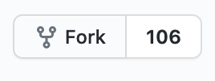

# Guide to Contributing Translations

This walkthrough will show you how to contribute translations via Github.

## Prerequisites

You need a github account to be able to submit translations.

## Guide

_Step 1_ Fork the repository

Go to https://github.com/ethereumclassic/ethereumclassic.github.io and click the "Fork" button in the top right corner

_Step 2_ Switch to the babel branch

In your newly forked repository at `https://github.com/your_name/ethereumclassic.github.io`, click the list of branches in the top left and change to the `babel` branch.

_Step 3_ Open the file of your chosen language

Open your country code's language file at `content/_i18n/xx.yaml`. If you cannot find your country code please contact a maintainer in the discord channel.

_Step 4_ Add your translations

All of the strings on the webstie are auto-translated by default, so you should review the translations and correct them where appropriate. In this file you will see english comments along with the auto-translations. The enligh comments may not be up to date with the website so please compare the most recent (live) version of the website when translating strings.

You must ensure that the indentation remains the same; there are two spaces at the start of each line.

_Step 5_ Commit your changes

It's a good idea to commit your changes frequently to avoid losing progress. You can commit as many times as you like. Commit directly to your `babel` branch.

_Step 6_ Create a Pull Request

Once you are done with translating, you can create a pull request.

From your repository's root on `babel` branch, `https://github.com/your_name/ethereumclassic.github.io/babel`, click "Pull Request".

Make sure are merge from `your_name:babel` into `ethereumclassic.github.io:babel`.

_Step 7_ Confirm the PR

Before confirming, check that the merged updates look accurate.

Create the pull request.

---

From here, repository maintainers will review your pull reuqest and merge your changes.

Thank you!
